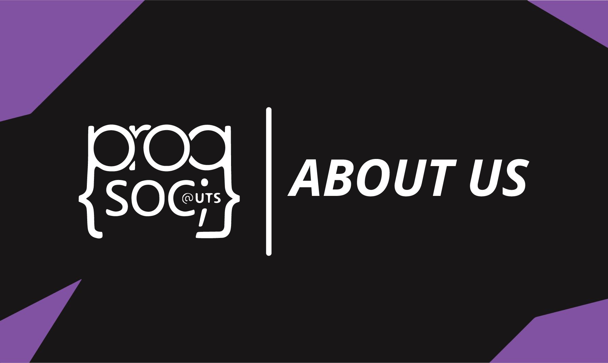

ProgSoc is a club for all programmers who want to find fellow coders and learn more about programming! Showcase your skills and get help from other programmers, or just hang out and have fun, even if you're a beginner!  

We're welcome to all beginners, and are happy to help you learn more about the field, as well as helping out with different programming subjects, or just generally talking about the industry!

Events
------

We have a variety of events, ranging from a beginner's workshops to a full-scale hackathon, while also having fun casual meetups or discord calls in between, to chat and have fun! We also frequently collaborate with other FEIT societies to bring you the biggest events FEIT has to offer.

Community
---------

We have members ranging from complete beginners, to experienced programmers already working in the industry, which means that no matter who you are, you can always find someone to talk to, help you out, or just have fun. Find group members for subjects, showcase your skills, maybe even get to know someone who will help you get a good internship or job later!

History
-------

Read more about our history [here](/our-history/).

FAQ
---

Our FAQ is located [here](/frequently-asked-questions/).
