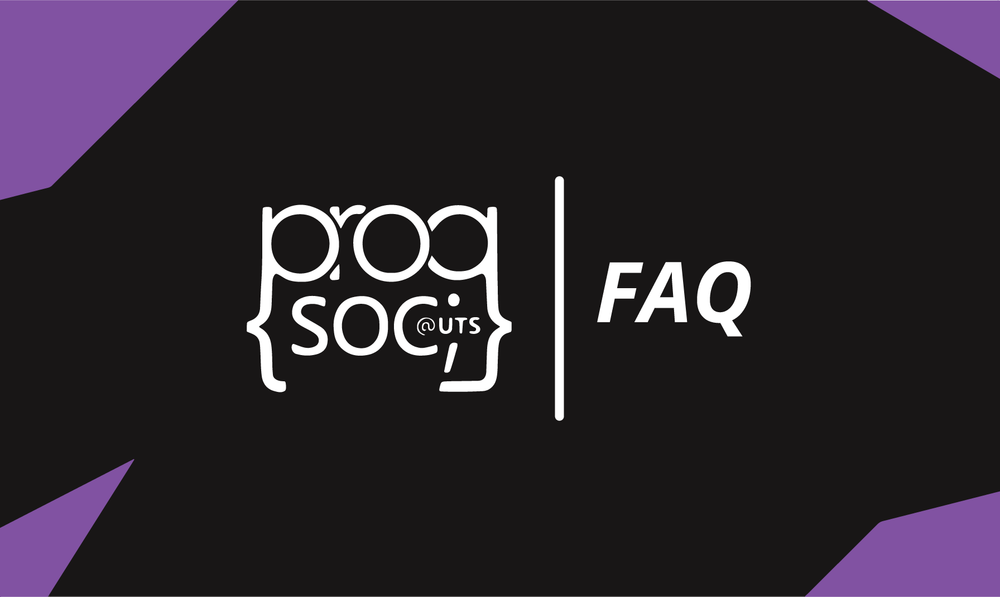

### Do I have to know any programming to join?

ProgSoc welcomes programmers of all levels, from complete beginners who haven’t written a line of code before, to seasoned programmers who can breathe code. We're open to all beginners and are happy to help you while you learn!  

### What kinds of events do you run?

We run all kinds of events, from chill drinking or programming nights, to programming/industry workshops, or even entire hackathons! There’s events for everyone, whether you’re new or want to challenge your skills. We also often collaborate with other FEIT societies for some of the largest events at UTS!  

### What do I get from joining your society?

Members of ProgSoc get access to our free events (where we usually give away free food!), as well as cheaper tickets to larger events, including collaborations with other FEIT societies! We also have a lot of resources for programming and are open to questions.  

### Do you have any advanced workshops?

ProgSoc runs a large variety of workshops for all skill levels, including more advanced topics such as Docker and UX design. Although it’s hard to run very specialized workshops for niche fields, there’s still plenty of blog posts on the ProgSoc blog for a wide range of advanced topics, or you can just ask about a topic you’re interested in in our discord server, and almost certainly you’ll get a response!  

### What’s the difference between ProgSoc and TechSoc?

ProgSoc focuses a lot more narrowly on the fun of programming. TechSoc is great at introducing students to the industry, however it is a lot more broad and industry focused while ProgSoc is the perfect place if you just want to chill with fellow programmers, or want to get into coding in the first place!
