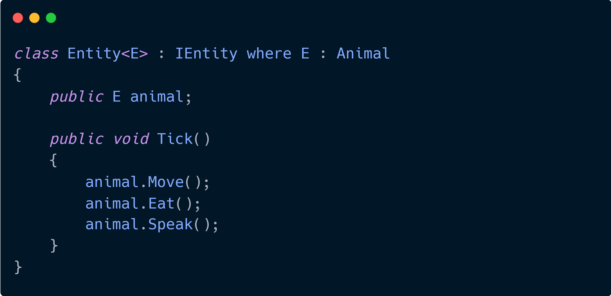

Earlier this year, I had an interesting conversation with another ProgSoc member about the performance benefits of generics compared to abstract interfaces. So I thought I might as well make my first blog post here about that!

This post mainly applies to compiled languages such as C#, C++, Rust, and possibly Java, however Java appears to use dynamic dispatch significantly more than necessary.

I will be using C# for demonstration, and I'll try to keep it simple and relevant to other languages also.

Compile time vs Runtime
-----------------------

Compiled languages have the concept of compile time, which allows code to be optimized before it is even run.

Let's take the example of enums. Enums are a human readable way to store a number, without having to remember the number. However, they are just as fast as using numbers because they are replaced at **compile time**.

Let's take this code as an example:

    enum Animal {
        Cat = 6,
        Dog = 23,
    }
    
    public void M() {
        Console.WriteLine("Compile time ID:");
        Console.WriteLine((int)Animal.Cat);
    }

If you compile and then decompile the code, you'd notice that the last line in Main has actually just become `Console.WriteLine(6)`. This is because the compiler knows it can directly replace enum values with their numbers.

However, let's say we have a dictionary instead of an enumerable:

    public void M() {
        var dictionary = new Dictionary<string, int>();
        dictionary.Add("Cat", 6);
        dictionary.Add("Dog", 23);
        
        Console.WriteLine("Runtime ID");
        Console.WriteLine(dictionary["Cat"]);
    }

If you compile and then decompile this code, you'd notice that the last line is still just `Console.WriteLine(dictionary["Cat"])`. The compiler doesn't know know what the values of a dictionary are at compile time, so therefore it's just left as-is.

_**Here's the full demonstration on** [Sharplab](https://sharplab.io/#v2:CYLg1APgAgTAjAWAFBQAwAIpwCwG5nJQDMmM6AwugN7Lp3oCmAdgK4C26AgkwJZsCGAG2q16Y8vwAu6ALzoAbABpRYugBEA9gHNZ6GEWVIxAXxXozxTNnQBZABQBKEUdV0AbvwBO6YDwDGkjwaTF4AnrpMDADu6Gr+gcFhADxYqIroPEySAHyO+C6uvgFBIZ6hAHScwMB2AEQSkrXp8g75rnRFCaUVVTW1mlpNekStZmJj9FgAnHXkGmwADjyCDOiBbKsAkmogtaMFqtN2dpmSDtx8QuUN++2YcDO1AEosWXxbantt7UedJWEAbXqUlqAF1bvRTEhjEA)._

Anyway, this just shows that it's possible to greatly optimize the performance of code with a simple change that the compiler can understand much better.

Function calls
--------------

The next thing we need to understand is function calls. Just like in the example above, function calls also have different levels of compile time optimization.

Let's say we have these classes:

    abstract class Animal
    {
        public abstract void Speak();
    }
    
    class Cat : Animal
    {
        public override void Speak()
        {
            Console.WriteLine("Meow!");
        }
    }
    
    class Dog : Animal
    {
        public override void Speak()
        {
            Console.WriteLine("Woof!");
        }
    }

This defines 2 functions, Cat's Speak function and Dog's Speak function. Animal's Speak function actually doesn't exist, it is just a marker that says "everything that inherits me must implement this".

So, let's say we call:

    Cat cat = new Cat();
    cat.Speak();

The compiler knows that the object's type is Cat, and can point directly to Cat's speak function, just like an enumerable value points directly to the number it represents.

Now, let's say we instead have:

    Animal animal;
    animal = new Cat();
    animal.Speak();

Which speak function are we calling? Cat's or Dog's? The compiler doesn't know. However, **at runtime**, C# knows the type of the object instance. In this case, it knows that animal gets set to an object of type Cat when the code is actually running, so what happens when Speak is actually called? The programming language does a similar thing to a dictionary, it looks at the type and finds the appropriate function to call **each time the function is called**.

This is known as dynamic dispatch, while knowing the function to call at compile time is known as static dispatch. Internally, dynamic dispatch creates a dictionary called a **vtable**, which maps between object type and function pointer, so that the language can always call the right function for any relevant object type. However, jumping vtables is relatively slow, compared to just having the function pointer compiled in directly. Also, static dispatch allows much easier function inlining by the compiler, which would often improve the performance of small frequently called functions by quite a lot.

If you're jumping vtables millions of times per second, switching to static dispatch would greatly improve performance of your code.

Abstraction without vtables?
----------------------------

Generally using virtual (or abstract) functions is thought to be the best approach to polymorphism, at least in object oriented programming. However, as we saw above, blindly using dynamic dispatch function calls may lead to a performance loss.

So how can this be improved? Well, if we use generics with type constraints, we can let the compiler know which variant of the abstract function we want to call at compile time!

Let's imagine our Cat and Dog are types of entities in a game, and have a look at this as an example:

    // We constraint the generic type E to be a sub type of Animal
    class Entity<E> : IEntity where E : Animal
    {
        public E animal;
    
        public Entity(E animal)
        {
            this.animal = animal;
        }
    
        public void Tick()
        {
            animal.Speak();
        }
    }
    
    static void Main(string[] args)
    {
        var entity = new Entity<Cat>(new Cat());
        entity.Tick();
    }

The code above always knows what exact type animal is, and therefore doesn't have to rely on vtables! But at the same time this code is still polymorphic, because we can swap out Cat for Dog and it will perform differently.

A more advanced example
-----------------------

Although this approach may seem very useful for one-off types, you might be thinking, "but what's the point if I can't put `Entity<Cat>` and `Entity<Dog>` together into the same array?", and you'd be right.

However, generics still help in this situation. Let's say Animal has more than just `Speak`. It has `Speak`, `Move` and `Eat` like so:

    abstract class Animal
    {
        public abstract void Speak();
        public abstract void Eat();
        public abstract void Move();
    }

And Entity uses it like so:

    interface IEntity
    {
        void Tick();
    }
    
    class Entity<E> : IEntity where E : Animal
    {
        public E animal;
    
        public Entity(E animal)
        {
            this.animal = animal;
        }
    
        public void Tick()
        {
            animal.Move();
            animal.Eat();
            animal.Speak();
        }
    }
    
    static void Main(string[] args)
    {
        var entities = new IEntity[] {
            new Entity<Cat>(new Cat()),
            new Entity<Dog>(new Dog())
        };
    
        foreach (var entity in entities)
        {
            entity.Tick();
        }
    }

Of course, this does still mean we use dynamic dispatch for 1 function each time, for the `Tick` function, but that's a lot better than using 3! The `Speak`, `Move` and `Eat`, are now statically dispatched due to the generic type, while at the same time we can still store all kinds of entities in the same array.

Although this is a simplistic example, imagine a much more complex data architecture that may benefit from complex flexible abstractions like this, for example low latency audio stream processing with recursive generics via an interface, or a high performance http webserver architecture with generics allowing for faster middleware binding at compile time without vtables.

Summary
-------

Using generics can allow mostly or entirely skipping dynamic dispatch function calls, improving performance for very frequently called functions in advanced abstractions.

Although this may only benefit high performance frequently called functions with very granular abstraction, this is still a nice tool to be aware of when developing these kinds of applications.

Happy coding!
