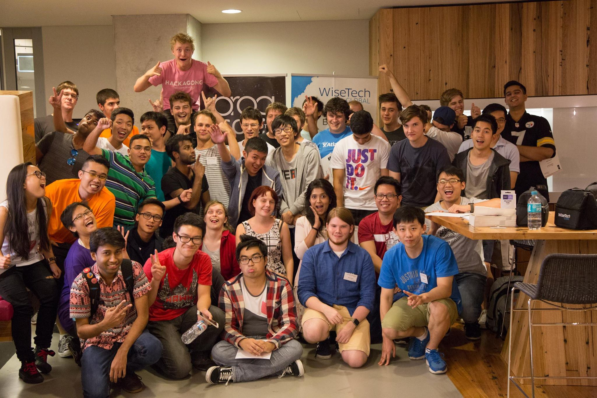
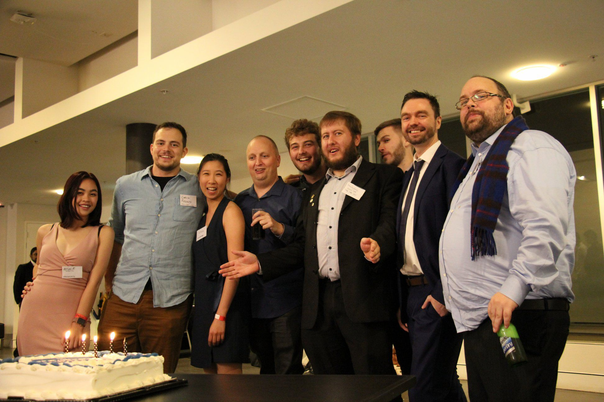

ProgSoc is a club for all programmers who want to find fellow coders and learn more about programming! Showcase your skills and get help from other programmers, or just hang out and have fun, even if you're a beginner!

We're welcome to all beginners, and are happy to help you learn more about the field, as well as helping out with different programming subjects, or just generally talking about the industry!

<!-- more -->

Events
------

We have a variety of events, ranging from a beginner's workshops to a full-scale hackathon, while also having fun casual meetups or discord calls in between, to chat and have fun! We also frequently collaborate with other FEIT societies to bring you the biggest events FEIT has to offer.

Community
---------

We have members ranging from complete beginners, to experienced programmers already working in the industry, which means that no matter who you are, you can always find someone to talk to, help you out, or just have fun. Find group members for subjects, showcase your skills, maybe even get to know someone who will help you get a good internship or job later!

The Team
--------

A list of our previous executive teams [can be found here](https://docs.progsoc.org/about/execs/). Our team for the 2025 office period is:

*   `President` Sebastian Pietschner
*   `Vice President` Brendan Hin
*   `Secretary` Audrey Santoso
*   `Treasurer` Jess Swain
*   `Marketing` Mohammed T
*   `Events`
    *   Vishwas Parpattegar
    *   Eddie Shafiq
    *   Ben Walters
    *   Ashwin Rajesh

ProgSoc formerly had a Computer Systems Officer (CSO), this position was abolished at the 2022 AGM in favour of sharing the responsibilities with, and drawing upon the experience of, all the executive team.

History
-------

ProgSoc is over 30 years old, having officially started in 1989 with UTS Union (later renamed to Activate UTS). Back then, learning programming was significantly harder, and the field was just emerging into popularity. It was also very difficult to run your own server and have your own website, so ProgSoc provided free website hosting on their own computers to all members! These days, providing free hosting is no longer necessary with companies such as GitHub and Vercel providing an excellent free service instead, however our mission statement of making programming more accessible to everyone still stays!

Following our old roots, we’re more than ever before providing a place for people to show off their projects and technologies they’ve learned, as well as providing our own workshops and online resources for all members!

### Early Beginnings

In 2019, on the 30th anniversary of ProgSoc, Roland Turner (one of the original co-founders) performed a speech where he talked about the early beginnings of ProgSoc and all of the interesting achievements that were possible at the time. The video can be found [here](https://www.youtube.com/watch?v=jWQlqHZgEqE).

### Old Website

Until 2021, we had a different website hosted under Apache with PHP, and it was a huge can of worms with different historical services glued together. In 2021, they were all statically archived with a custom crawler and hosted [here](http://oldarchive.progsoc.org/).

Some notable pages include:

*   The [main wiki](https://oldarchive.progsoc.org/wiki/Main_Page) (Mediawiki, 2006-2021)
*   The [old wiki](https://oldarchive.progsoc.org/resources/) (Dokuwiki, ??-2006)
*   [Old user folders](https://oldarchive.progsoc.org/users.html)
*   [Archived mailing lists](https://oldarchive.progsoc.org/pipermail/)

ProgSoc's 30th Anniversary (2019)

Frequently Asked Questions
--------------------------

### Do I have to know any programming to join?

ProgSoc welcomes programmers of all levels, from complete beginners who haven’t written a line of code before, to seasoned programmers who can breathe code. We're open to all beginners and are happy to help you while you learn!

### What kinds of events do you run?

We run all kinds of events, from chill drinking or programming nights, to programming/industry workshops, or even entire hackathons! There’s events for everyone, whether you’re new or want to challenge your skills. We also often collaborate with other FEIT societies for some of the largest events at UTS!

### What do I get from joining your society?

Members of ProgSoc get access to our free events (where we usually give away free food!), as well as cheaper tickets to larger events, including collaborations with other FEIT societies! We also have a lot of resources for programming and are open to questions.

### Do you have any advanced workshops?

ProgSoc runs a large variety of workshops for all skill levels, including more advanced topics such as Docker and UX design. Although it’s hard to run very specialized workshops for niche fields, there’s still plenty of blog posts on the ProgSoc blog for a wide range of advanced topics, or you can just ask about a topic you’re interested in in our discord server, and almost certainly you’ll get a response!

### What’s the difference between ProgSoc and TechSoc?

ProgSoc focuses a lot more narrowly on the fun of programming. TechSoc is great at introducing students to the industry, however it is a lot more broad and industry focused while ProgSoc is the perfect place if you just want to chill with fellow programmers, or want to get into coding in the first place!

Club Constitution
-----------------

[Constitution of the Programmers' Society](/constitution)

Since 2021, our constitution [now lives on GitHub](https://github.com/ProgSoc/Constitution). This has allowed us to easily track constitutional changes with commit messages summarizing such changes.

Looking for our meeting minutes? Follow the link below:

[Click here for Meeting Minutes](/meeting-minutes)
