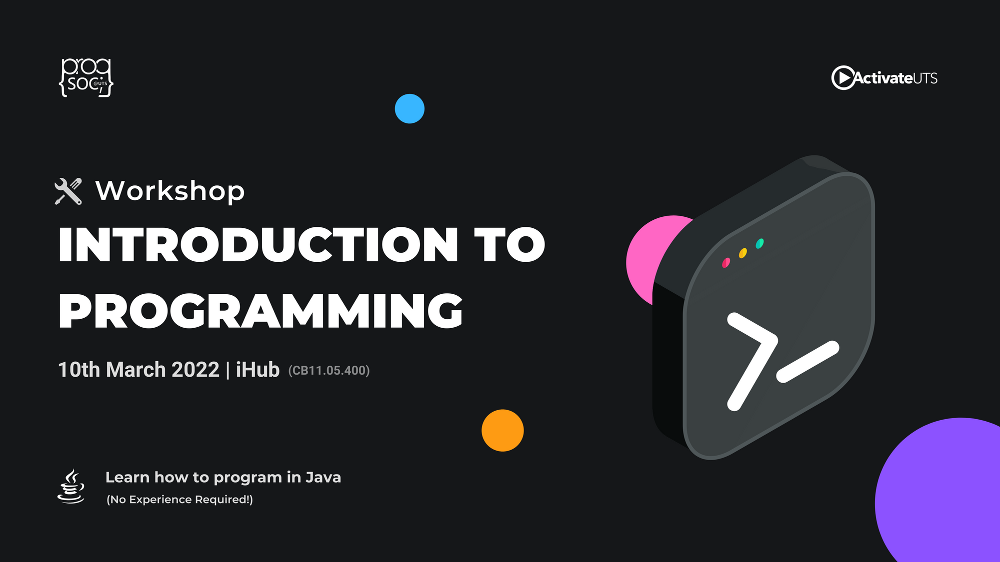

Hi! This blog post is a follow-up to the Introduction to Programming (in Java) workshop that we ran on 10/03/2022. It should cover the same content, in a similar way, including the exercises we provided. Also, here's a link to our original [slides](https://docs.google.com/presentation/d/142nNSNc97L5DdMpZuN5gOXxX6kMIc8a2jHqr-qb-vPo/edit?usp=sharing) for the workshop.

Oh, and if you have any questions while reading this post, don't be afraid to ask on our Discord server!

<!-- more -->

But before we start learning about how to program in Java, we first need to know what Java is.

What's Java?
------------

Java is a popular programming language created in 1995. For a while, it was considered the #1 programming language by many metrics, but these days it's fallen behind some other languages. However, it is still widely used in many places. For example, many businesses have their servers written in Java, your android phone natively runs apps in Java, and Minecraft is written in Java too.

Java can easily be run on different operating systems. The same code would often work on Windows, Mac and Linux with minimal changes.

Java isn't the easiest language to learn, but we are teaching it because it's the language that UTS chooses to teach first. Both Programming 1 and Programming Fundamentals teach in Java, so we decided it's best to teach it in our introductory workshop to reduce confusion.

Oh, and also, don't confuse Java with JavaScript. Those two languages have very little in common, and the reason JavaScript contains Java in it is because of Java's popularity when JavaScript was created.

Setting up
----------

There’s a lot of great IDEs/development environments you can use to run Java, such as

*   [https://www.jetbrains.com/idea/](https://www.jetbrains.com/idea/)
*   [https://www.eclipse.org/](https://www.eclipse.org/)
*   [https://code.visualstudio.com/](https://code.visualstudio.com/)

However, to make this workshop easier to follow, we decided to use an online IDE called Replit: [https://replit.com](https://replit.com).

If you want to follow along with the exercises, log in to replit using Github or Google.

After creating an account, go to our java starter code here: [https://replit.com/@progsoc/IntroToJavaStarter](https://replit.com/@progsoc/IntroToJavaStarter).

And then press "Fork repl" at the top to copy it into your replit account.

Starting with Java
------------------

Below will be content that mimics the slides we used on the day.

Also, keep in mind that Java has quite a lot of complexity that is hard to explain at the moment. There will be many times when I will ask you to ignore part of the code because "it has a purpose, but it will confuse you if I try to explain it now".

### Hello World!

    class Main {
      public static void main(String[] args) {
        System.out.println("Hello World!");
      }
    }

This is the simplest program you can make in Java.

When you run it in replit, you should get this in the console:

    Hello World!

Like I mentioned above, there's some extra complexity around here. Ignore the `class Main` and the `public static void main(String[] args)`. Those are relevant in Java, but are too confusing to explain right now. All your code should go inside the second set of {}, where `System.out.println("Hello World!");` is right now.

`System.out.println(`something here`);` prints anything you put inside into the console.

Anything between `"two double quotes"` is literal text. If you remove the double quotes, Java will try to read it as code and cause an error.

Oh, and most lines of code also end in `;`. Java will tell you if you're missing a `;` somewhere.

### How your code is processed

Computers run code one line at a time, from top to bottom.

    class Main {
      public static void main(String[] args) {
        System.out.println("Hello World!");
        
        System.out.println("The computer runs code one line at a time");
        
        // This is a comment! It is ignored by the computer
        
        System.out.println("From top to bottom"); // Also a comment!
        
        System.out.println("Like instructions in a recipe");
      }
    }

Here, the program instructs the computer to print four things, one at a time. They appear in the same order in the console.

    Hello World!
    The computer runs code one line at a time
    From top to bottom
    Like instructions in a recipe

Any text after a `//` will be ignored. You can use these to tell other humans what your code does, or leave notes for yourself!

### Variables and Data Types

Variables are pieces of memory that can store data.

    class Main {
      public static void main(String[] args) {
        int number = 5;
        double decimal = 4.3;
        String text = "These are variables";
        boolean logic = true;
    
        System.out.println(text);
        
        System.out.println("Decimal: " + decimal);
        decimal = decimal + number;
        System.out.println("Decimal: " + decimal);
      }
    }

The first 4 lines here declare 4 variables. Variables are declared in the format `[type] [variable name] = [value];`

All variables have a type. They can only store data of their type. For example an `int` (which stands for Integer) can only store integer numbers.

Other variable types include `boolean` which can only store `true` or `false`, `String` which stores any text, and `double` which is a decimal value (explaining what "double" stands for is pretty complicated, but feel free to google it).

You can use the value inside the variable just like variables in mathematics.

You can also tell the computer to change the value inside the variable. As you can see on the second last line, `decimal = decimal + number;` which changes `decimal`'s value to be `decimal`'s value plus `number`'s value. When you run the code, it prints:

    These are variables
    Decimal: 4.3
    Decimal: 9.3

### Operators

As you may have noticed, there are several operations you can perform on data using operators. Here's a list of the most common ones and what they do:

    class Main
      public static void main(String[] args) {
        // Arithmetic operators: +, -, *, /
        System.out.println(5 + 3); // 8
        System.out.println(9 / 3); // 3
        System.out.println(9 % 2); // 1
        
        // Comparison operators: <, >, <=, >=, ==, !=
        System.out.println(5 == 3); // false
        System.out.println(5 != 3); // true
        System.out.println(5 < 7); // true
        System.out.println(5 >= 7); // false
        
        // Logic Operators: || (or), && (and)
        System.out.println(false || true); // true
        System.out.println(5 > 3 && 7 > 5); // true
      }
    }

Operators perform simple operations on your data.

Order of operations is followed when using operators (e.g. you multiply and divide before adding and subtracting).

Arithmetic operators return numeric values, comparison and logic operators return boolean values.

And some more things to note:

*   The % operator is called a "modulo", returning the remainder after division. So, for example, when you divide 9 / 2, the remainder is 1.
*   The || and && logic operators are very helpful for chaining different conditions together.
*   You can use the + operator to join strings (text) together or join anything else to a string.

### User Inputs

You can run code that asks for user input.

In the code you forked from our replit, we will provide the “Input” class that helps you easily read input from the console.

    class Main {
      public static void main(String[] args) {
        System.out.print("Enter some text: ");
        String enteredText = Input.readLine();
    
        System.out.println("You have entered: " + enteredText);
      }
    }

Here, the program pauses on the fourth line when `Input.readLine()` is waiting for user input, then the value is placed inside `enteredText` and used in the next line below.

    Enter some text: progsoc
    You have entered: progsoc

### Workshop Practice!

Inside the `Input` class, we have also provided a `readInt` function that reads an integer from the console. Here's an example of how you could use it:

    class Main {
      public static void main(String[] args) {
        System.out.print("Enter a number: ");
    
        // Read a number from the console
        int number = Input.readInt();
    
        // Print out the number that was entered
        System.out.println("You have entered " + number);
      }
    }

    Enter a number: 42
    You have entered 42

Now, the challenge we have is to make a program that asks for 2 numbers and then outputs the sum of them. So the console output should look something like this:

    Enter a number: 7
    Enter another number: 9
    Their sum is 16

If you need help with this, feel free to ask on the ProgSoc discord server!

Once you feel like your solution works, feel free to look at my solution here: [https://replit.com/@arduano/IntroToJavaStarter](https://replit.com/@arduano/IntroToJavaStarter)

Anyway, after this, there are some more things we cover.

### Conditional Statements

“If” statements let you have conditions in your code

Code is still executed from top to bottom, but you can skip blocks of code based on a condition

Lines of code between {} are in a block, and the if statement can determine if it should run or not

    class Main {
      public static void main(String[] args) {
        System.out.print("What is your age? ");
        int age = Input.readInt();
    
        if (age >= 18) {
          System.out.println("You can legally drink!");
        } 
        else if (age >= 14) {
          System.out.println("You can't legally drink, but you can legally work!");
        } 
        else {
          System.out.println("You have no freedom");
        }
      }
    }

Keep in mind that the elseif/else statements don't run if an if statement above has been run. So if the age is 19, it enters the first if statement (because 19 >= 18), but then skips the other statements (even though 19 >= 14).

So some example outputs you'd see are:

    What is your age? 20
    In Australia, you can legally drink!

    What is your age? 14
    You can't legally drink, but you can legally work!

### Arrays

Whilst we can store a single piece of information like a name easily, when we start storing a lot of closely related information, it becomes tedious and inefficient to create a lot of variables.

This is where arrays come into play.

    class Main {
      public static void main(String[] args) {
        String[] cars = {"Volvo", "BMW", "Mazda"};
    
        // Accessing an item
        System.out.println(cars[0]); // Volvo
    
        // Changing an element of an array
        cars[0] = "Ford";
        System.out.println(cars[0]); // Ford
        
        // Getting the length of the array
        int carsLength = cars.length;
        System.out.println(carsLength); // 3
      }
    }

Arrays store a list (an array) of items of the same type. You access the item at a location using square brackets \[\].

**IMPORTANT**: everything in programming starts at 0. The first element is at \[0\], the second element is at \[1\], etc.

_You can also have arrays where you can change the number of elements. Try googling how to do that! Search “Java variable length array”_

### Loops

There are two types of loops in Java, `while` loops and `for` loops. `while` loops are the simplest type of loop, while `for` loops are an extension of while loops.

A while loop will repeat the code inside as long as the condition inside the parentheses is true. For example, this code:

    while (true) {
      System.out.println("repeat forever");
    }

Will print out

    repeat forever
    repeat forever
    repeat forever
    repeat forever
    repeat forever
    repeat forever
    repeat forever
    repeat forever
    repeat forever
    repeat forever
    repeat forever
    ……
    

Because the condition is hardcoded to be \`true\`, it will always be true.

Any condition can be used inside a while loop. For example, the condition passes here while the number is smaller than 10.

    int i = 0;
    while (i < 10) {
      System.out.println("Counted: " + i);
      i++; // Same as i = i + 1
    }

The output of the code above becomes

    Counted 0
    Counted 1
    Counted 2
    Counted 3
    Counted 4
    Counted 5
    Counted 6
    Counted 7
    Counted 8
    Counted 9

Every time the code inside the loop runs, it prints the value of i, and then increments i by 1. When i becomes 10, the loop ends.

This code pattern is so common that a different kind of loop, the "for" loop, was created to simplify it. Here's an example of the for loop being used to output the same text as above:

    for (int i = 0; i < 10; i++) {
      System.out.println("Counted: " + i);
    }

You can probably notice that 3 parts of code are combined into a single line of code, separated with `;`. The first part lets you define a variable. The second part is the condition, and if the condition is false, the loop ends. The third part is the increment which always runs at the end of each loop cycle.

### Loops over an Array

By combining loops and arrays together, we can do many things we can’t normally do with variables alone.

Here's an example piece of code that loops over an array of numbers and gets their average:

    class Main {
      public static void main(String[] args) {
        double[] numbers = {1, 2, 3, 4};
    
        // Start with zero
        double sum = 0;
        
        for (int i = 0; i < numbers.length; i++) {
          // Add up each number in the array onto sum
          sum = sum + numbers[i];
        }
    
        // Divide by the number of items to get the average
        double average = sum / numbers.length;
        
        System.out.println("Average: " + average);
      }
    }

Again, keep in mind that arrays start at zero, hence why `i = 0` at the beginning.

The code above prints out:

    Average: 2.5

### Functions

Functions are reusable pieces of code that you can use as many times as you need.

Functions can have “arguments”, the stuff you put inside the (), to pass different data into the function.

Functions can also return a value. If a function doesn’t return anything, it is a “void”.

In Java, the program always starts running from the “main” function.

    class Main {
      public static boolean isEven(int val) {
        return (val % 2) == 0;
      }
      
      public static void main(String[] args) {
        System.out.println(isEven(4)); // true
        System.out.println(isEven(7)); // false
        System.out.println(isEven(8)); // true
      }
    }

Functions are defined using `public static [return type] [function name] ([arguments]) { }`. Arguments are like variables that you pass into the function. The `public static` has a meaning in Java, but for now, it's too complex to explain, so it's best to ignore it.

You may remember how I mentioned that `%` gives you the remainder after division, and because of that, `x % 2` would return either 0 or 1 depending on whether the number is even or odd. If it `== 0`, then the function returns true, otherwise it returns false.

After defining the function, you can call it as many times as you want, and it returns appropriate values each time.

Here's another example of a function being used:

    class Main {
      public static double arrayAverage(double[] numbers) {
        double sum = 0;
        for (int i = 0; i < numbers.length; i++) {
          sum = sum + numbers[i];
        }
        double average = sum / numbers.length;
        return average;
      }
      
      public static void main(String[] args) {
        double[] array1 = {1, 2, 3, 4};
        double[] array2 = {6, 9, 12, 1, 74, 2};
        
        double average1 = arrayAverage(array1);
        double average2 = arrayAverage(array2);
        
        System.out.println("Average 1: " + average1);
        System.out.println("Average 2: " + average2);
      }
    }

Here, the function takes a decimal array and returns the average of the items (using code that's similar to another example I showed above).

### Now it's your turn again!

Now it's your turn to try writing some code yourself! In the workshop, we asked everyone to try writing a Rock Paper Scissors game using Java. Here is the starter code: [https://replit.com/@progsoc/IntroToJavaRockPaperScissorsStarter](https://replit.com/@progsoc/IntroToJavaRockPaperScissorsStarter)

You may notice the new function called `getRandomPlay` we added at the top. That function picks a random string from the `options` array and returns it. You can use this function to determine the computer's play.

Also, it's important to note that in Java, if you want to compare if two strings are equal, you need to use `text1.equals(text2)`. If you do `text1 == text2` it will always give you false. This is an issue with Java, and most other self-respecting languages just let you use `==` as you'd expect.

So to give an example, here's how you could implement a "tie" condition after getting the plays:

    if (userPlay.equals(computerPlay)) {
      System.out.println("It's a Tie!");
      continue;
    }

`continue` means "skip everything below, and return to the top of the loop". There's also `break` which means "Skip everything below and exit the loop", so you could use `break;` to implement a stop condition in your game.

Anyway, with all this in mind (yes, this is was fairly fast-paced), it's your turn to write the game!

If you find anything confusing, feel free to google it, or ask in our discord server.

I'd like to note that being able to google is an essential skill as a programmer. Once you get out of the basics, you'd be learning 90% of your skill from google searches. People even joke that software engineers are actually just professional googlers.

Anyway, once you feel like you're happy with your game, feel free to have a peek at the way I personally implemented it. Just PLEASE KEEP IN MIND that the code I write isn't the "best code". If your code differs from mine, that doesn't mean it's wrong! There are many different styles to programming, and it's up to you to find your taste.

[https://replit.com/@arduano/IntroToJavaRockPaperScissorsStarter](https://replit.com/@arduano/IntroToJavaRockPaperScissorsStarter)

Wrapping up
-----------

I hope you found this workshop helpful. Please let us know if you liked it! Or if you have tips on how we could improve, that's always welcome too.

I want to answer some common questions I got while wrapping up the workshop in person.

### What is the best programming language?

There isn't one. Every programming language has a purpose. Some are cleaner or easier to use than others. Some are older and more mature. When it comes to projects you'll likely be doing in your early programming adventures, the main languages you'll have to worry about are:

*   Javascript or Typescript if you want to develop anything web-based. For example, a website, some sort of web server, a discord bot, etc.
*   Python if you want to do anything in data science or machine learning. Although it's hard to make any big projects in python, it has amazing libraries for all sorts of large number crunching and data analysis/visualization tasks.
*   Java if you want to make Minecraft mods. Honestly, I don't know any use for Java when it comes to personal projects other than that.
*   C# for game development or desktop app development. Unity (one of the most popular game engines) uses C#, and C# has many tools available for writing desktop apps too. It is also much faster than python or javascript.

### How do I get better at programming?

Work on personal projects! University and ProgSoc can help kickstart you in the right direction, but you'll never get a good programming job if you've never programmed in your spare time before. It's like any other skill, for example, art. You can't get good at drawing without drawing in your spare time.

### I have ideas for personal projects, but where do I start?

If you don't know where to start with personal projects, feel free to ask on our discord server! There will almost always be someone who's had experience with your kind of personal project, and could offer some direction if you feel completely lost.

### I am interested in learning more programming, but can I message you if I need any help?

The best place to get help is in our discord server! Yes, I know I mention the server a lot, but I can't remember the last time a programming question went unanswered there. We will also host many more programming events in the future, including study sessions for programming assignments, and more advanced workshops for those who want to explore further into different parts of programming. You can also find new friends who are doing the same course/subjects as you, and help each other out with the rest of your time at uni.

I, along with the rest of ProgSoc, am looking forward to seeing you around!
