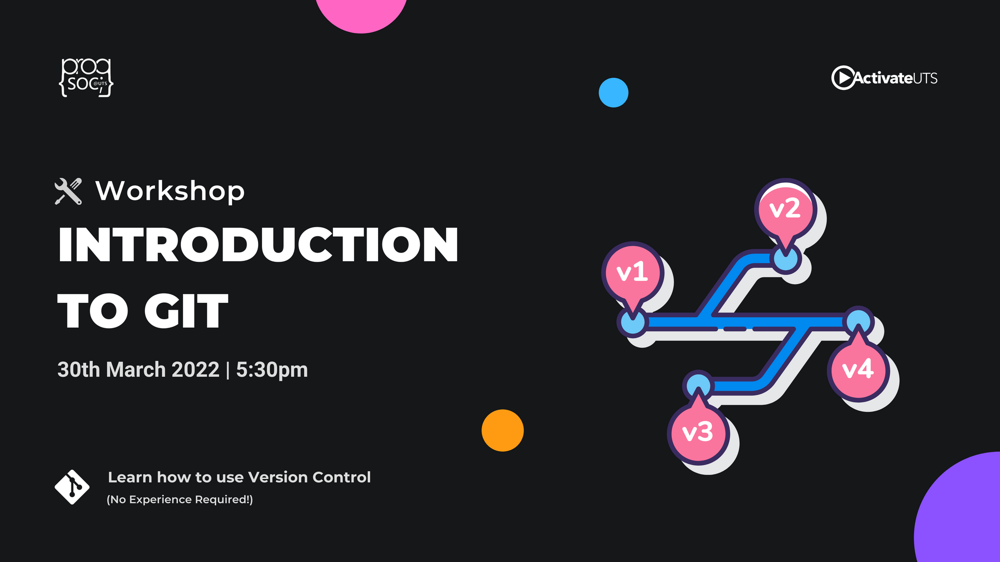
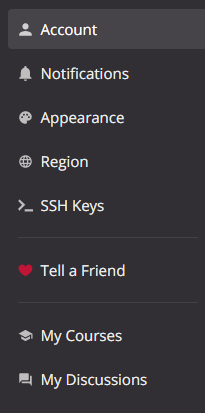
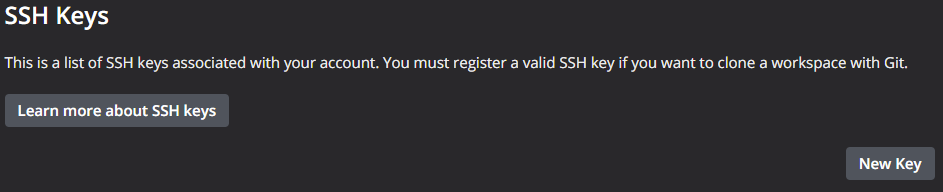
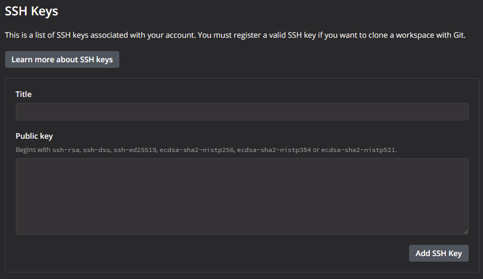
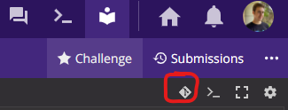
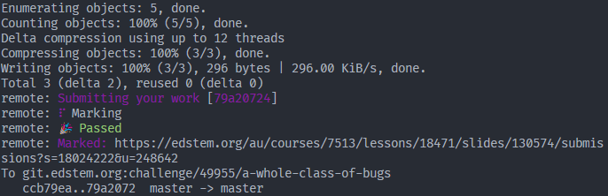

If you're studying computer science, I.T., or software engineering the odds are high that you would've used the platform Ed at some point to do programming assessments. But, what you might've not come across are some awesome features that are part of most programming IDEs like autocomplete, IntelliSense, and the ability to use a wide range of languages and tools.

Whilst Ed tries its best to do these things, because of its web-based nature it is severely limited so, I'm going to go through how to set up Visual Studio Code to connect to Ed for all your programming education needs.

<!-- more -->

The Install
-----------

### VSCode

Because we're not using the web-based editor we need to install our own. In this case, we're going to use VSCode, an awesome modular editor with native support for a wide range of tools and a massive library of plugins for all that stuff that's not built-in.

No matter your operating system you should be able to download the VSCode installer from here:

[

Download Visual Studio Code - Mac, Linux, Windows

Visual Studio Code is free and available on your favorite platform - Linux, macOS, and Windows. Download Visual Studio Code to experience a redefined code editor, optimized for building and debugging modern web and cloud applications.

MicrosoftMicrosoft

](https://code.visualstudio.com/Download)

There aren't too many steps in the installation process and it should be ready to go out of the box but, depending on what language your course uses you might have to install some additional software. Because of this, I'm going to divide the guide into something similar to a "choose your own adventure" game. Below are two sections with the instructions to install the software for either of the languages you might use. You don't need to install both if you don't need to.

### Java

If you've decided to go with Java you can find the download here:

[

Download the Latest Java LTS Free

Subscribe to Java SE and get the most comprehensive Java support available, with 24/7 global access to the experts.

Oracle

](https://www.oracle.com/java/technologies/javase-downloads.html)

Make sure to select the option that corresponds to your operating system and platform and after following the installer you should be good to go.

After that, we need to set up VSCode to handle the more complicated things that java supports. Whilst you might get code highlighting without installing anything else errors in your code may not be highlighted correctly. Therefore we can install the Java Extension Pack which adds support for Java IntelliSense, debugging, and projects.

[

Extension Pack for Java - Visual Studio Marketplace

Extension for Visual Studio Code - Popular extensions for Java development that provides Java IntelliSense, debugging, testing, Maven/Gradle support, project management and more

Visual Studio Marketplace

](https://marketplace.visualstudio.com/items?itemName=vscjava.vscode-java-pack)

From there all the Java Language features should work. You might not have yet noticed but Ed hasn't been mentioned yet. If you don't need python-support just skip down to the section titled Git for the last piece of the "stuff you need to install" puzzle.

### Python

Much like Java, we need to install Python on our machine before we can run its code. You can find the latest downloads here:

[

Download Python

The official home of the Python Programming Language

Python.org

](https://www.python.org/downloads/)

After you've gone through the installation process there's one thing left:

[

Python - Visual Studio Marketplace

Extension for Visual Studio Code - IntelliSense (Pylance), Linting, Debugging (multi-threaded, remote), Jupyter Notebooks, code formatting, refactoring, unit tests, and more.

Visual Studio Marketplace

](https://marketplace.visualstudio.com/items?itemName=ms-python.python)

Unlike Java Python only requires a single extension. Once that's installed and ready to go you should be able to open, run and edit python files on your computer. On to Git!

### Git

Git is a piece of software that allows you to manage the different versions of your code. If you haven't encountered it before make sure to take a look at this to understand the basics of how it works.

[

Introduction to Git

Git, you might’ve heard of it. It’s awesome for managing your code and almost universally used across the industry.

UTS ProgSocSebastian Pietschner

](/blog/intro-to-git/)

If you haven't installed it already here! Another link to install stuff with:

[

Git - Downloads

Downloads

](https://git-scm.com/downloads)

After installing git we reach the last piece of the puzzle. Setting up VSCode to connect to Ed _through_ Git.

The Setup
---------

### Generating keys

Phew, everything should be downloaded now. Now to become the ultimate hacker.

Open whatever terminal you can find, PowerShell or Command Prompt on Windows or Terminal on Mac.

Linux users should be intimately familiar with the terminal and know where to find it.

From there enter:

    ssh-keygen

and click enter a bunch of times till it's done asking questions.

What we've just done is generated a key (private and public) to prove that you're you to any server you connect to with git but, for the server on the other end to know that it's you connecting you need to give it the public part of the key.

You should be able to find this by opening the file at `<whatever the name of your home folder is>/.ssh/id_rsa.pub` which is the default location. From there copy the contents of the file. It should start with ssh-RSA and end with `<your username>@<your device name>`. We're going to need this for later.

### Adding your key to Ed

Depending on your course's coordinator they may or may not have enabled git for your account. You can figure this out by going to the settings:

Ed settings

There should be a section there titled "SSH Keys". This is where we're going to put the key we copied earlier.

From there click "New Key".

And enter in the key you obtained earlier in the massive box provided and enter a nickname for it:

From there click "Add SSH Key" and you should be set! Ed knows who you are now.

### Getting your Code on

If all those steps have been completed successfully then you should be able to go to whatever workspace or programming task that has been set for you and see a little icon that looks like this:

This means that your lecturer has enabled Git for this task. From there give it a click and copy down the URL it gives you. It should look like this ↓.

`git.edstem.org:challenge/xxxxx/a-whole-class-of-bugs`

From there go into your favorite folder for all things code and enter:

    git clone git.edstem.org:challenge/xxxxx/a-whole-class-of-bugs

If you want to know more about what this command actually does go check out the "Intro to Git" post.

Afterward, you should be able to see that a new folder has been created with the same name that was on the end of that URL. Running this command will open a new VSCode window with all of the lesson's content within.

    code ./a-whole-class-of-bugs

Make the changes you want to including adding any new files then run:

    git add .
    git commit -m "message"

Make sure to replace the message with something a bit more meaningful then finally run:

    git push

If everything went smoothly you would see this in your window after a few seconds:

It'll even tell you if you passed or failed!

Done!
=====

That's it. Once everything is set up it's pretty easy to use and allows you the advantages of a fully-fledged IDE with autocompletion and handy shortcuts that come in handy.

If you're interested in more helpful articles like this make sure to let us know on our discord server where you can find heaps of cool people and hear about all our upcoming events!
