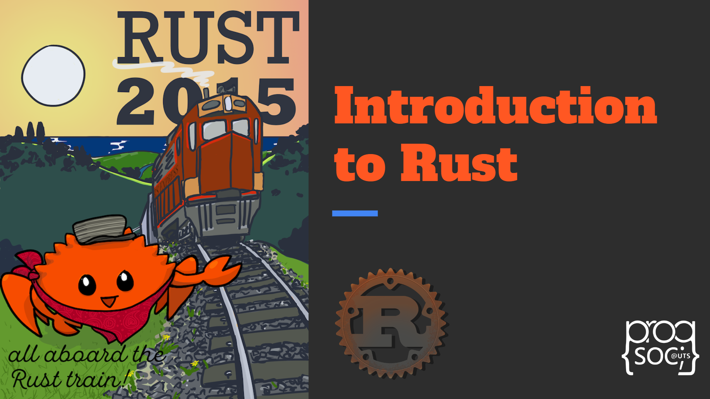

Hi! This blog post is a follow-up to the Rust Workshop that ran on the 16th of August 2022.

This post should cover the same concepts, while also providing links to relevant resources and further reading, where necessary. I will be explaining the concepts in terms of C/C++ and Java, so a general understanding of both is recommended.

What makes Rust different?
--------------------------

There are several parts of Rust that come together to make it a fairly unique approach to programming as a whole. Instead of manual memory management (C, C++), or garbage collection (Java, Python, Go, others), Rust uses a completely different paradigm called the “Borrow Checker”. Also, Rust allows data to be treated like code much easier, while also optimizing that code at compile time and maintaining C-like performance, or often even faster than C due to easier abstraction and the ease of importing highly optimized 3rd party libraries via Cargo.

Hello World
-----------

    pub fn main() {
        let name = "Ferris";
        println!("Hello {}!", name);
    }

A basic Hello World in Rust looks something like this, except the `println!` macro also allows formatting other values inside, similar to other languages' text format features, except it generates optimal code for this at compile time (because it is a macro).

Also for future reference, anything with a \`!\` at the end of it is a macro, meaning it is code that runs at compile time which generates (unwraps to) more code.

Functions and Expressions
-------------------------

In Rust, any set of `{}` can be an expression (kind of like `1` is an expression and `1 + 1` is also an expression), and this extends to things like if statements and functions. So rust doesn't have tertiary statements (such as `bool ? val1 : val2` in other languages), instead, it just has normal if statements.

Below is an example of different ways of writing the same function, all of them do the same thing:

    fn make_even_1(number: u32) -> u32 {
        // Similar to how most languages would do it
        if number % 2 == 0 {
            return number;
        } else {
            return number + 1;
        }
    }
    
    fn make_even_2(number: u32) -> u32 {
        let even = if number % 2 == 0 {
            // The last line in this {} doesn't have a ; so it is the return value of the expression
            number
        } else {
            number + 1
        };
    
        return even;
    }
    
    fn make_even_3(number: u32) -> u32 {
        let even = if number % 2 == 0 {
            number
        } else {
            number + 1
        };
    
        // Like above, any {} where the last line doesn't have a ; returns the value of the last line
        even
    }
    
    fn make_even_4(number: u32) -> u32 {
        // The simplest way of doing it
        // Both the if statement and each arm are expressions
        if number % 2 == 0 {
            number
        } else {
            number + 1
        }
    }

More examples on expressions can be found [here](https://doc.rust-lang.org/rust-by-example/expression.html), and more on functions can be found [here](https://doc.rust-lang.org/rust-by-example/fn.html).

Match statements
----------------

In Rust, a `match` statement is similar to switch statements in other languages. However, it forces you to account for all possible states. If not all states are covered, the compiler will throw an error. Here is an example of match statements in use:

    fn match_statements() {
        let number = 13;
    
        println!("Tell me about {}", number);
        match number {
            // Match a single value
            1 => println!("One!"),
            // Match several values
            2 | 3 | 5 | 7 | 11 => println!("This is a prime"),
            // Match an inclusive range
            13..=19 => println!("A teen"),
            // Handle the rest of cases
            _ => println!("Ain't special"),
        }
    
        let boolean = true;
        // Match is an expression too
        let binary = match boolean {
            // The arms of a match must cover all the possible values
            false => 0,
            true => 1,
        };
    
        println!("{} -> {}", boolean, binary);
    }

And here is what happens if not all match arms are covered:

    let boolean = false;
    
    // ERROR: "missing match arm: `true` not covered"
    let binary = match boolean {
        false => 0,
    };

More on match statements can be found [here](https://doc.rust-lang.org/rust-by-example/flow_control/match.html).

Numeric types
-------------

There will be many numeric types used in this post, so it's useful to cover that first.

Numeric types in Rust follow a simple pattern, a letter and then the number of bits it uses. So an `i` means int, `u` means unsigned int, `f` means float. This follows through to `i32` being a signed 32-bit int, `u64` being an unsigned 64-bit int, `f64` being a 64-bit floating point number (same as `double` in other languages), and so on.

This makes differentiating types much easier because for example you never know what a `long` is in C, it could be 32 or 64 bits depending on the compiler and platform you use. Having the size be part of the name makes this much more straightforward.

Loops
-----

Rust has 3 loop types: `while`, `for` and `loop`.

`loop` is basically the same as `while true`. It means loop forever until broken.

`while` is the same as other languages. You loop until the condition argument is false.

`for` is similar to python for loops, or foreach loops in other languages. It takes an iterator and iterates over every element. For example:

    for i in 0..10 {
        println!("{}", i);
    }

This would iterate on all numbers from zero through to nine. It's basically the same as  `for i in range(10)` in python.

`..` is a range operator, which specifies a range of numbers.

More on for loops and iterators can be found [here](https://doc.rust-lang.org/rust-by-example/flow_control/for.html).

Value ownership
---------------

This is a very important part to understand, as the whole idea of the borrow checker revolves around it.

When a value is created in Rust, it has an owner. The value can be moved, but it can't be copied (unless it allows copying, such as numbers). This includes references to heap values.

    let s1 = String::from("hello");
    let s2 = s1;
    // s1 is moved to s2, so s1 is invalid
    
    // ERROR: borrow of moved value: `s1`
    println!("{}", s1);

More on the above example is explained [here](https://doc.rust-lang.org/rust-by-example/scope/move.html). Also, values can be "partially" moved which is explained [here](https://doc.rust-lang.org/rust-by-example/scope/move/partial_move.html).

If you want to pass around a variable without moving it, you can borrow it. A borrow can be done using `&`, and it creates a reference to the value. Rust keeps track of all the active borrows at compile time.

    fn print_value(s: &String) {
        println!("{}", s);
    }
    
    let s1 = String::from("hello");
    let s2 = &s1;
    // s1 is not moved, so it is valid
    println!("{}", s1);
    // s2 is a reference to s1, so it is valid
    println!("{}", s2);
    
    // Create a second borrow of s1 and pass it to the function
    print_value(&s1);
    // Pass s2 to the function
    print_value(s2);

Mutable borrowing
-----------------

Mutable references can be created to data, but only a single mutable reference can exist to something at a time, and no immutable references can exist if there’s a mutable one. So any value can have either:

*   Unlimited immutable references
*   One mutable reference

But not both at once.

    fn modify_value(val: &mut String) {
        // Extend the string with " world"
        val.add_assign(" world");
    }
    
    fn mutable_references() {
        // Mutable variables have to be declared with `mut`
        let mut s = String::from("hello");
        modify_value(&mut s);
    
        // Prints "hello world"
        println!("{}", s);
    }
    
    fn mutable_reference_error() {
        let mut s = String::from("hello");
        let borrowed = &s;
    
        // ERROR: cannot borrow `s` as mutable because it
        // is also borrowed as immutable
        modify_value(&mut s);
    
        print_value(borrowed);
    }

Lifetimes
---------

Along with an owner, each value has a "lifetime" which affects how long it can be referenced by borrows.

    fn borrow_lifetime() {
        let borrow: &String;
    
        {
            let s = String::from("hello");
    
            // ERROR: `s` does not live long enough
            // borrowed value does not live long enough
            borrow = &s;
    
            // `s` is dropped here at the } scope
            // so no reference to `s` can exist past here
        }
        
        println!("{}", borrow);
    }
    
    // ERROR: Cannot return reference to local variable `x`
    fn return_borrowed() -> &u32 {
        let x = 7;
        &x
    }

The Rust compiler is very smart with checking how long references exist. For example if `println!("{}", borrow);` is removed in the above code, it will no longer error.

Also, the compiler often infers lifetimes even through function calls. For example, here the return value borrow has the same lifetime as the input argument:

    // Return value lifetime inferred
    fn get_first_10_chars(a: &str) -> &str {
        &a[..10]
    }

### Explicit lifetimes

Sometimes, the compiler can't guess the return lifetime, so you need to help it by explicitly specifying them. Lifetimes look similar to generics, and they are written as `'something` with the `'` always at the beginning.

In this example, the compiler can't guess the return lifetime:

    // ERROR: missing lifetime specifier
    // this function's return type contains a borrowed value, but
    // the signature does not say whether it is borrowed from `a` or `b`
    fn get_shorter_string(a: &str, b: &str) -> &str {
        if a.len() < b.len() {
            a
        } else {
            b
        }
    }

So you would need to help the compiler by explicitly specifying the lifetime:

    fn get_shorter_string<'a>(a: &'a str, b: &'a str) -> &'a str {
        if a.len() < b.len() {
            a
        } else {
            b
        }
    }

It's a bit confusing at first why both arguments use the same lifetime, but basically the compiler picks the smallest lifetime to use if there are different lifetimes passed to the same lifetime argument.

When this function is used, the compiler knows that the shorter lifetime may not be long enough:

    let shorter: &str;
    
    let a = String::from("hello");
    
    {
        let b = String::from("world");
    
        // `b` does not live long enough
        // borrowed value does not live long enough
        shorter = get_shorter_string(&a, &b);
    }
    
    println!("The shorter string is {}", shorter);

Difference between String and str
---------------------------------

I've been using both `String` and `str` in the examples above, so it might be a bit confusing what's the difference.

A `String` is effectively a heap-allocated managed array of characters, that owns the value. A `&str` is a reference to the character array, that contains a pointer to the first character and a length. You basically never see `str` be used without a `&`.

So in terms of C++ types, a `String` is like a C++ `std::string` while an `&str` is like a `char*` but with a length.

    let string = String::from("hello");
    
    let str: &str = &string;
    println!("{}", str); // Prints "hello"
    
    let str: &str = &string[1..4];
    println!("{}", str); // Prints "ell"

### Vectors and slices

Similarly to String and str, there are Vectors `Vec<T>` and slices `&[T]`. A Vector is basically the same as a C++ `std::vector` or a Java `ArrayList<T>`, it is a variable-length array stored in the heap.

A slice `&[T]` is a pointer to the first element in an array, along with the length.

    let vector: Vec<u32> = vec![1, 2, 3, 4, 5];
    
    let str: &[u32] = &vector;
    println!("{:?}", str); // Prints "[1, 2, 3, 4, 5]"
    
    let str: &[u32] = &vector[1..4];
    println!("{:?}", str); // Prints "[2, 3, 4]"

### Owned slices

It is possible to create a stack-allocated array using the slice syntax, however, it usually needs to explicitly specify the length to be able to compile.

    // Create a stack-allocated array of bytes with length 4, initialized to 0
    let mut bytes = [0u8, 4];
    
    // Edit some values
    bytes[0] = 1;
    bytes[1] = 2;
    
    // Create a slice from the array, of type &[u8]
    let slice = &bytes[..];

More on arrays and slices can be found [here](https://doc.rust-lang.org/rust-by-example/primitives/array.html?highlight=slice#arrays-and-slices).

Structs
-------

Structs in rust are similar to structs in other languages. They are stack-stored structures that store data inside.

Structs can be constructed anywhere (if the fields inside are publicly available), and you can `impl` functions onto the struct too (more on that later).

`#[derive()]` is a macro metaprogramming system that generates and implements functions for the structs.

    #[derive(Debug, Clone)]
    struct User {
        username: String,
        email: String,
    }
    
    fn make_sample_user(username: String) {
        // Structs can be constructed anywhere
        let user = User {
            email: format!("{}@example.com", username),
            username,
        };
    
        println!("{:?}", user); // Prints out the data in the struct
    }
    
    impl User {
        // Although there are no constructor functions in Rust,
        // a function called "new" is usually used to create new
        // instances
        fn new(username: String, email: String) -> User {
            User { username, email }
        }
    
        fn new_with_email(username: String) -> User {
            User {
                email: format!("{}@example.com", username),
                username,
            }
        }
    }

In this example, `new` and `new_with_email` are static functions implemented onto `User`, which can be called like this:

    let user = User::new_with_email(String::from("john"));

### Struct types

Structs can be defined in 3 different forms, labelled structs, tuple structs, or marker structs.

    struct MarkerStruct;
    
    struct TupleStruct(i32, String);
    
    struct LabelledStruct {
        username: String,
        email: String,
    }
    
    fn structs() {
        let marker = MarkerStruct;
    
        let tuple = TupleStruct(1, String::from("hello"));
    
        let user = User {
            email: String::from("email@examle.com"),
            username: String::from("username"),
        };
    }

Accessing fields in the tuple struct is done with numbers, e.g. `tuple.0` would give you the i32 field and `tuple.1` would give you the String field.

Marker structs store no data and use zero memory, they are only used for abstraction and implementing functions.

### Implementing instance functions

Instance functions can be implemented onto a struct by using `self` as the first argument, similar to how it's done in Python. However, the borrow modifier needs to be specified depending on how the function uses the struct. The function can even move the struct out entirely.

    impl User {
        fn new(username: String) -> User {
            User {
                email: format!("{}@example.com", username),
                username,
            }
        }
    
        fn print_username(&self) {
            println!("{}", self.username);
        }
    
        fn set_email(&mut self, email: String) {
            self.email = email;
        }
    
        fn consume_and_print(self) {
            println!("{:?}", self);
            // User gets dropped here
        }
    }

The functions can then be used as follows:

    let mut user = User::new(String::from("jeff"));
    println!("{:?}", user);
    
    user.print_username(); // Prints `jeff`
    user.set_email(String::from("mail@example.com")); // Sets the email
    user.consume_and_print(); // Moves the user variable out to the function
    
    // ERROR: value borrowed here after move
    println!("{:?}", user);

Enums
-----

Enums in Rust are like options of structs. Each value can either just be like a marker struct, or contain data inside. When it compiles, an enum is stored as a discriminator integer with the potential data attached afterwards. The size of an enum is the size of the largest option’s data, plus the discriminator integer.

If no data is stored inside an enum, then it behaves similarly to enums in other languages (mapping names to integers).

Enums can be unwrapped in match or if statements.

    enum ExampleEnum {
        Value1, // Values with no fields are the same as
        Value2, // enums in other languages
    
        // However, values with fields can be specified,
        // similar to structs.
        ValueWithTuple(i32, String),
        ValueWithInnerStruct(User),
        ValueWithFields { username: String, email: String },
    }
    
    fn enum_match(e: ExampleEnum) {
        match e {
            ExampleEnum::Value1 | ExampleEnum::Value2 => println!("Empty Value"),
    
            ExampleEnum::ValueWithTuple(i, s) => {
                println!("Value with tuple: {} {}", i, s);
            }
            ExampleEnum::ValueWithInnerStruct(u) => {
                println!("Value with inner struct: {}", u.username);
            }
            ExampleEnum::ValueWithFields { username, email } => {
                println!("Value with fields: {} {}", username, email);
            }
        }
    }
    
    fn enum_if(e: ExampleEnum) {
        if let ExampleEnum::ValueWithFields { username, email } = e {
            println!("Value with fields: {} {}", username, email);
        } else {
            println!("Not a ValueWithFields");
        }
    }

### Very important enums in Rust

There are 2 enums that are built-in to rust which are very important to how Rust passes data around: the `Option` and `Result` enums.

    // These two enums are built-in to Rust.
    
    // Used for error handling
    pub enum Result<T, E> {
        /// Contains the success value
        Ok(T),
    
        /// Contains the error value
        Err(E),
    }
    
    // Used instead of null values
    pub enum Option<T> {
        /// No value.
        None,
    
        /// Some value of type `T`.
        Some(T),
    }

`Option` is a replacement for null values, there is no `null` in safe Rust, so Option is used instead to specify whether a value exists or not.

`Result` is used for error handling. Instead of throwing an error, functions return either the success value or the error value, differentiated by the Result enum.

### Option and Result in practice

    enum ValidNumbers {
        One,
        Two,
        Seven,
    }
    
    fn number_to_enum(n: i32) -> Option<ValidNumbers> {
        match n {
            1 => Some(ValidNumbers::One),
            2 => Some(ValidNumbers::Two),
            7 => Some(ValidNumbers::Seven),
            _ => None,
        }
    }
    
    enum NumberError {
        NumberIsNegative,
        NumberIsTooLarge,
    }
    
    fn number_to_enum_error(n: i32) -> Result<ValidNumbers, NumberError> {
        match n {
            1 => Ok(ValidNumbers::One),
            2 => Ok(ValidNumbers::Two),
            7 => Ok(ValidNumbers::Seven),
            _ => {
                if n < 0 {
                    Err(NumberError::NumberIsNegative)
                } else {
                    Err(NumberError::NumberIsTooLarge)
                }
            }
        }
    }

Functions can use Option or Result to return the desired state, depending on the use case.

Error handling
--------------

`Result<>` is used for expected errors, while `panic!` is used for unrecoverable errors. `panic!` kills the entire thread, so it should only be used in unrecoverable situations.

In the function, the `?` at the end of the lines is called the "try macro", that macro unwraps a Result, if the Result is Ok it passes the value inside out, if the value is Err then it returns the entire function with the error value. You can imagine that there's a `match` and a `return` statement inside every `?`.

    use std::{
        fs::File,
        io::{self, Read},
    };
    
    pub fn open_and_read_file(path: &str) -> Result<String, io::Error> {
        let mut file = File::open(path)?;
        let mut contents = String::new();
        file.read_to_string(&mut contents)?;
        Ok(contents)
    }
    
    fn main() {
        // Handle all possible return states
        match open_and_read_file("examples/errors.rs") {
            // Handle the ok state
            Ok(contents) => println!("{}", contents),
    
            Err(error) => {
                match error.kind() {
                    // Handle all possible error states here
                    io::ErrorKind::NotFound => {
                        println!("No such file or directory");
                    }
                    _ => {
                        println!("Other error: {}", error);
                    }
                }
            }
        }
    }

Sometimes, you don't want to handle all possible states and only care about one state. You can panic the thread if unwanted/impossible states are reached. Usually, this should only be done in example/test code, or if you're 100% certain that a state is impossible to reach. Here's an example of that in practice:

    let result = open_and_read_file("examples/errors.rs");
    
    let contents = if let Ok(contents) = result {
        contents
    } else {
        panic!("An error occured");
    };
    
    println!("{}", contents);

This pattern is fairly common, so Rust has a built-in function on both Result and Option called `.unwrap()` which just extracts the inner value, and panics otherwise:

    let contents = open_and_read_file("examples/errors.rs").unwrap();
    println!("{}", contents);

Traits and Generics
-------------------

Traits are similar to interfaces in other languages. Traits allow you to specify what shared functionality a struct/enum supports.

For example, `ToString` is a built-in trait in Rust that describes that the struct/enum can be converted to a string.

Here is it being implemented onto a custom struct, and then being used together with generics:

    #[derive(Clone)]
    struct User {
        name: String,
        age: u8,
    }
    
    impl ToString for User {
        fn to_string(&self) -> String {
            format!("{} ({})", self.name, self.age)
        }
    }
    
    fn print_item_as_string<T: ToString>(item: T) {
        println!("{}", item.to_string());
    }
    
    fn print_item_as_string_impl(item: impl ToString) {
        println!("{}", item.to_string());
    }
    
    fn main() {
        let user = User {
            name: "John".to_string(),
            age: 30,
        };
    
        print_item_as_string(user.clone());
        print_item_as_string_impl(user);
    }

With generics, `item: impl ToString` is the exact same as `item: T` with `<T: ToString>`.

Rust also allows dynamic dispatch of functions (vtables, or also known as abstract/virtual functions). However, it's often very explicit and done like so:

    let user = User {
        name: "John".to_string(),
        age: 30,
    };
    
    let mut items: Vec<Box<dyn ToString>> = Vec::new();
    
    items.push(Box::new(user));
    items.push(Box::new(15));
    items.push(Box::new("asdf"));
    
    for item in items {
        println!("{}", item.to_string());
    }

`dyn` means dynamic dispatch for a trait. `User`, `i32` and `&str` all implement `ToString` so they can be added to the same array. However, using a `Box` is required because `User`, `i32` and `&str` have different sizes at compile time so they can't all be in the same array, instead `Box` puts the value on the heap and stored the pointer to it, and of course all pointers have the same size.

For anyone interested, I have [written a post](/blog/blazingly-fast-code-using-generics/) on how static and dynamic dispatch differ, and how the compiler can optimize statically dispatched code.

### Custom traits

You can define a trait by specifying what functions it supports inside, and then you can implement it onto any type. The interesting thing is that it can be any type, not a type you've defined yourself. So you can for example implement a trait onto `u32` or any other type.

Here is an example of a trait being created and implemented onto standard library types:

    trait Quack {
        fn quack(&self);
    }
    
    impl Quack for u32 {
        fn quack(&self) {
            for i in 0..*self {
                println!("Quack! {}", i);
            }
        }
    }
    
    impl Quack for String {
        fn quack(&self) {
            for c in self.chars() {
                println!("Quack! {}", c);
            }
        }
    }

And of course, just like before, this trait can be used with generics or dynamic dispatch:

    let mut quackers: Vec<Box<dyn Quack>> = vec![];
    
    quackers.push(Box::new(5));
    quackers.push(Box::new("Hello".to_string()));
    
    for quacker in quackers {
        quacker.quack();
    }

Abstraction
-----------

Because of how well Rust differentiates static and dynamic dispatch, as well as how powerful generics are, it is easy to create zero-cost abstractions that at compile time would get inlined and optimized away.

Let's say for example we wanted to make a file stream reader, except the file is a set of float32s one after another (4 bytes each). We want to read them 1 at a time, but we also want to know the current position of our reader. We could write something like this:

    use std::{
        error::Error,
        fs::File,
        io::{self, Read},
    };
    
    struct F32StreamReader<T: Read> {
        stream: T,
        position: u64,
    }
    
    impl<T: Read> F32StreamReader<T> {
        // The "constructor" function, creates a new instance of F32StreamReader
        fn new(stream: T) -> F32StreamReader<T> {
            F32StreamReader {
                stream,
                position: 0,
            }
        }
    
        // The reader function, requires self to be &mut because it modifies the internal state
        fn read_f32(&mut self) -> Result<f32, io::Error> {
            let mut buffer = [0u8; 4];
            self.stream.read_exact(&mut buffer)?;
            self.position += 1;
    
            Ok(f32::from_le_bytes(buffer))
        }
    
        // A getter function, returns an inner value, doesn't need self to be mutable
        fn position(&self) -> u64 {
            self.position
        }
    }

The `Read` trait basically describes that the current struct supports reading bytes. It's used by all streams that allow byte reading. We put that into a generic, which allows this struct to encapsulate any stream reader, so it can work with file streams or memory streams or anything else that implements `Read`.

Because this is a generic, it allows static dispatch with the functions, which would optimize away the abstraction overhead, likely inlining the functions inside the read\_f32 function.

Using this reader in practice might look something like this:

    fn main() -> Result<(), Box<dyn Error>> {
        let file = File::open("examples/data.bin")?;
        let mut reader = F32StreamReader::new(file);
    
        // Should print 0
        println!("{}", reader.position());
    
        for _ in 0..10 {
            println!("{}", reader.read_f32()?);
        }
    
        // Should print 10
        println!("{}", reader.position());
    
        Ok(())
    
        // reader is dropped here, so reader.stream is dropped,
        // reader.stream is the file we opened so the file is closed.
    }

And here's where some concepts of rust really shine:

*   The `reader` takes ownership over `file`, so it's impossible to modify or even access `file` after the reader takes it, so you can't modify with the inner state and cause unsave behavior.
*   `reader` is automatically dropped when the function ends, which means that all the data inside gets dropped too, so `reader.stream` is dropped and therefore the file is closed. We don't need any cleanup process, rust handles that automatically.
*   It is very explicit which functions could error, and what errors they would return.

Other notes
-----------

This post was a brief overview about what makes Rust different, from the perspective of other languages. However, it didn't go in-depth around some more advanced features, such as thread safety and other features of rust. There are many great articles around about these topics if you're interested in further reading.

Overall, if there was anything you'd like to ask about this post or the workshop or Rust in general, we will answer any question posted on our Discord server.

Happy coding!
