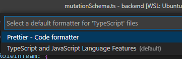

_The batteries-included guide to what UTS doesn't teach you_

This post is aimed at the majority of people who use a Windows machine and want to get into web development in 2022. Modern web development has some fairly common environment setups, and this guide aims to explain all the software you'd need to be on top of things.

This guide covers how to install:

*   VS Code (the most popular web development environment)
*   VS Code Extensions
*   WSL2 Ubuntu (WSL = Windows Subsystem for Linux, developed by Microsoft)
*   Node.js (using NVM)
*   Docker Desktop (for building your apps, as well as running database servers locally with ease)
*   Setting up SSH keys for Github

<!-- more -->

Visual Studio Code
------------------

VS Code is currently the most popular IDE (Integrated Development Environment) for web development. It supports writing code in basically all JavaScript-related web setups, and is fairly lightweight compared to many alternatives.

You've probably seen it before, it looks something like this:

Installing VS Code is fairly straightforward, via the [Official Website](https://code.visualstudio.com/).

Inside VS Code, there are a bunch of buttons on the left sidebar that you need to get familiar with. The most important ones are:

All of your files are located here

Extensions are installed through this tab.

Your Git information is here. If you want to view your changes or commit or push/pull, you can do it through this tab.

Depending on how you set up your project, this tab could be used to run your code. Although, you often skip using it for javascript development, depending on your setup.

### Extensions to install

Go to the extensions tab and install these extensions which are important for the guide:

This extension pack allows you to open VS Code from different environments, including WSL2 and Docker.

The most popular code formatting tool for JavaScript related projects 

After installing it, consider installing the following _optional_ extension that may make your life easier:

This extension lets you use VS Code kinda like Google Docs, where multiple group members can write code at the same time in the same file. This is very useful if you have tutorial classes where they expect you to get programming work done together and you can't just use Git.

Lets you open a folder as a HTTP live server with live reload. This is only useful for projects where you write pure HTML/CSS without Node.js, for subjects like WebSystems.

Add a lot of variety to the icons in your file explorer within VS Code. This extension is purely cosmetic but it's fairly nice to have. 

Shows a nice view of your git history, and on each line that you select in your files, you'll see some shadow text of when the line was last changed and by who.

Shows a graph view of your git history.

### VS Code Settings

Some nice settings to change. Most of these are optional, but are really nice to have:

The first setting at the top of VS Code. Set it to "afterDelay" to make VS Code autosave your files as you write. Some people don't like having this on, but most people I know prefer it.

If you ever find it annoying that you have a 2 space project but VS Code automatically inserts 4 space tabs instead, it's probably a good idea to change this setting. Although usually this isn't an issue.

Every time you press Ctrl+S, it will automatically format your code right before it saves. This means you don't have to press Ctrl+Shift+F each time, only Ctrl+S.

Also, to select Prettier as your default formatter, you need to open any Typescript or Javascript file inside VS Code, then while the file is open, do Ctrl+Shift+P to open the commands menu, then search for "format document with"

Configure the default formatter:

And select Prettier

Installing WSL2
---------------

WSL2 is basically like running a Linux virtual machine under Windows. However it integrates fairly seamlessly with Windows and was developed by Microsoft.

The simple way to install WSL2 is to go to the Microsoft Store (yes, that app you never use), and install Ubuntu:

If this doesn't work, or you already have WSL1 installed, try following this guide by Microsoft:

[

Install WSL

Install Windows Subsystem for Linux with the command, wsl --install. Use a Bash terminal on your Windows machine run by your preferred Linux distribution - Ubuntu, Debian, SUSE, Kali, Fedora, Pengwin, Alpine, and more are available.

Microsoft Learncraigloewen-msft

](https://learn.microsoft.com/en-us/windows/wsl/install)

If you have an older version of windows, make sure to look over this:

[

Manual installation steps for older versions of WSL

Step by step instructions to manually install WSL on older versions of Windows, rather than using the wsl install command.

Microsoft Learncraigloewen-msft

](https://learn.microsoft.com/en-au/windows/wsl/install-manual)

### Why Linux?

Linux has a much better experience for developers. For example, NVM (Node Version Manager) just works with no issues while on windows you need to enable admin permissions each time you want to use it. When you delete large folders, on Windows sometimes you get file lock issues (remember those issues where you can't delete a folder without restarting your whole computer for no reason, while on Linux it just works), which is especially good for node\_modules folders. Also, your code will likely run on a Linux server in production, so developing on Linux is nice to make the environment be the same.

### Ways to access WSL from windows

To get inside Ubuntu, you can:

*   Open "Ubuntu" via the start menu
*   Open CMD, then type `wsl`. Afterwards, type `cd ~` to get into your home folder.

### Important note!

When using WSL2, make sure you use the home folder `~`, instead of any mounted windows drives. Mounted windows drives will be really slow under WSL2, so make sure you only write code somewhere inside the home folder.

### What's WSL 1 then?

WSL1 was just an abstraction layer over Windows, kind of like Wine/Proton for Linux or Mac. This meant there was no virtual machine, and it had some limitations.

WSL2 is a proper virtual machine running under Windows's Hyper-V. This does mean that it doesn't have direct access to windows drives. They're mounted as samba partitions, which makes them really slow. Instead, it's recommended to program in the home folder `~` as that is purely managed by the VM and is really fast.

### Browsing your WSL2 files

When inside the WSL2 terminal, you can open Windows Explorer in the current folder by typing `explorer.exe .`, and the path would look something like this:

Or if you want to open VS Code in the current folder, then type `code .`

Installing Node (via NVM)
-------------------------

NVM (Node Version Manager) makes life really easy with balancing multiple node versions or just installing/updating node in the first place. The project can be found [here](https://github.com/nvm-sh/nvm).

To install the latest version of NVM, run the command on the project page, the command should look something like this:

After the command finishes, close the terminal, then open the terminal again. This refreshes the environment variables.

Then, run `nvm install 16` to install Node.js version 16, which is the recommended version as of 2022. If this command successfully runs, then everything is installed correctly.

### Install Yarn

Please use yarn instead of npm. It will make your life so much easier.

Anyway to install it, run `npm install -g yarn`, then after that you'll never need to touch npm again.

You'll have to run this command every time you install new node versions with nvm.

### VS Code extension

Install this extension to automatically run `nvm use` in your terminal when you open a new terminal. This will make sure that all new terminals use the node version specified in your `.nvmrc` file.

.nvmrc files look something like this:

They just store the node version for the project.

Docker Desktop
--------------

This is technically optional, but could be very helpful for your projects if you know how to use it.

ProgSoc is running a Docker workshop soon, more details about Docker will be added here after the workshop runs.

To install Docker Desktop, download and run the installer here on their [official website](https://www.docker.com/products/docker-desktop/).

After that, docker should just work in both Windows and WSL2. Verify that it works by running:

    docker run --rm hello-world

In both Windows and WSL2. The command should have this output:

Setting up SSH Keys for Github
------------------------------

SSH stands for "Secure Shell". It allows computers to talk to each other securely. Git supports using SSH to transfer data around, and currently using SSH keys is the standard way to authenticate with Github.

Here is a step by step guide for creating an SSH key and connecting it to github under WSL2:

First, start in the WSL2 home folder using `cd ~`. You likely don't have a .ssh folder yet, the easiest way to create one is by typing `ssh git@github.com` and then typing `yes` when it asks you.

Next, `cd .ssh` to go into the folder that was just created. You an open VS Code inside the folder by typing `code .`

Now you're in the folder. Run `ssh-keygen` to generate a key pair. Type `github` for the name, then press enter twice to skip the optional passphrase part.

You should have 2 new files in the folder: `github` and `github.pub`. The `github.pub` file is your **public key**, while the other file is the **private key**. Never share your private key with other people.

Now, you should go your user settings in Github, under the "SSH and GPG keys" section.

Press "New SSH Key", give it a title (can be anything, e.g. "laptop" or "main key" or anything else), then for "key" copy-paste the contents of the `github.pub` file. Then create your key.

Now, go back to VS Code.

Create a new file called `config` and copy paste this inside:

    Host github.com
        User git
        IdentityFile ~/.ssh/github

This tells SSH what key to use for authenticating to github.

Then, in the terminal, run `chmod 600 ./config` to secure the file. If you don't do that, SSH will complain that it is unsecured.

To make sure everything works, run `ssh git@github.com` again. If everything is correct, it should output:

Now, when cloning any github projects, make sure you use the SSH link rather than HTTPS:

Final notes
-----------

If there are any issues with following this guide, or if you feel like something important should be added or changed, feel free to ask about it on the ProgSoc Discord server.

Happy coding!
