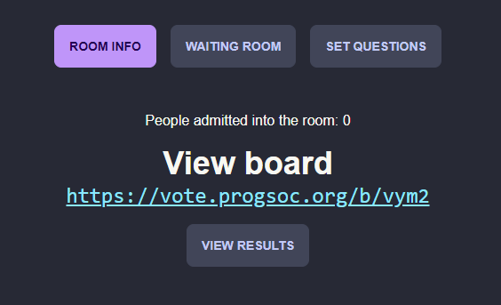
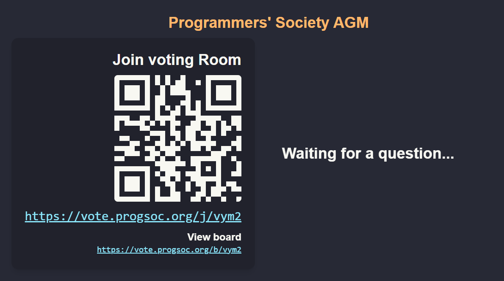
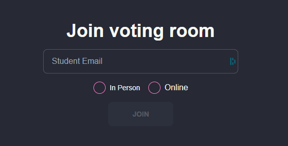
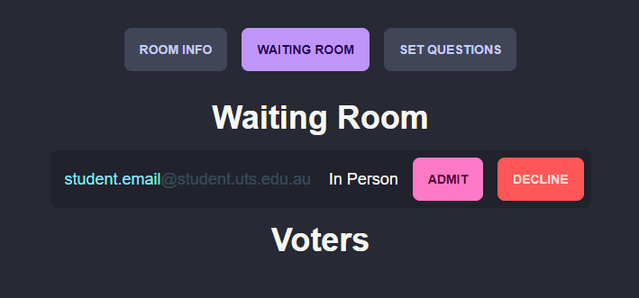
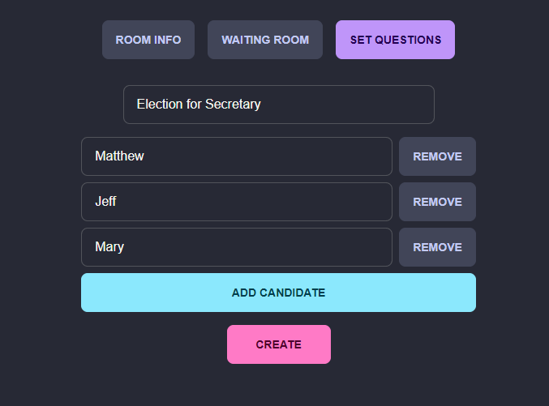
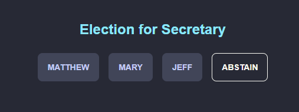
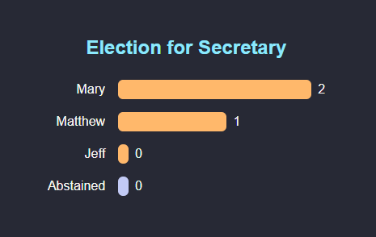
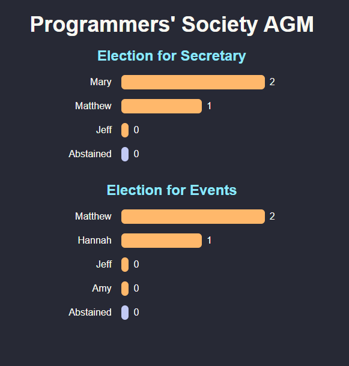

I've been asked to make a quick guide to using the voting system I've been developing. Keep in mind that there are still more features to add, and I will hopefully get most of it done before other societies' AGMs begin. But as of writing, the system works well and has been stress tested by a room of people.

How to use
----------

[https://vote.progsoc.org/](https://vote.progsoc.org/)

On the page, enter a room name and create it.

The view after creating a room

The "Board" is what the members should see. It contains the join link and the current room voting state.

Open the board on the projector and screen share (or just in a new tab if testing).

The board should have a join code:

Board page for the room

Let members join either via the link or the QR.

Members trying to join should see this page:

Voting room join page

Once members start joining, navigate to the "Waiting Room" tab in the admin menu. You should see members trying to join:

User waiting in the waiting room

When you press "Admit", the user will be added to the voting room. If you press "Decline", the user will be rejected, however, they can try joining again via the code/URL (it's impossible to prevent that). If a user is unintentionally admitted, it is possible to kick them after.

The "In Person" and "Online" options help you as an exec get a general feel for who's applying from where, so you can tell if the people applying are really present or they're fake.

After you're ready to start setting questions, navigate to the "Set Questions" tab and create a question:

Creating a question for the voters

 After the vote is created, the users may vote:

Users voting for the question

After that, you can end the question, and see the results:

Results of the vote

To view the results, click "View Results" on the room info page and all the previous questions will be shown:

Previous questions in the room

Currently there is no exporting mechanism other than taking screenshots, but that should be sufficient for the minutes anyway.

Bugs, Feature suggestions and Contribution
------------------------------------------

If you would like to report a bug, suggest features, or are interested in contributing, contact our executives in the ProgSoc Discord server, or contact me directly (Arduano#0481).
