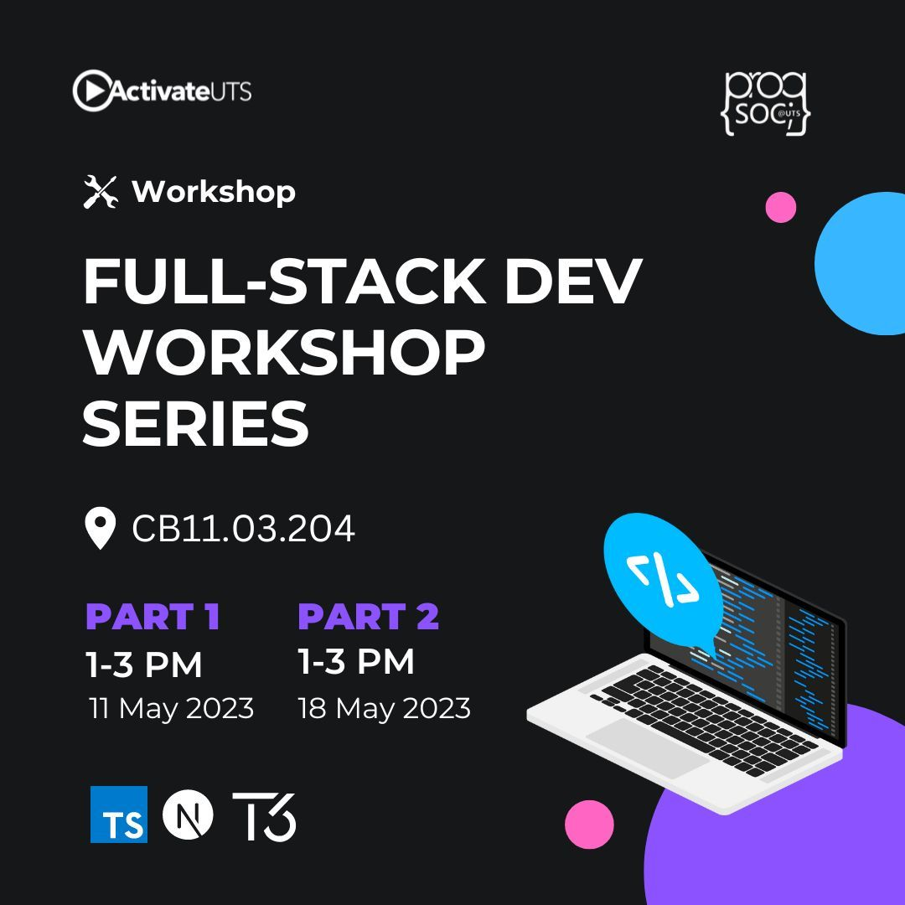
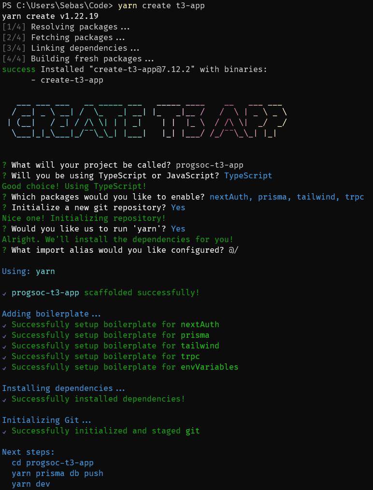
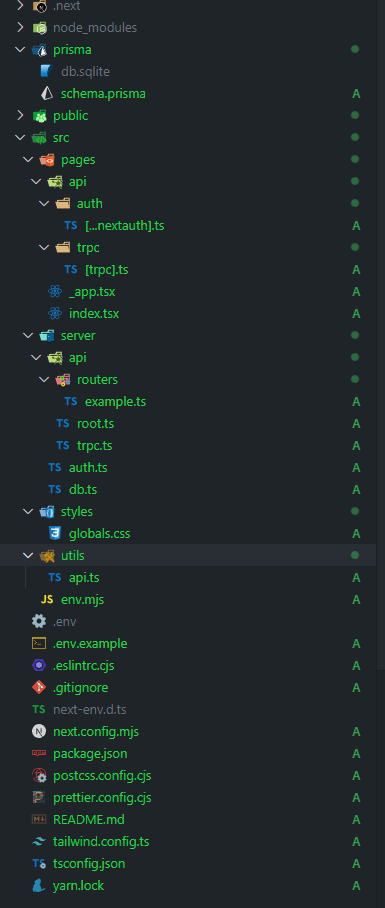

Intro
=====

Welcome to the ProgSoc T3 Workshop, in this workshop we’ll be learning how to build a full-stack application using common practices and modern tooling unlike you’ll find at UTS.

What You’ll Learn
-----------------

This describes the different goals of the workshop.

*   Project Structure
*   Using React
    *   Hooks
    *   Packages
    *   State Management
*   Processing data
*   Authentication
*   Connecting to a database and CRUD
*   Application Styling

Picking an Idea
---------------

In the second part of this workshop, we’ll look at developing our own application using the concepts talked about above. What’s important to do is to choose what type of application you would like to develop.

If you’re stuck for ideas here are a few:

*   **Guestbook** - Basically a page where people can post a short message after signing in and people who aren’t signed in can see the list of messages on a guest book page.
*   Todo - The classic starter project. A page that has a list of to-do items belonging to a specific user.
*   **Notes** - A note-taking application where a user can create a note (similar to google keep or apple notes)

Links
-----

Links to different tools and libraries that our project is going to use.

[Create T3 App](https://create.t3.gg/)

[Next.js by Vercel - The React Framework for the Web](https://nextjs.org/)

[React](https://react.dev/)

[Download | Node.js](https://nodejs.org/en/download)

[Introduction to Git](/blog/intro-to-git/)

[NextAuth.js](https://next-auth.js.org/)

[Prisma | Next-generation ORM for Node.js & TypeScript](https://www.prisma.io/)

[tRPC - Move Fast and Break Nothing. End-to-end typesafe APIs made easy. | tRPC](https://trpc.io/)

Table of Contents
=================

Pre-Workshop
============

[Modern Web Development: an installation guide](/blog/modern-web-development-installation-guide/)

ProgSoc Ultimate Web Development Setup Guide.

Thanks Leo!

There are a few things that you need to install in order to get a running start with this workshop. It mostly consists of having the basics like Git and VSCode installed and set up.

If you haven’t set up git already with GitHub then take a look at the introduction to git workshop linked above.

As part of the development process installing NodeJS and npm is also a requirement. This can also be done by following the download like above.

After you’ve done that please make sure to install `yarn`, the preferred package manager for NodeJS packages (similar to rust crates or libraries).

Once `Yarn`, `Nodejs`, `Git` and `VSCode` are installed and ready for development you’re good to continue.

💡 \*\*Optional:\*\* If you’re on Windows you can opt to use WSL by following the Modern Web Development installation guide linked above.

Project Setup
=============

For this workshop, we’re using the `T3 stack` which is a combination of different packages and tools that try to streamline the creation. For this project we’ll be looking at all the different features that `T3` can setup for us. Including Authentication, Database, Styling, and API communication using `tRPC`.

    yarn create t3-app
    

This should result in a nice walkthrough where you can select the features you want to include in your application.

Here I’ve chosen nextAuth (Authentication), Prisma (Database ORM), Tailwind (Styling) and tRPC

File Structure
--------------

Once you’ve opened VSCode or your chosen editor in the folder you should see something like this:

Here we can see a few different folders and files that follow the names of the tools we’re using for this project.

At the top, we can see our `prisma` folder which contains our `sqlite` database and the config.

Beneath that, we can see the `api` folder. This is where NextJS reads all your API code from. You shouldn’t need to worry about this too much as it’s all abstracted elsewhere.

In the same folder as `api` we can also see `index.tsx`. This file contains the code for the User Interface portion of the app.

In our `server` folder, we can see the actual server code for our application including an example `router` that defines the different `endpoints` for our application.

The `auth.ts` and `db.ts` contain prewritten code for connecting to our database and configuring our authentication out of the box for our application.

Below that are our `styles` and `utils` folders which are pretty self-explanatory.

The rest of the project at the top level are different configuration files for different developer tools like `ESLint` and `Prettier` for code `linting` and formatting.

The Stack
=========

tRPC
----

### What is RPC?

If you’ve ever looked at game or API design in depth you might have come across RPC (Remote Procedure Call). Though API design doesn’t specifically use `tRPC` (TypeScript RPC) it normally uses gRPC or similar.

RPC generally means that your frontend application instead of calling an API route calls a function, not a route. This means that the function call on the client needs to know which values to send to the server in order to run the function.

### Introducing tRPC!

This is where `tRPC` comes in. Because we’re using TypeScript on both the client and the server for our application we can export only the `Type` from the server, meaning that our server code isn’t exposed to the client but the data it requires is.

As a result, we can use the same set of variables on the client as is exposed on the server.

Another thing that can help us with this is `zod` which is a package that performs schema validation. It will make sure that the input data follows a certain set of rules. e.g. password is greater than 10 characters or email matches a certain _regex_ pattern.

This allows us to easily link what’s happening on the front end of our app to what we want to do on the back end.

[tRPC - Move Fast and Break Nothing. End-to-end typesafe APIs made easy. | tRPC](https://trpc.io/)

Database (Prisma ORM)
---------------------

Every good application has a database behind it. In most cases, this will be hosted separately but for this demo, we’ll be using SQLite (a file-based database).

If you’ve done `Database Fundamentals` you might know that SQL databases typically use a special syntax to create, read, update, and delete database entries. Sadly not everyone has the time to learn special database syntax and then use it in their code.

This is where an ORM like Prisma comes in.

An ORM allows us to easily define a database schema and then use a set of functions and classes to perform database operations.

Here is the default configuration that we’re provided with for this project.

*   Here we can see the configuration options as well as the entire relational database schema.
    
        // This is your Prisma schema file,
        // learn more about it in the docs: https://pris.ly/d/prisma-schema
        
        generator client {
            provider = "prisma-client-js"
        }
        
        datasource db {
            provider = "sqlite"
            // NOTE: When using mysql or sqlserver, uncomment the @db.Text annotations in model Account below
            // Further reading:
            // https://next-auth.js.org/adapters/prisma#create-the-prisma-schema
            // https://www.prisma.io/docs/reference/api-reference/prisma-schema-reference#string
            url      = env("DATABASE_URL")
        }
        
        model Example {
            id        String   @id @default(cuid())
            createdAt DateTime @default(now())
            updatedAt DateTime @updatedAt
        }
        
        // Necessary for Next auth
        model Account {
            id                String  @id @default(cuid())
            userId            String
            type              String
            provider          String
            providerAccountId String
            refresh_token     String? // @db.Text
            access_token      String? // @db.Text
            expires_at        Int?
            token_type        String?
            scope             String?
            id_token          String? // @db.Text
            session_state     String?
            user              User    @relation(fields: [userId], references: [id], onDelete: Cascade)
        
            @@unique([provider, providerAccountId])
        }
        
        model Session {
            id           String   @id @default(cuid())
            sessionToken String   @unique
            userId       String
            expires      DateTime
            user         User     @relation(fields: [userId], references: [id], onDelete: Cascade)
        }
        
        model User {
            id            String    @id @default(cuid())
            name          String?
            email         String?   @unique
            emailVerified DateTime?
            image         String?
            accounts      Account[]
            sessions      Session[]
        }
        
        model VerificationToken {
            identifier String
            token      String   @unique
            expires    DateTime
        
            @@unique([identifier, token])
        }
        
    

By defining the schema like this in a single file it allows Prisma to automatically manage migrations and the code it generates.

This makes it relatively easy to create your own database and use it in your code.

For example, in this file, you can see `prisma.example.findMany()`

    export const exampleRouter = createTRPCRouter({
      hello: publicProcedure
        .input(z.object({ text: z.string() }))
        .query(({ input }) => {
          return {
            greeting: `Hello ${input.text}`,
          };
        }),
    
      getAll: publicProcedure.query(({ ctx }) => {
        return ctx.prisma.example.findMany();
      }),
    
      getSecretMessage: protectedProcedure.query(() => {
        return "you can now see this secret message!";
      }),
    });
    

This example will find all items in the `example` table in the database.

In this instance, our database is also storing our session information and our users that log into the application.

Authentication & Authorization
------------------------------

### Intro

Authentication is essential for any application on the internet as users normally have to be able to use an account to sign in with a service and identify them. Using NextAuth we can setup basic authentication including sign-in and signup pages using different services that expose an `OAuth` API.

### NextAuth

In the above example, you may have noticed `protectedProcedure` which is a protected Remote Procedure Call that is only allowed if the user is logged in.

In this case, our authentication is managed by a library called `NextAuth` which is linked to above in the links section.

It manages the configuration for different authentication providers like GitHub or Discord (Project Default). It also connects to our database and stores important information like the users’ access and refresh tokens. Allowing us to get certain details about the user when they sign in.

What this also allows us to do is make sure that only certain people with certain roles can perform certain actions by _protecting_ procedure calls as seen above.

Because it was designed to work with NextJS NextAuth also exposes several useful functions that we can use to tell if the user is authenticated or not.

### Authentication vs Authorization

Though these two words are very similar they couldn’t be more different.

**Authentication** is making sure a user is who they say they are whereas **Authorization** is making sure that a user has permission to perform certain actions.

In the default template, we’re not doing any **Authorization** but we are doing Authentication. If we wanted to do Authorization then we might make it so that a user has a role depending on the permissions that they should have. e.g. `staff`, `admin`, or `customer`.

UI & Styling
------------

When it comes to making an application there are many different options when it comes to making a user interface. Some of these include:

*   React
*   Svelte
*   Solid
*   Vue
*   Angular

In this case, we’re going to be using ReactJS as it’s the easiest to get started with out of the box.

Last year I ran a React workshop and dove relatively deep into state management and how data is passed throughout the application. We’re not going to be diving too deep into that in this workshop as NextJS and tRPC are going to handle a lot of that for us.

[React Workshop](https://www.notion.so/React-Workshop-71b3a82705364357ac14d3e131f0e1f0)

### React

React is a framework for Client and Server applications used to make websites more interactive.

Using a traditional approach in vanilla javascript you might get the element by Id and update what’s inside it.

This can become tedious when there are many different pages that use the same set of components. React allows us to create reusable sections of code called “Components”. A component can include logic that allows us to change how it behaves. e.g. a to-do item component might allow us to edit the text inside it and delete/update it.

React will also handle UI updates. So if a bunch of different components in the app all update at once it’ll make them part of one large batch update. This handling of dynamic data is typically called _state_.

In a React component, you can use HTML elements like you normally would in an HTML file as well.

### NextJS

NextJS is a full-stack framework that _**extends**_ React’s default behavior with advanced techniques and tools. It has the ability to do not only everything that React is capable of but even more through the use of its parent company’s (Vercel) CDN and API/Edge routes.

This allows us to make an API for our NextJS app without having to deploy a separate service.

Another advantage of having a CDN and Framework like this tied so closely together is that the framework can allow for all sorts of custom features. Chief among them is **Server Side Rendering**.

### Server Side Rendering (SSR) vs Client Side Rendering

When you look at a website on the internet the odds that it’s rendered server side are quite high. An example of pure Server Side Rendering is PHP-based sites like WordPress. They do all the checks and work on the back-end and then send the result to the user. No processing happens on the user side of the link as it’s all rendered on the server.

On the other hand, you have client-side rendering where the server sends the raw data to the client and the client does all the processing to figure out how to display that data.

The main benefit of SSR over CSR is that it makes the site a lot faster. Rather than waiting on a bunch of JavaScript to render your content on your browser, you can get your server to do it much faster and with fewer loading spinners.

In the context of NextJS, it sends the first page you go on using SSR so the first load is really fast, then because that page is already loaded it loads the rest of the code for other bits of the site in the background, this creates a really responsive site that loads really fast initially then seems to load almost instantly as you move around different pages.

### Styling Using Tailwind

When it comes to making your HTML look pretty and giving boxes nice rounded corners and a nice colour scheme you typically learn to use CSS but if you want to make it easier to experiment without having to swap between files often you can use TailwindCSS.

It takes all the properties you would normally use in a CSS file and makes each one into its own class. You can then combine them to style your components.

[https://tailwindcss.com/](https://tailwindcss.com/)

Building your application
=========================

💡 Make sure you have NodeJS, Git and Yarn installed (instructions above)

Now that we’ve covered all the different components of our application we can start to put them together.

You might’ve already noticed but T3 stands for TypeScript, Tailwind and tRPC.

To get your own copy of the template all you need to do is run the command below:

    yarn create t3-app
    

This should bring you to a wizard where you’ll select the different components that you want to use.

After the install wizard has completed follow the steps at the end to install the project’s dependencies and start up the dev server with

    cd <projectName>     # Go into the right folder
    yarn prisma db push  # Initialise your database
    yarn dev             # Start the development server
    

From here if you open `[http://localhost:3000](http://localhost:3000)` in your browser you should see the default configuration running.

By default the application is configured to allow login through Discord but by changing the `auth.tsx` file you can choose whichever authentication provider you want be it Email, GitHub, or any number of different solutions found in the extensive list here:

[https://next-auth.js.org/providers/](https://next-auth.js.org/providers/)

Most of the projects that you’ll create will use the credentials provider [https://next-auth.js.org/providers/](https://next-auth.js.org/providers/)

This provides a simple username-password login and, when combined with the email provider allows a user to connect their own email address to their account.

There are a few limitations to using a pre-fill authentication solution like this. Chief among them is that custom fields may not be added to the login process. e.g. Address or DoB.

What this does provide however is a simple setup for most applications that require authentication.

Appendix
========

*   **T3** - [https://create.t3.gg/](https://create.t3.gg/) - A starter template for a full-stack application
*   **Stack** - Combination of different technologies normally consisting of an OS, database, API layer, and client.
*   **Git** - Source control software for managing code versions
*   **tRPC** - Type-Safe communication between your API and your client
*   **RPC** - Remote Procedure Call
*   **NextJS** - Web Development Framework based on React
*   **Yarn** - Package Manager
*   **NodeJS** - A runtime that allows us to run JavaScript outside of the browser
*   **TypeScript** - Basically enhanced JavaScript that has stricter rules that prevent errors during the development process.
*   **Zod** - Schema Verification. Making sure inputs like forms follow certain rules.
*   **Tailwind** - UI Toolkit
*   **TSX** - TypeScript React Files that allow the use of React Components.
*   **TS** - TypeScript files (cannot use React components)
*   **Linter** - A tool that makes sure your code follows certain formatting rules
*   **ESLint** - A linter for TypeScript and JavaScript files
*   **Prettier** - A code formatter
*   **Prisma** - Database ORM (Object Relational Mapping) that allows us to connect and communicate with our database in code.
*   **ORM** - Object Relational Mapping
*   **Regex** - Short for regular expression is _a sequence of characters that specifies a match pattern in text._
*   **SSR** - Server Side Rendering. Send only html without javascript to the client.
*   **SQLite** - A light version of SQL that writes to a file instead of an installed database. Useful for non-production environments.
*   **OAuth** - Authentication Protocol for integrating authentication into 3rd party apps. e.g. Login with Google or Login with Discord.
*   **Component** - A Reusable Section of React Code
*   **State** - An object that holds data that determines how a component renders and behaves. State is used to manage dynamic data in a component and allows the component to update its rendering based on changes to the data.
