Before going into hooks, let's first have a quick recap of the basics of React:

*   React components are functions that take in props and return HTML-like fragments
*   Props are the arguments to a component, which look like HTML attributes.
*   The component function is called every time the component re-renders
*   Components choose to re-render when their parent component re-renders, or when their state updates (when a useState's "set" function is invoked).

<!-- more -->

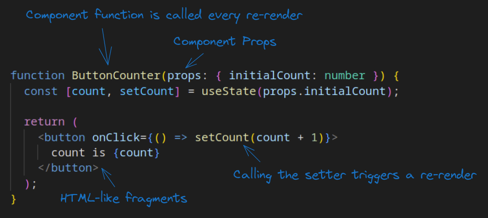

Then the component can be used like this:

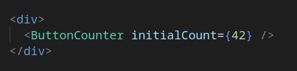

What is a hook?
---------------

A react hook is a function that "hooks" into a component's lifecycle-related data. Functions themselves are generally stateless, while hooks provide ways of storing a state and other component-related data. You can make your own hooks by making a function that uses and combines other hooks internally. Here is a simple example of a custom hook:

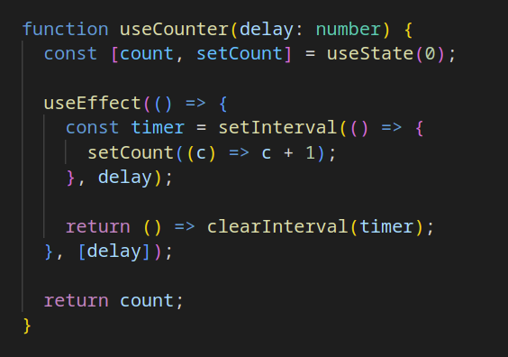

This custom hook combines useState and useEffect together to increment the count (and re-render the component) every `delay` milliseconds. If `delay` changes, then the timer is cancelled and a new one is created with the new delay.

Each hook contributes something to the lifecycle-related data stored for the component. In the above example, the following lifecycle data is stored:

*   useState stores the current count, re-rendering the component when it changes
*   useEffect stores the current delay, calling the clear/set functions again whenever the component re-renders with a new delay

Primitive hooks
---------------

Many of the hooks you use in React will be custom hook functions that use other hooks under the hood. However, there are a set of "primitive" hooks which React uses to build up everything above. Some are fairly simple, and some are a bit more advanced.

The most important hooks are:

*   **useState:** used to store basically any state updates to the component. It is used when a component has any interactive state that may change during its' lifetime.
*   **useEffect:** invoke extra code based on updates to a component's data. It is used to manage the lifecycle of any "effects" that the component has, e.g. subscribing to external events or sending network requests.

And some more advanced hooks include:

*   **useMemo:** memo-ize data to not have to generate it each time a component is invoked. It is used to help cache data that we don't have to re-calculate every render.
*   **useRef:** the main use for useRef is to store and have access to a component's instance easily, for example a `<canvas/>` or any other component that requires direct access to use. However, useRef can also be used to store a mutable state without re-rendering the component.
*   **useContext:** use react's Contexts API to recieve and share data with parent components. This is mainly useful when you have some global data that needs to be shared between many components automatically, useContext lets you listen in on that data.

In this guide, we'll explain how hooks generally work, explaining the most important hooks in detail, and briefly mentioning the more advanced ones.

How hooks work
--------------

For each component, primitive hooks create a list of stored data within each component instance. Any custom hooks (e.g. useTransition in the example below) end up calling primitive hooks under the hood.

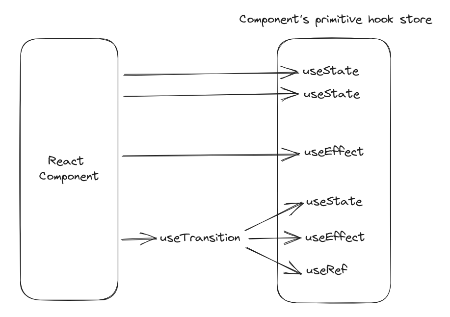

The primitive hook store is initialized when the component renders for the first time, and then returns appropriate values on each subsequent render.

If you change the hooks that are called on a subsequent render, React will give you an error:

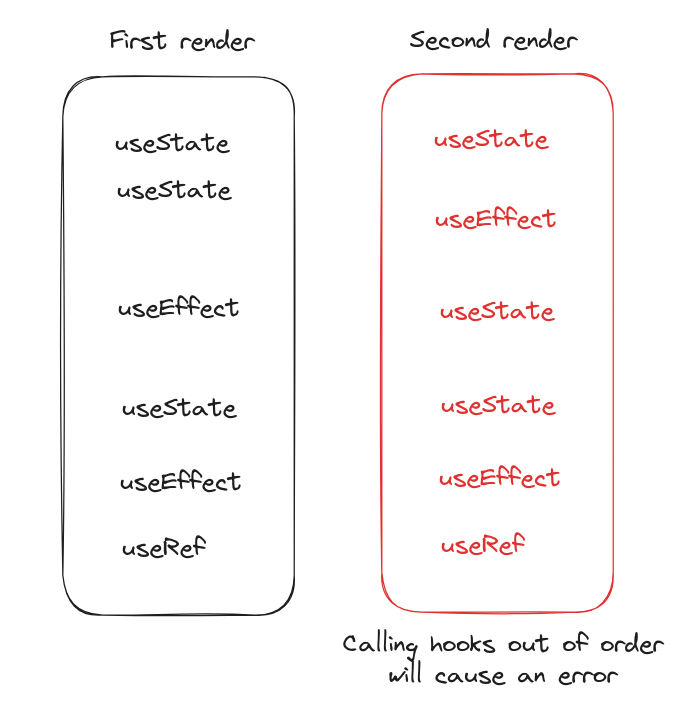

In order to better illustrate the point, here is a practical example of what happens when you call different hooks on different renders:

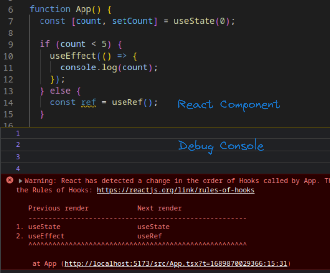

useState
--------

This is probably the most important hook in React. It is also the only hook that can trigger a re-render of a component.

useState takes the initial value and returns 2 values: the current value and the setter function.

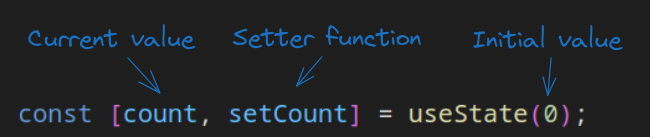

Each time the setter function is called with a new value, a re-render of the component is triggered.

#### The setter function

There are 2 ways to call a setter function:

*   By passing in the new value
*   By passing in a function that immediately gets called with the old value, and the returned value becomes the new value

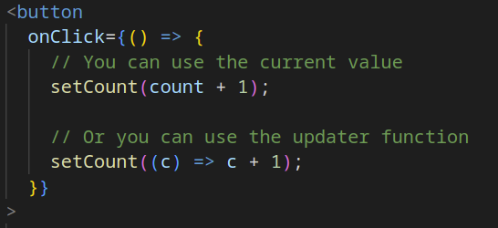

If react sees you passed in **any** function to the setter function, it assumes it's an updater function and calls it with the old value as the argument.

Using updater functions is more advanced, but it's preferred in some more complex scenarios where functions are cache'd and don't constantly update. This will be further explored in a future blog post.

When updating a state, you must pass in a new value that's not the same as the old one. That is easy for things like strings and numbers, but it's more complex for arrays and objects. Modifying an existing array/object would not change the reference, so instead, it's best practice to create a new array/object each time it needs to be updated. Here is an example:

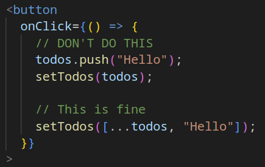

Doing `[...todos, "Hello"]` creates a new array that contains the same elements as the old one, along with "Hello" at the end.

useEffect
---------

useEffect is a fairly advanced hook while also being one of the most important ones, hence it being the second in the list. It does so many things while also being very easy to mess up, making some people refer to it as useFootgun. But it's still a critical component of React, and thus important to know.

useEffect contains 3 main components:

*   The setup function (the first argument to useEffect). That function is called after all the components finish rendering.
*   The teardown/cleanup function, which is returned by the setup function. It is called whenever the current setup function becomes invalid, e.g. when the component unmounts or when the dependencies change.
*   The dependencies array, which contains a list of values that the current useEffect instance "depends" on. Setting dependencies to `[]` would make useEffect only be called when the component mounts, and never again. If at least one value in the dependencies array changes on a re-render, the old teardown function and the new setup function are called.

It is also possible to completely omit the dependencies array, but in 99% of cases, **avoid doing that** as it would make useEffect get called on every single re-render, which is almost never useful. It's easy to forget to add the dependencies array, and that will cause annoying to find bugs. **Always** make sure to include a dependencies array, even if it's just `[]`.

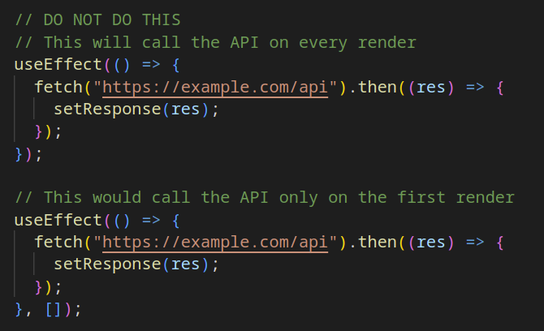

Here is another more practical example of useEffect in action:

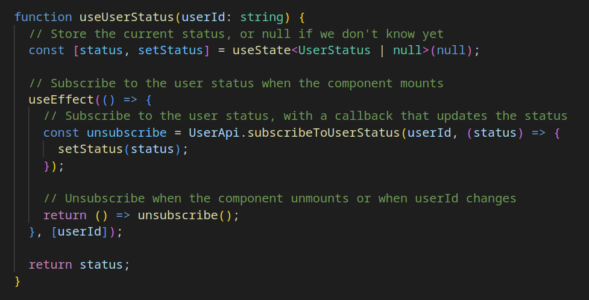

useMemo
-------

useMemo is a hook that helps memo-ize (cache) some state so it doesn't have to be re-calculated every render. The main use case is for doing expensive calculations in a component that frequently re-renders. useMemo only re-calculates the expensive calculations when the dependencies change.

useMemo takes in a "factory" function which performs the expensive calculations, returning the final value. It also takes in the dependencies that the calculations depend on. The factory function is only called when the component mounts or when the dependencies change. On every other render, it will return the last memo-ized value without computing anything.

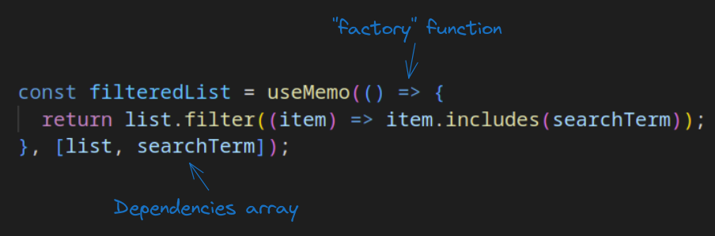

Here is a basic example of useMemo in practice:

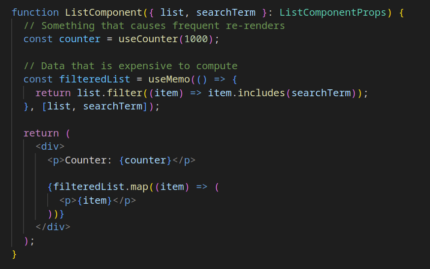

Calling `list.filter` with `item.includes` on a very large list can be fairly expensive to compute. The component would re-render at least once per second due to useCounter, so we want to avoid unnecessary computation. Adding useMemo there would only calculate the filtered list when either `list` or `searchTerm` changes.

useRef
------

useRef returns the same object on each render which contains only 1 field: `current`. This means that we can have a reference to a variable that can be updated from many different places.

As mentioned before, useRef has 2 uses:

*   Storing a reference to a HTML element for future use
*   Storing a mutable variable that doesn't cause component re-renders. Make sure you're very familiar with how javascript's references work, especially between multiple function calls, before using it for this use case.

The use cases are fairly distinct, so I'll explain them separately.

#### Storing an element reference

All HTML elements have a prop called `ref`, where you can pass in the value of a useRef hook, and it will automatically set its value into there. Then the value can be used anywhere else in the component to directly interact with the element.

For example, here is a component that contains a text input and a button, and when the button is pressed, the text input gets focused:

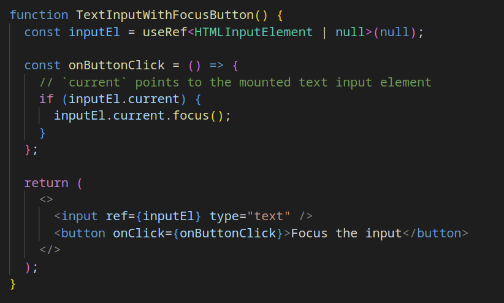

#### Storing a mutable variable

Sometimes (in more advanced cases) you need to store a variable in a component that persists between re-renders. In the below example, an interval handle is stored in a useRef variable as we don't need to re-render the component to update it, because the component doesn't show the current state of the timer. We'd need to use useState if we wanted the component to also show whether the time is started/stopped, but again, this is only useful for more specific and advanced use cases.

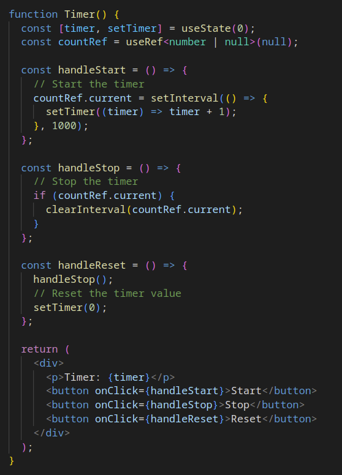

We can guarantee that the component doesn't need to re-render when `handleStop` is called, because nothing in the UI actually needs to update when the timer is stopped, we just need to change the internal state without re-rendering.

useContext
----------

Although being fairly advanced to use, useContext is a fairly useful hook for storing and recieving data that is shared to all child components. I'll only explain it briefly as it's a fairly deep rabbit hole on its own.

Here is a step by step example of how to create a React context:

1.  Create the state for the context. The state can contain both data and functions.

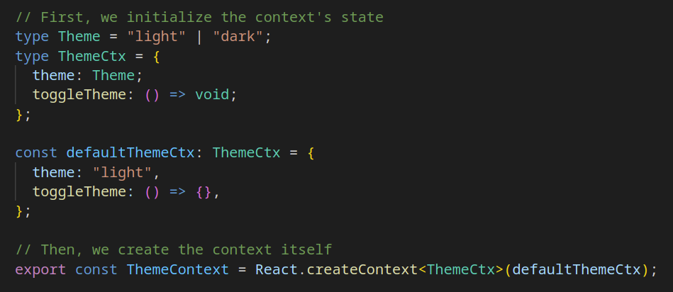

2\. Create the context's provider component. This component manages the context's state and uses the `.Provider` component to send the context to all children.

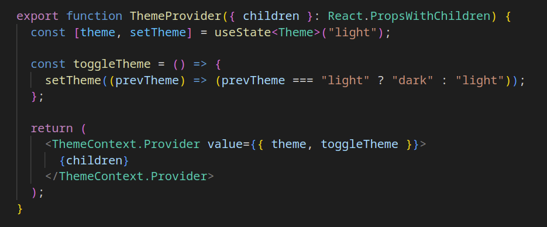

Keep in mind that this is not the most optimal way of organizing this component. I've omitted some extra details for brevity.

3\. Add the provider to your app (or any other root-level component)

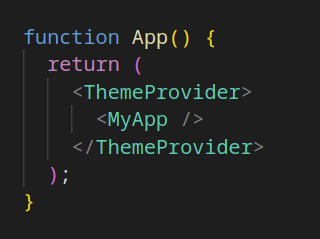

4\. Use the context using useContext

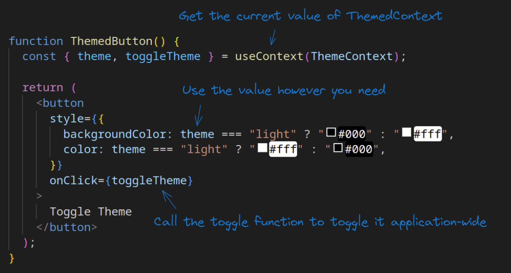

When `toggleTheme` is called, it actually calls the function we defined in `ThemeProvider`, which in turn calls `setTheme`, causing a re-render of both the provider and the rest of the application that depends on the context.

A more in-depth guide to useContext can be found on [React's documentation](https://react.dev/reference/react/useContext).

Summary
-------

This should cover 95% of use cases for React hooks. Although there are some more advanced hooks that you may see in larger codebases, they are way out of the scope of this tutorial.

I hope this introduction was easy to read. If there's anything confusing or if you have any further questions, feel free to ask in our Discord server!
