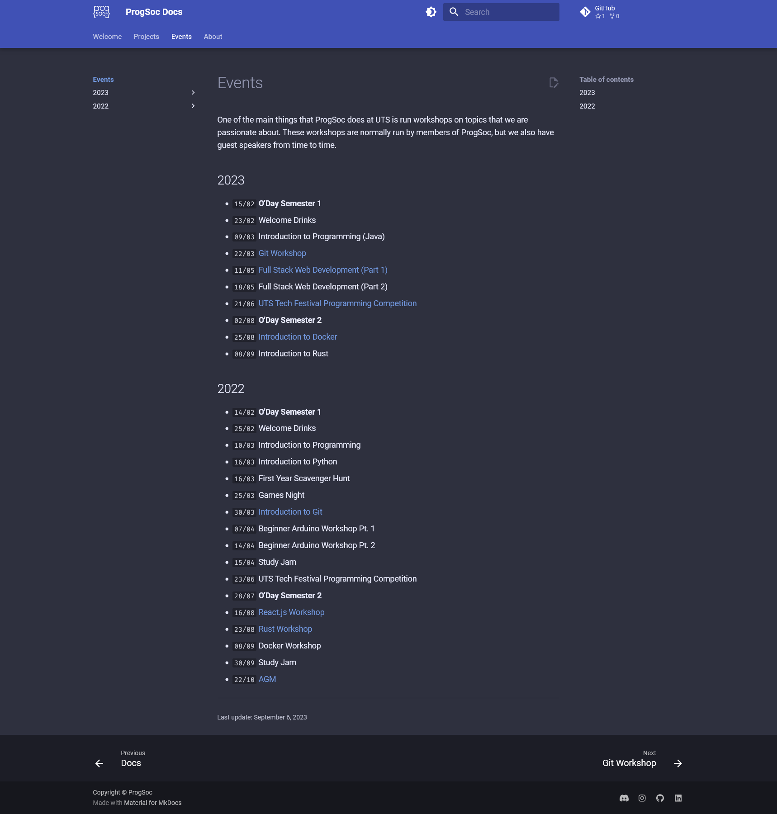

As you might have seen, our society has a rich history, mostly preserved on [https://oldarchive.progsoc.org](https://oldarchive.progsoc.org). Due to the loss of the dedicated ProgSoc space a little less than a decade ago, we no longer host them on our own servers.

Instead, everything ran on Digital Ocean VPS'. This became quite expensive as time went on and the massive ~200-300 GB of data was hard to store. As a result, Leo created a tool that scraped all the pages of the wiki and served whatever it found. This is how we keep costs down and still have the old versions of the wiki.

<!-- more -->

But, as a society that revolves around programming we need to have our documentation _somewhere,_ over the past year or two it's been on this blog. But as we've discovered blogs aren't ideal for documentation.

That's why we're trying something new.

The Events page on the docs

[https://docs.progsoc.org](https://docs.progsoc.org)

Generated from static files on GitHub by the widely used Mkdocs documentation system it allows us to easily add new things just by editing some Markdown files. If you want you can even contribute by creating a pull request.

Hopefully, as time goes on more of our stuff will be available in the docs, including old workshops, guides and projects that currently reside on this blog.

If there's anything missing feel free to let us know on Discord as we're always trying to make improvements as time goes on.
