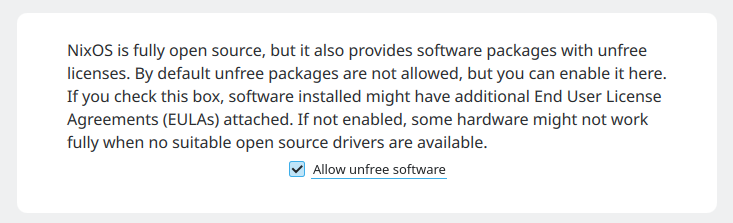
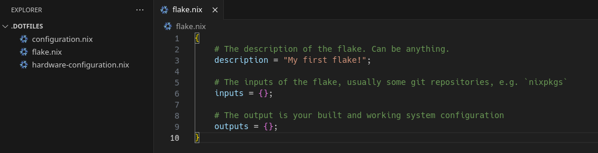

Hey! This is a bit of a weird post for ProgSoc to make, but I've been trying to learn NixOS and have been frustrated with the fragmented information about how to get started, especially with the new "flakes" beta feature that Nix is slowly transitioning over to.

This post serves as:

*   Me documenting my own journey to setting up a VM with desktop NixOS
*   A reference for myself when I decide to make NixOS my host OS, and for anyone else reading this :)

I won't go into much explanations for why NixOS is great, I'm sure you've seen too many of that if you're landing here after trying to find a basic how-to guide.

I assume you have a strong familiarity with Linux concepts, and you're familiar with the general idea of Nix, and you're comfortable with virtual machines (I'll be using qemu/VMM).

**Disclaimer:** This post is largely based on [this video](https://www.youtube.com/watch?v=ACybVzRvDhs), with me closely following along. I've already had some minor experience with Nix though (and attempting to boot NixOS), so I'm inserting my own experience in places as well.

But why NixOS anyway?
---------------------

I mentioned above I won't go into too much detail, but TL;DR: **reproducible and transferrable modular system/software configs**.

Let's say you've been forced to install VMware by some university subject, or you need to install an aarch64 cross-compiling pipeline for some project, or any other arcane install that pollutes your root partition with a LOT of random packages and services. In NixOS, you can isolate that all to a single flake (or even just a single line), and then Nix will perform all of that building/installation for you. If you fucked up and want to revert, that's a single command. If you have been using it for a few months and want to remove it, that's as simple as deleting the line, or the reference to your flake, and then re-building.

Getting started
---------------

First, downloaded the ISO file for NixOS from [their downloads page](https://nixos.org/download), specifically the graphical Plasma Desktop one.

Then, I created a vanilla virtual machine in VMM, with like 16GB of RAM and 8 CPU cores (possibly overkill for this, but why not). I added a 250GB disk.

Fun fact, you can create a non-preallocated disk with the following command:

    qemu-img create -f qcow2 -o preallocation=off <disk>.qcow2 <size gigabytes>G

Then, I followed the graphical installer to setup the system as desired.

**Important:** Make sure you "allow unfree software" during the installation to be able to download things like Steam and VSCode and other unfree stuff. This can be changed with 1 line later, but it's easier to do it here.

Checkbox to allow unfree stuff in the installer

If your installation gets stuck at 46% "Installing NixOS", that's normal. Click the terminal icon on the right to see the logs.

This is normal

Getting familiar
----------------

Once you're in, the 2 most important files you'll have are:

*   `/etc/nixos/configuration.nix`
*   `/etc/nixos/hardware-configuration.nix`

These files basically dictate the root of your system configuration.

**Important:** Be careful when touching `hardware-configuration.nix` as it contains system-specific configurations, usually generated for your install. `configuration.nix` is more general though.

### Installing packages

First, you'll need to install basic packages for working with your system. Use `sudo nano` to edit your `configuration.nix` file (vim isn't installed yet), and navigate to the following lines:

System package configuration within configuration.nix

You can uncomment the lines there, and also add any other basic packages you'd want to have system-wide for now. You can find the full list of NixOS packages on [their package repository](https://search.nixos.org/packages).

You can also add user packages to the list here:

User packages list, along with the rest of the user config

I've added `vscode`, and things like `google-chrome` and plenty of other packages are also available.

And while you're at it, set the hostname too (it will be used later):

Setting the hostname of the machine

Now, it's time to re-build your system.

    sudo nixos-rebuild switch

It's that simple! It's not even at the shell level either, all other open shells get the new environment too. This creates a new "generation" of your system, so you can always roll back with:

    sudo nixos-rebuild switch --rollback

You will also see all the "generations" of your system in your boot manager, e.g. grub.

**Important:** Make sure you reboot your system to propagate the hostname change, otherwise you may have errors later. Most rebuilds don't need a reboot, but some system-level changes still require one.

### Enabling beta features

Because we're using flakes, we need to enable some beta features (as of writing).

Include this in your `configuration.nix`,

    nix.settings.experimental-features = ["nix-command" "flake"];

Location of where I placed my experimental features flag

And of course, rebuild again via `sudo nixos-rebuild switch`

Starting on Flakes
------------------

This part of the post closely follows both the video, as well as the [official NixOS flakes tutorial](https://nixos-and-flakes.thiscute.world/nixos-with-flakes/nixos-with-flakes-enabled). When in doubt, consult either resource.

Make a folder in your home directory called `~/.dotfiles`. The name doesn't matter, but this name seems to be the convention.

Copy your `/etc/nixos` configuration into the folder.

    cd .dotfiles
    cp /etc/nixos/configuration.nix .
    cp /etc/nixos/hardware-configuration.nix .

Then, create a `flake.nix` file in this directory as well.

`flake.nix` files are like modular configuration entities, and when you use them, they create/use a `flake.lock` file as well which locks dependency versions/hashes for you, for truly reproducible environments.

You can begin editing the flake, but I'll explain more about that in the next section. For now, here's a basic overview of the folder and the flake structure:

Overview of the flake structure, and the files in the .dotfiles folder

### Configuring your flake

Let's start with inputs. A good input to include in all flakes is `nixpkgs`, which will give your flake access to all the official nix packages. You can do that by doing the following:

    inputs = {
        nixpkgs.url = "github:NixOS/nixpkgs/nixos-unstable"
    };

Keep in mind that in the Nix language:

    # This syntax
    {
        nixpkgs.url = "some url"
    }
    
    # Is equivalent to this:
    {
        nixpkgs = {
            url = "some url"
        }
    }

Also, deconstructing the `github:` protocol, the format is `github:<org>/<repo>/<branch>`. So [here](https://github.com/NixOS/nixpkgs/tree/nixos-unstable) is the link to the github repository referenced in the above config.

Also, optionally, you can omit the `github:NixOS/` part of your URL, because Nix hardcodes the repository location of `nixpkgs` for convenience.

Now, we do the outputs.

In the output, we need to output our resulting NixOS configuration. However, You can do this by referencing the copied configuration file like so:

    # The output is your built and working system configuration
    outputs = {
      nixosConfigurations = {
        # Hostname used here!
        arduano-test-vm = lib.nixosSystem {
          system = "x86_64-linux";
          specialArgs = {inherit inputs;};
          modules = [ ./configuration.nix ];
        };
      };
    };

Notice that it's plural Configuration**s**, not Configuration, because you can reference multiple configurations, one for each hostname. Also, `lib.nixosSystem` is a function with the configuration being passed in as input.

In the Nix language, function calls are done without parentheses, similar to Haskell. So when you see `<some value> <some other value> [maybe another value]`, then the first value must be a function and the other values separated by spaces would be the arguments.

If you try to check the flake now, you get the following error:

`lib` is missing when building

(technically the above command isn't the right one either, but )

One thing I omitted so far, is that `outputs` is actually supposed to be a **function**, not an object. It takes the state as parameters, and returns the new state.

To make it a function, we need to add the following:

Added function signature

`{}:` syntax specifies the arguments and `:` basically means function signature. The return value is the expression that follows after.

But we're not done here.

We need to also import `lib` somehow. Technically we could replace `lib` with `nixpkgs.lib`, but another alternative is:

Using a `let` binding for lib

Using a `let` binding to declare lib to be available within the expression that follows.

Also, we want to make `inputs` available inside configuration.nix, for things like home-manager and other packages. So for that, we need to add a `specialArgs` field as shown below, and bind `inputs` to the function via the `@` so it's accessible inside.

Here is the code again, so you can copy paste:

    outputs = { self, nixpkgs, ... } @ inputs:
    let
      lib = nixpkgs.lib;
    in {
      nixosConfigurations = {
        # Hostname here
        arduano-test-vm = lib.nixosSystem {
          system = "x86_64-linux";
          specialArgs = {inherit inputs;};
          modules = [ ./configuration.nix ]
        };
      };
    };

Now, we can re-build the system again. Here is the command:

    sudo nixos-rebuild switch --flake .

It should switch you over. This command may take a while to run as it might re-download large chunks of the system due to the channel change.

#### Quick troubleshooting

If you get an error like this:

Hostname related error

Then your hostnames don't match with the file. Make sure your hostname is correctly set in the OLD `/etc/nixos/configuration.nix`, and then make sure you rebuilt your system using the old command, and then make sure you reboot to propagate the hostname change. After that, try the new command again.

### Some further reading/watching

At this point, I highly recommend watching [this video](https://www.youtube.com/watch?v=ACybVzRvDhs).  
Also, go through at least all of section 5 in the [NixOS manual](https://nixos.org/manual/nix/stable/language/index.html).

And lastly, fragments of code are taken from [this starter repository](https://github.com/Misterio77/nix-starter-configs/tree/main) that you should definitely check out.

Setting up home-manager
-----------------------

This part of the post basically paraphrases [this video](https://www.youtube.com/watch?v=IiyBeR-Guqw). I recommend giving it a watch for more context, but the steps from the video will be listed below.

We will be using a self-managed home-manager installation, rather than one declared by the system, similarly to the video. The benefit is that you can re-use that configuration on any other computer later, even on computers where you don't have root.

First, you need to create a home.nix file. You can use [this file](https://github.com/Misterio77/nix-starter-configs/blob/972935c1b35d8b92476e26b0e63a044d191d49c3/minimal/home-manager/home.nix) as a template. Make sure you change the username and user path folders.

Then, let's add home-manager as inputs for our flake:

    inputs = {
      nixpkgs.url = "nixpkgs/nixos-unstable";
      home_manager.url = "github:nix-community/home-manager/master";
      home_manager.inputs.nixpkgs.follows = "nixpkgs";
    };

Then, add home-manager to your outputs arguments:

    outputs = { self, nixpkgs, home-manager, ... }:

And the home configuration:

      homeConfigurations = {
        # Username
        arduano = home-manager.lib.homeManagerConfiguration {
          pkgs = nixpkgs.legacyPackages."x86_64-linux";
          extraSpecialArgs = {inherit inputs;};
          modules = [ ./home.nix ];
        };
      };

Lastly, we need to actually install home-manager as an executable. To install it, we need to:

In `configuration.nix`, add `input` to the arguments. We originally passed in `input` via `specialArgs` in the flake.

Input in the arguments

Then add `inputs.home-manager.packages.${pkgs.system}.default` to your system packages list (alongside wget, vim, etc).

home-manager alongside other system packages

And finally, you can run the following command to switch:

    home-manager switch --flake .

Further steps
-------------

Congrats, you have the basic setup functional. Technically, you can copy paste this to a new VM and re-initialize everything again with a single command, as long as the hostnames and usernames match up.

### Minor cleanup

Now that you have a home-manager config, you can remove user packages in configuration.nix, as they may conflict. You can see what happens if you install `kate` in configuration.nix, run `which kate`, then install it in home.nix and run `which kate` again, it will be a different path, with 2 versions of kate installed at the same time.

### The rest is up to you!

Nix is new enough that there's no standard way to go on from here, it's all up to your personal preference, with configs reflecting your preferred system management style.

Make sure you check out [mynixos.com](https://mynixos.com/) for a very comprehensive list of nix options that you can use.

For any change you want to make to your system, make sure you check, is it possible to do it declaratively? And try to declare it, so it is part of your personal config for any future system you want to run this on.

Thank you for following along! I hope it was helpful.
