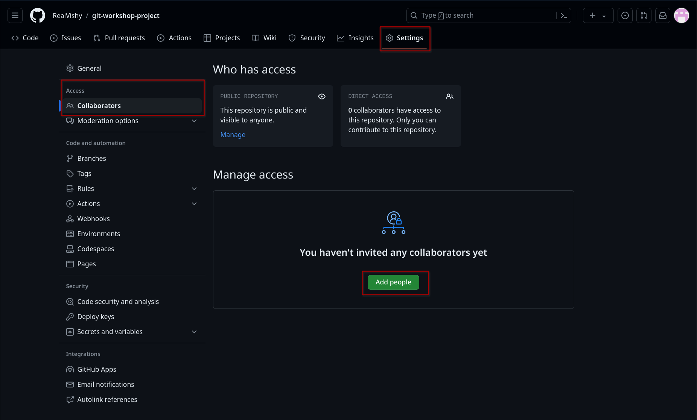

This post is based on the workshop that we held on the 27th of March in-person, it'll cover everything we covered during the workshop!

Unlike the workshop, we'll mostly be using the Git and GitHub CLI to interact with Git but feel free to check out [Last Year's Workshop](/blog/git-workshop-2023/) if you prefer a more graphical method.

If you run into any issues or have any questions, feel free to ask on on Discord.

Prerequisites for Git Workshop
------------------------------

Before starting the workshop, ensure you have installed the necessary tools.

Ensure you have the following ready:

*   [GitHub Account](https://github.com/signup)
*   [GitHub CLI](https://cli.github.com/)
*   [Git](https://git-scm.com/book/en/v2/Getting-Started-Installing-Git)
*   [Visual Studio Code](https://code.visualstudio.com/download?ref=progsoc.org)

Users of Windows/Mac OS/Other Linux distributions may follow the respective installation instructions for each of the above tools.

If you use arch btw, follow these steps:

    sudo pacman -Syu
    sudo pacman -S git github-cli
    

What is Git?
------------

Git is the word's most popular "distributed version control system". Effectively, this means that in Git, every developer local repository contains the full history of all changes ever commited to that particular remote repository.

This allows for multiple developers to work together on the same codebase, while branching off individual changes that can be merged back to the main branch or discarded!

### Why learn Git?

*   Version Control: Keep track of every modification to your code with an easy way to revert any changes even in a solo or group project.
*   Collaboration: Using Git with a hosting service such as GitHub makes collaboration on codebases much easier to manage.

Git vs GitHub
-------------

During the workshop, we'll use GitHub as our online git hosting service for Git.

Git provides a personal, local environment where you can interact with and modify your work.

GitHub is an hosting service that is used to manage and share Git repositories. Addtionally, it provides features such as pull requests, issue tracking and a web-based graphical user interface.

In this guide, we'll be using a mixture of commands from the `Git` and `GitHub CLI`.

Authenticating with GitHub
--------------------------

To authenticate with GitHub using the GitHub CLI, run:

    gh auth login
    

*   **Account:** Github.com
*   **Preferred protocol:** HTTPS (Windows), SSH (Mac, Linux)
*   **Generate a new key pair (for SSH):** Yes
*   **Passphrase (for SSH):** leave it blank and press enter
*   **Title (for SSH):** leave it blank and press enter
*   **Authenticate:** Log in with browser

Follow the interactive prompts to authenticate your machine.

### First Time Git Setup

Before we create our first Git repo, we'll need to configure some settings.

    git config --global user.name "John Doe"
    # Set this to your name or a username
    
    git config --global user.email johndoe@example.com
    # Set this to your GitHub email address
    
    git config --global core.editor "code"
    # Set this to your preferred text editor
    
    git config --global init.defaultBranch main
    # This sets your default branch to main

Creating a Git Repo
-------------------

There are various ways to create a repository and share it onto GitHub but we'll be using the GitHub CLI. If you're following along as a group, **delegate one person to create and initialise the repository**.  
  
Only the group leader should follow the creation and initialisation steps below:

    gh repo create

This will open an interactive menu to allow you to create a repository on GitHub!

*   **What would you like to do?** Create a new respository on GitHub from scratch
*   **Repository Name:** git-workshop-project
*   **Description:** Leave blank or include something if you'd like
*   **Visibility:** Public
*   **README File:** No
*   **.gitignore:** No
*   **License:** No
*   **This will create <your-repo> on GitHub. Continue?:** Yes
*   **Clone the new repository locally?:** Yes

Follow the interactive prompts to create a public GitHub Repository. Once it finishes, you'll be provided with a link to access the repository.

### Repository Initialisation

Now that we've created our git repository, navigate inside the local folder.

    cd git-workshop-project

You don't need to do this if you're already inside the folder!

Copy over the two files inside your repository folder using the provided `curl` commands.

    curl -O https://raw.githubusercontent.com/ProgSoc/git-workshop-project/master/README.md
    
    curl -O https://raw.githubusercontent.com/ProgSoc/git-workshop-project/master/index.js

These create `README.md` and `index.js` files within your repository.

### Staging Changes

When using git, there are various stages your files can be in: untracked, modified, staged and committed.

**Untracked:** New files that have been added to your project directory.  
**Modified:** Files that have been edited since your last commit.  
**Staged:** Files that have been marked as ready to be included in the next commit.  
**Committed:** Changes have been synced with your local git repository.  
**Pushed:** Changes are now synced with the remote repository and all collaborators.

### Walkthrough

Now, we'll walk through all the steps needed to go from having untracked files to having them synced on your remote repository.

**Pro Tip:** Use the command `git status` to keep track of your files through the process.

**Adding/Tracking Files**  
You can stage and track all files in your current directory using the `git add .` command.  
  
**Committing Changes**  
You can commit your changes to the local repository using the `git commit -m "your message` command.  
  
**Pushing Changes**  
You can publish your changes to the remote repository using the `git push` command. This ensures that your changes are accessible to others when you share your repository.

    git add .
    
    git commit -m "concise and useful message"
    
    git push

  
Collaborating using GitHub
-----------------------------

Unfortunately, there isn't a way to add contributers to a GitHub repository using the CLI, so we'll have to do it graphically on the GitHub website.

Use the command below to open your GitHub repo on your browser:

    gh repo view <your-github-username>/git-workshop-project --web

it's case sensitive

From there, navigate to Settings, Collaborators and click the green "Add People" button. You should now be able to add contributors using their GitHub username or email address.

Once added, your team members should now be able to clone the repostory using the below command. Make sure they **use the username of the person who created the repository** rather than their own!

    gh repo clone <your-github-username>/git-workshop-project

This command clones the repository to the current directory you're in.

Working with a repository
-------------------------

Now that we've initialised our repository, we can start making changes just like a real project.

When working together with others, we use git branches to maintain different sets of changes that are separated from the main codebase. This is useful when working on new features, bugfixes or refactoring, especially as a team!  
  
Multiple people can merge changes into the same file (as long as the exact same lines aren't charged).

### Creating a new branch

We can see which branches exist in our repository using `git branch`.  
  
To create a new branch, we'll use `git switch -c`. This specifies for Git to create a new branch where we can modify things without them affecting the `main` branch.

Using the `-c` flag allows us to create a new branch whereas using using `git switch` with no flag switches to an existing branch.

    # This switches to an existing branch (in this case, main)
    git switch main
    
    # This creates a new branch
    git switch -c new-branch

#### Making changes in your branch

Now that you have have a local branch for your changes, feel free to make any changes to the `README.md` or `index.js` and save your changes. To stage, commit and push your changes along with your new branch to the remote repo, use the following commands!

    git add . # Stage and track files
    
    git commit -m "your message" # commits your changes to the local repo
    
    git push --set-upstream origin new-branch 
    # publishes your branch to the remote repo

After publishing your branch, it should be available as a branch on GitHub. We can verify this using the GitHub CLI.

    gh repo view -b new-branch

#### Making a pull request

Once you're happy with your changes, we can create a pull request to propose merging our changes to the main branch. We can once again do this using the GitHub CLI.

    gh pr create

*   **Title:** A short summary of your changes
*   **Body:** More general information on the changes made.
*   **What's next?:** Submit.

Pull requests are used to allow collaborators to review and discuss the proposed changes before integrated into the main branch. Once everyone's happy, it's ready to be merged into the main branch.

### Merging a pull request

A pull request can be merged into the main branch using the below command.

    gh pr merge

When merging changes, there are three merge methods we can use.  
  
**Merge Commit:** This copies our commits into the branch into the main branch and then finishes with a merge commit. This ensures each commit in your branch also follows through to the main branch.  
  
**Squash Merge:** This combines all your commits into a singular large commit and merges it. This hides the commits made to the branch but is neater in the main branch.

**Rebase Merge:** This one a bit complicated, so it's out of scope for this post.

We'll use a `merge commit` in this example.

*   **What merge method would you like to use?:** Create a merge commit.
*   **Delete the branch locally and on GitHub:** Yes.
*   **What's next?:** Submit.

Congratulations, your changes should now have been merged to the main branch!  
You can verify this by using `git branch` to see that you're in the main branch and your text editor to verify the file contents.

Managing Merge Conflicts
------------------------

Merge conflicts occur when multiple people make changes to the same lines in a file.  
They show you what currently exists and your incoming change and you have to resolve it manually.  

### Inducing a merge conflict

To learn how to resolve merge conflicts, we can force a merge conflict manually.  
This can be done as a group or individually if you're just following along by yourself.  

*   2 People should each create a new branch using `git switch -c`
*   Both people should stage and commit their changes, ensuring they change the same line in different ways
*   Both people open a pull request
*   Merge one of the pull requests
*   Trying to merge using `gh pr merge` for the second branch should now fail.
*   The other person will be shown by `GitHub CLI` how to solve the merge conflict.
*   Once it's resolved they'll be able to merge their branch with main!  
    

Gitignore
---------

A `.gitignore` file can be used to ignore files or folders you don't want git to track. This is useful for ensuring you don't commit transient files from your working directory like temporary files, build specific folders or secrets.  
  
Additional information on their usage and utility can be found in the resources below!

  
  
Additional Resources
--------------------------

[

Git - What is Git?

What is Git?

](https://git-scm.com/book/en/v2/Getting-Started-What-is-Git%3F)

[

How to Write Better Git Commit Messages – A Step-By-Step Guide

When first introduced to Git, it’s typical for developers to feel uncomfortable with the process. You might feel uncertainty when encountering the Git commit message, unsure how to properly summarize the changes you’ve made and why you’ve made them. But the earlier in your career you can develop good

freeCodeCamp.orgNatalie Pina

](https://www.freecodecamp.org/news/how-to-write-better-git-commit-messages/)

[

Learn Git - Tutorials, Workflows and Commands | Atlassian

Git is an open source version control system used by programmers to manage their code. Learn about its features and benefits in this tutorial.

AtlassianAtlassian

](https://www.atlassian.com/git)

[

Ignoring files - GitHub Docs

You can configure Git to ignore files you don’t want to check in to GitHub.

GitHub Docs

](https://docs.github.com/en/get-started/getting-started-with-git/ignoring-files)
