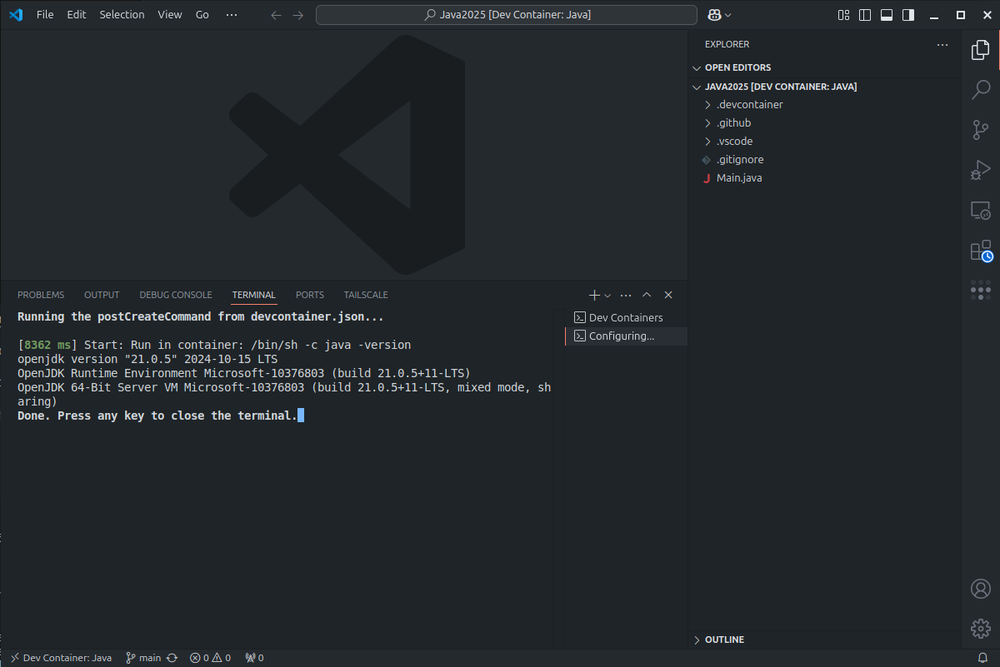

# 2025 Java Workshop

## Introduction

Welcome to the 2025 Java Workshop! This workshop is designed to help you learn the basics of Java programming. Whether you're new to programming or just looking to brush up on your skills, this workshop is for you.

In this workshop you'll cover the following topics:

* Java syntax
* Variables and data types
* Control flow (if statements, loops)
* Basic Functions

<!-- more -->

## Prerequisites

Before you get started, make sure you have the following installed on your computer:

* Docker Desktop [https://docs.docker.com/desktop/](https://docs.docker.com/desktop/)
* Git [https://git-scm.com/downloads](https://git-scm.com/downloads)
* VS Code [https://code.visualstudio.com/download](https://code.visualstudio.com/download)
  * Dev Container Extension [https://marketplace.visualstudio.com/items?itemName=ms-vscode-remote.remote-containers](https://marketplace.visualstudio.com/items?itemName=ms-vscode-remote.remote-containers) 

## Workshop Structure

* Setup
* Variables and Data Types
* Operators
* Input and Output
* Conditional Statements
* For Loops
* Arrays
* Functions
* Practical Project Demo

## Setup

To get started, download the workshop materials by cloning the repository: (this can also be done from inside vscode)

=== "Command Line"

    1. 
    ```bash
    git clone https://github.com/ProgSoc/Java2025.git
    ```
    2. 
    ```bash
    cd Java2025
    ```
    3. 
    ```bash
    code .
    ```

=== "VS Code"
    
    1. Open VS Code
    2. Press `Ctrl+Shift+P` to open the command palette
    3. Type `Git: Clone` and press `Enter`
    

    4. Enter the repository URL: `ProgSoc/Java2025`
    

    5. Choose a location to save the repository
    6. Open the repository in VS Code
    
    


Once you've cloned the repository, and it's open in VS Code you should get a popup asking if you want to open the development container. Click `Reopen in Container` to get started.


This will start the development container and install all the necessary dependencies for the workshop including Java.

This may take a few minutes so have a chat with your fellow attendees while you wait.

When it's done you should see a terminal window with the Java version displayed.



## Hello World

Let's start with the classic "Hello World" program. This program simply prints "Hello World" to the console.

```java title="org/progsoc/java2025/basics/HelloWorld.java"
--8<-- "https://raw.githubusercontent.com/ProgSoc/Java2025/refs/heads/main/org/progsoc/java2025/basics/HelloWorld.java"
```


## Variables and Data Types

There are several different data types in Java, including `int`, `double`, `boolean`, and `String`. Each data type is used to store different types of values.

Typically you declare a variable by specifying the data type followed by the variable name. For example, to declare an integer variable called `age`, you would write `int age;`.

```java title="org/progsoc/java2025/basics/VariablesAndDataTypes.java"
--8<-- "https://raw.githubusercontent.com/ProgSoc/Java2025/refs/heads/main/org/progsoc/java2025/basics/VariablesAndDataTypes.java"
```

## Operators

Operators are used to perform operations on variables and values. Java has several different types of operators, including arithmetic, comparison, and logical operators. (e.g. `+`, `-`, `*`, `/`, `==`, `!=`, `&&`, `||`)

```java title="org/progsoc/java2025/basics/Operators.java"
--8<-- "https://raw.githubusercontent.com/ProgSoc/Java2025/refs/heads/main/org/progsoc/java2025/basics/Operators.java"
```

## Input and Output

When building a simple Java program, you may want to take input from the user and display output to the user. This can be done using the `Scanner` class for input and the `System.out.println()` method for output. (similar to `console.log` in JavaScript)

```java title="org/progsoc/java2025/basics/UserInput.java"
--8<-- "https://raw.githubusercontent.com/ProgSoc/Java2025/refs/heads/main/org/progsoc/java2025/basics/UserInput.java"
```

## Conditional Statements

Conditional statements are used to perform different actions based on different conditions. In Java, you can use `if`, `else if`, and `else` statements to control the flow of your program.

```java title="org/progsoc/java2025/basics/Conditionals.java"
--8<-- "https://raw.githubusercontent.com/ProgSoc/Java2025/refs/heads/main/org/progsoc/java2025/basics/Conditionals.java"
```

## Arrays

An array is a collection of variables of the same type. You can access the elements of an array using an index. The index starts at 0, so the first element of an array is at index 0, the second element is at index 1, and so on.

```java title="org/progsoc/java2025/basics/Arrays.java"
--8<-- "https://raw.githubusercontent.com/ProgSoc/Java2025/refs/heads/main/org/progsoc/java2025/basics/Arrays.java"
```

## Loops

If you want your program to repeat a block of code multiple times, you can use loops. Java has several different types of loops, including `while` loops and `for` loops which we'll cover below.

### While Loop

This is a basic example of a `while` loop. The loop will continue to run as long as the condition inside the parentheses is `true`. (which is always in this case)

```java title="org/progsoc/java2025/basics/WhileLoop.java"
--8<-- "https://raw.githubusercontent.com/ProgSoc/Java2025/refs/heads/main/org/progsoc/java2025/basics/WhileLoop.java"
```

### While Condition

Instead of using a constant condition, you can use a variable to control the loop. In this example, the loop will continue to run as long as the value of `i` is less than 5.

```java title="org/progsoc/java2025/basics/WhileCondition.java"
--8<-- "https://raw.githubusercontent.com/ProgSoc/Java2025/refs/heads/main/org/progsoc/java2025/basics/WhileCondition.java"
```

### For Loop

A `for` loop is used when you know how many times you want to repeat a block of code. The loop has three parts: the initialization, the condition, and the increment.

Each of these parts is separated by a semicolon. The initialization is executed once before the loop starts, the condition is checked before each iteration of the loop, and the increment is executed after each iteration of the loop.

```java title="org/progsoc/java2025/basics/ForLoop.java"
--8<-- "https://raw.githubusercontent.com/ProgSoc/Java2025/refs/heads/main/org/progsoc/java2025/basics/ForLoop.java"
```

### Over an Array

By combining a `for` loop with an array, you can iterate over each element in the array and perform an action on it.

```java title="org/progsoc/java2025/basics/ArrayLoop.java"
--8<-- "https://raw.githubusercontent.com/ProgSoc/Java2025/refs/heads/main/org/progsoc/java2025/basics/ArrayLoop.java"
```

## Functions (Methods)

A function is a block of code that performs a specific task. You can define a function to take input parameters and return a value. In Java, you define a function using the `public static` keywords followed by the return type, the function name, and the parameters.

```java title="org/progsoc/java2025/basics/Functions.java"
--8<-- "https://raw.githubusercontent.com/ProgSoc/Java2025/refs/heads/main/org/progsoc/java2025/basics/Functions.java"
```

## Practical Project Demo

### Guess Number

Now that you've learned the basics of Java programming, it's time to put your skills to the test with a practical project. In this demo, we'll build a simple number guessing game.

If you're ready, open the `GuessNumber.java` file and follow the instructions in the comments to complete the project.

```java title="org/progsoc/java2025/demos/GuessNumber.java"
--8<-- "https://raw.githubusercontent.com/ProgSoc/Java2025/refs/heads/main/org/progsoc/java2025/demos/GuessNumber.java"
```

### Rock Paper Scissors

Another fun project you can try is building a simple rock-paper-scissors game. Open the `RockPaperScissors.java` file and follow the instructions in the comments to complete the project.

```java title="org/progsoc/java2025/demos/RockPaperScissors.java"
--8<-- "https://raw.githubusercontent.com/ProgSoc/Java2025/refs/heads/main/org/progsoc/java2025/demos/RockPaperScissors.java"
```

## Conclusion

Congratulations on completing the 2025 Java Workshop! We hope you've learned a lot and had fun along the way. If you have any questions or feedback, feel free to reach out to us on Discord or GitHub.


