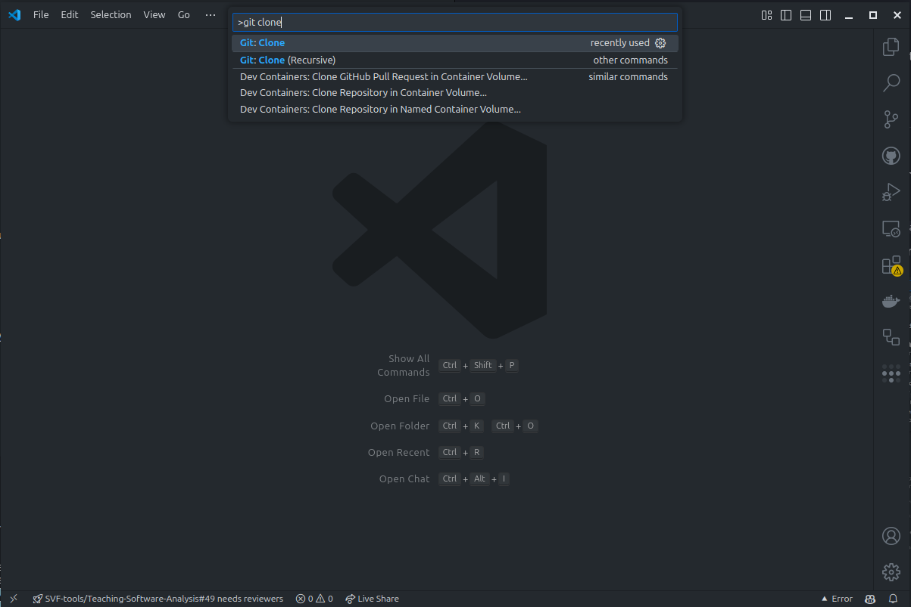
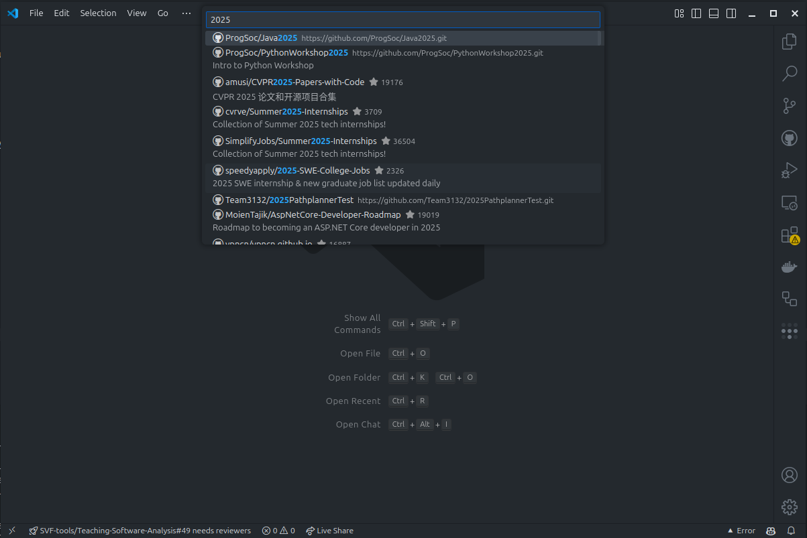
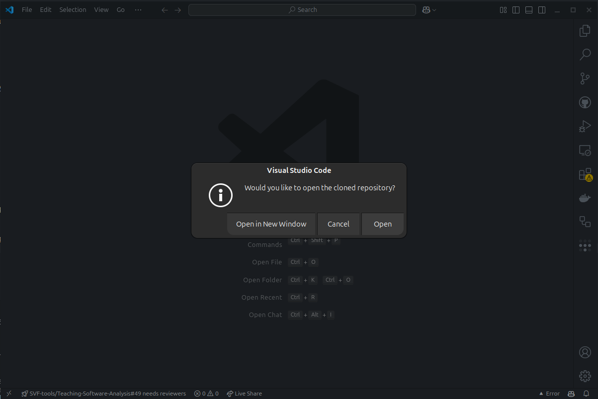
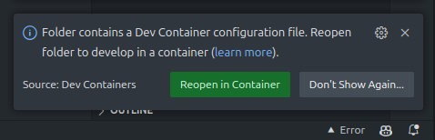

# 2025 Java Workshop

## Introduction

Welcome to the 2025 Java Workshop! This workshop is designed to help you learn the basics of Java programming. Whether you're new to programming or just looking to brush up on your skills, this workshop is for you.

In this workshop you'll cover the following topics:

* Java syntax
* Variables and data types
* Control flow (if statements, loops)
* Basic Functions

## Prerequisites

Before you get started, make sure you have the following installed on your computer:

* Docker Desktop (https://docs.docker.com/desktop/)[https://docs.docker.com/desktop/]
* Git (https://git-scm.com/downloads)[https://git-scm.com/downloads]
* VS Code (https://code.visualstudio.com/download)[https://code.visualstudio.com/download]

## Getting Started

To get started, download the workshop materials by cloning the repository: (this can also be done from inside vscode)

=== "Command Line"

    1. 
    ```bash
    git clone https://github.com/ProgSoc/Java2025.git
    ```
    2. 
    ```bash
    cd Java2025
    ```
    3. 
    ```bash
    code .
    ```

=== "VS Code"
    
    1. Open VS Code
    2. Press `Ctrl+Shift+P` to open the command palette
    3. Type `Git: Clone` and press `Enter`
    

    4. Enter the repository URL: `ProgSoc/Java2025`
    

    5. Choose a location to save the repository
    6. Open the repository in VS Code
    
    


Once you've cloned the repository, and it's open in VS Code you should get a popup asking if you want to open the development container. Click `Reopen in Container` to get started.



