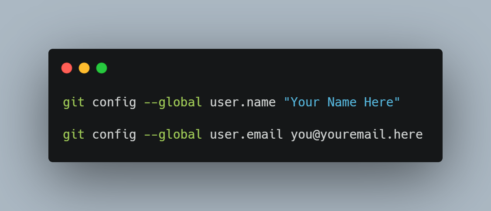
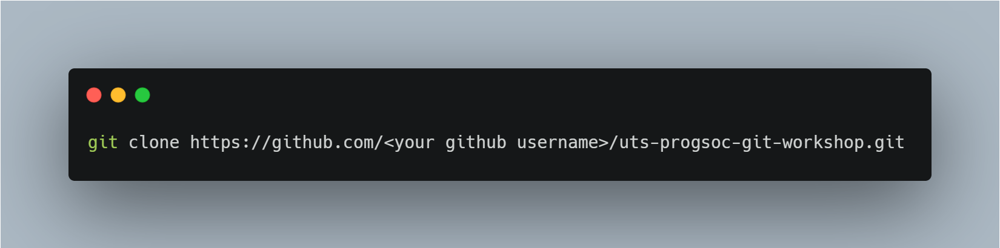
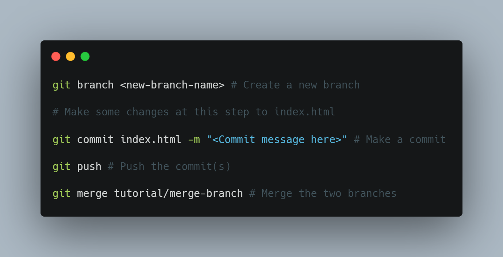
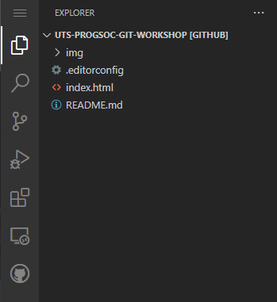
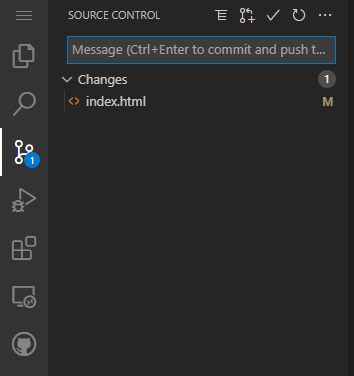
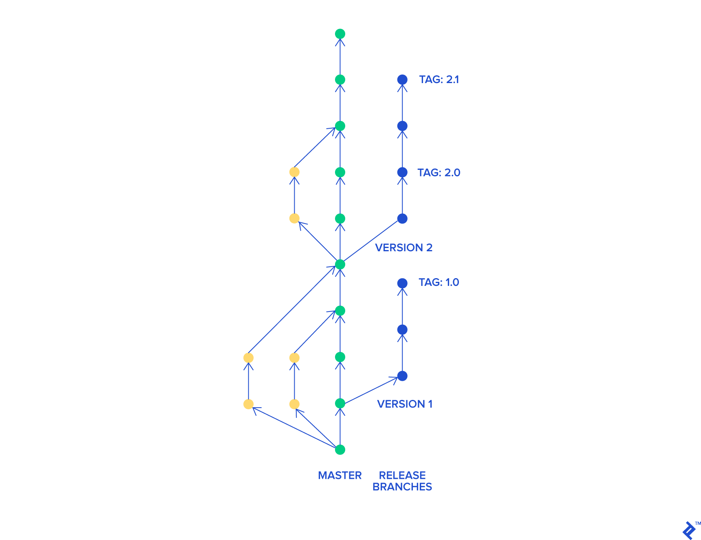
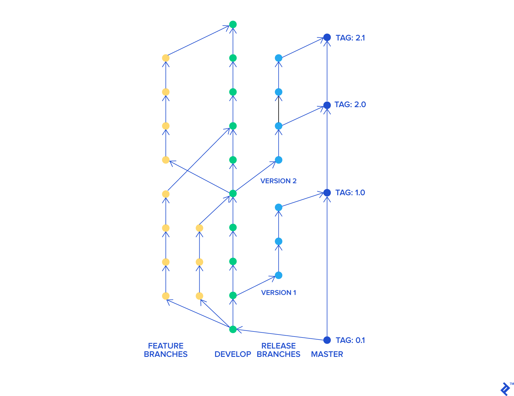

# Introduction to Git

Whether or not you've heard of git before you should know that it's a skill that's almost universal when it comes to programming. An essential skill for anyone just getting started to the most skilled of experts, the ultimate headstart for getting your first developer gig or simply for organising your own projects. 

Git is a piece of software designed to accomodate the massive amount of changes that occur in projects involving an insane amount of code being changed by many people all at once. 

If you've ever done group work you'll have had this problem at *some *point where two people try to edit the same paragraph and it just ends up as a jumbled mess of randomly placed characters.

Git records everyone's changes line by line, making it easy to see what's been changed, when it's been changed and by whom whilst at the same time making sure your files don't end up like this.

# Terminology

When using git you'll come across a few new terms you might not have before:

- Git: The version tracking software itself
- Repository: The folder that gets tracked and synced
- GitHub, Gitlab, Bitbucket: Services that can host Git Repositories

# The Basics

Remote.
Remote is the version of your git repository that's accessible by everyone across the internet rather than just on your own computer.

Clone.
Used when creating a local copy of a git repository on your own computer so that you can modify it.

Fork.
Used to create a brand new repository owned by you that is seperate from the original but has all the version data (changes and who made them and when).

Add/Stage/Track.
Used to specify which files git should track and save changes for.

Commit.
Lock in a set of changes with a meaningful message as to what they accomplish.

Pull.
Get any changes (commits) that were made on the remote so that your code is up to date.

Push.
Send all your changes (commits) to the remote repository.

# Branching & Workflows

To seperate the different things people are working on Git uses a tree-like structure where each branch can divert from the main set of changes in the repository and be merged back in later.

Each branch contains a seperate subset of changes which can be pushed and pulled independantly of any other branches. By "Checking out" a branch you can switch between the branches or even create a new branch.

But what do we do if we want to merge our own changes back into the main branch? Well, unsurprisingly that's called merging. Where you take the contents of one branch and merge it with another. 

But, before your changes get merged into the extremely stable absolutely bug-free code they need to be checked. This is almost always done through something called a pull request. A pull request allows people to review your changes, make suggestions, comment on your code and then once it's all good give it their approval to be merged.

# Have a go!

To edit and then use Git with your code we reccomend installing and setting up several things:

- Install Git
- Install VSCode
- Create a Github Account if you don't already have one

The first time you try and run any git commands you might get an error about specifying a name and email. To prevent this you just need to run these two commands:

Keep in mind that each commit you make will include the name and email you specified in the commands above.

Once you have got all that setup it's finally time to get into it. And it couldn't be more simple. Because we've got a repository already setup [here](https://github.com/utsprogsoc/uts-progsoc-git-workshop) we're going to fork it and make our own modifications (the process is much the same for cloning a repo so don't worry).

For this activity click fork in the top right (making sure you're signed in).

Once you've got the repo forked and under your own name we're ready to clone. We do this by finding our favourite project folder and running this command in the terminal.

## Onto the Commands!

## How about VSCode?

There exist several different UI tools to use git a bit easier, with the majority being already built-in to whatever editor you use whether it be VSCode, Atom, IntelliJ or even the Android IDE. You can use the UI rather than the commands above (though we would recommend knowing them anyway in case there's any problems).

Once you've run `git clone` (above) you can open the folder that command creates in your editor.

Once you've opened the folder VSCode will look similar to what you see above. On the left you should see an icon representing source control (git) with a line connected by two circles with another branching off of it. Clicking that will show any files you've made changes in and allow you to review them.

From there you can see the files you've changed as well as a box to enter a commit message to descibe your changes. To commit your files you need to stage them first by clicking the `+` that appears when you hover over it.

At the bottom of your VSCode window is a button to fetch/push/pull changes as well as a button representing whatever branch you're on currently. By clicking it you can change the current branch or create a new one.

Git and VSCode is an awesome combination, making it easier to do some of the more complicated actions with git like resolving merge conflicts (next section) and reviewing code (with the Github extension). Because of all the posibilities we won't get too far into it now but anything you need to do with git can be done inside VSCode's UI.

## Merge Conflicts

If you end up making changes and someone commits to the same branch before you without pulling your changes first then you'll end up with a problem where git tries to figure out what to keep and throw away but can't.

To fix this you have to go through file-by-file where the conflicts occured and choose which bits to keep. Whilst some tools try to figure this problem out themselves there's only so much they can extrapolate.

The best way to prevent this from ever happening is to have good development processes and updating your branches regularly with both pushes and pulls.

If you want to have a go with solving these just try merging the `tutorial/merge-conflict` branch.

# Team Work Makes the Merge Conflicts Not Appear (and the dream work)

As mentioned above constantly pushing your changes helps lower the risk. In addition to this there are several other things you can do like:

- Having a discussion and constant communication with the rest of the team on what you're all going to be implementing through either a group chat on a platform like Slack or through Agile boards/kanban.
- Follow a clear procedure on how and when you push your code

In the following section we'll talk about some more advanced methods like Trunk-based development and the Git flow.

# Trunk-based development

In TBD you have two primary branches, master and release with master being the place for the very latest version of your code and release having the code for each seperate release.

There are, however some drawbacks to this method, most of which are with managing other people's code. It becomes difficult to manage in larger teams or even larger code bases but also during the review process where you might need to review the code of other people (typically junior programmers).

# Git Flow

In contrast to TBD there are 3 main branches rather than 2.

- Release
- Master
- Develop

Another important element is that each user creates a feature branch off of the develop branch and once the pull request is implemented commit it back to the develop branch.

This method has some advantages over TBD as it makes it easier to review the code of your peers which increases the quality of the code as well as making it easier to manage larger code bases and teams.

# Fin

This concludes this blog post. Thanks to any of you that participated in the workshop that we ran about Git (don't forget to watch out for new events). If you've got any questions at all feel free to ask in our Discord where our members will be more than happy to answer any questions you may have.
