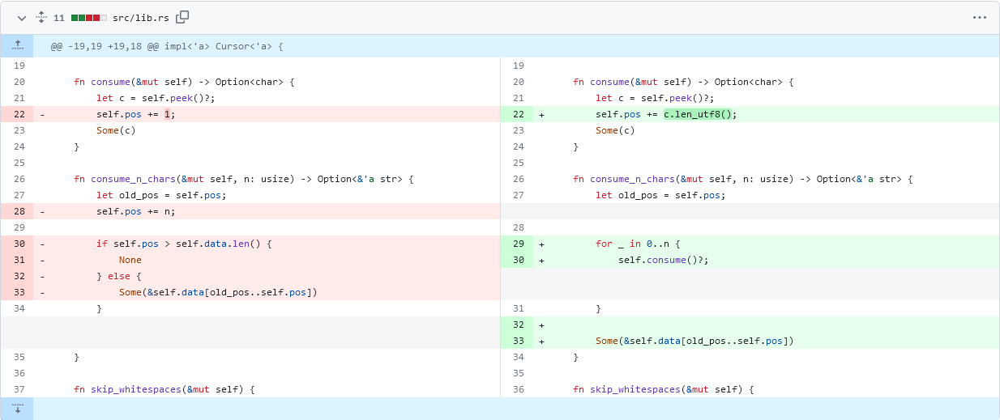

# Fuzzing Workshop 2023

> This Workshop was originally presented as "Fuzzing: Automated Edge Case Searching" at CSECcon II, 16th September 2023 by Leo Schurov and Oliver Lenehan.

Fuzzing is about throwing random input or operating conditions at a program until it breaks in interesting, unusual or unexpected ways.

In this workshop, we'll cover a brief history and general overview of fuzzing. At the end, you'll get a hands-on demo on finding a potential DOS vector in a DIY JSON parser.


## Setup Notes

For the follow-along at the end of the workshop, you'll need to install the components below:

1. Install Compiler & Linker Tooling
    * Windows: <https://visualstudio.microsoft.com/visual-cpp-build-tools>
    * Linux (Debian Flavour): `apt install build-essential`
    * Linux (Arch Flavour): `pacman -S base-devel`
    * MacOS: `xcode-select --install`
2. Rust Compiler
    * <https://rust-lang.org/tools/install>
    * If you already have Rust, update it with `rustup update`
3. Rust Nightly
    * You will need "nightly" Rust to use cargo-fuzz for now,
    * `rustup install nightly`
    * `rustup default nightly`
    * At the end, you can revert to normal with `rustup default stable`
4. Cargo Fuzz
    * `cargo install --locked cargo-fuzz`
    * If you already have cargo-fuzz, update it by adding the `--force` flag
5. Workshop Repository
    * Via web ("Code > Download ZIP") or `git clone` <https://github.com/ProgSoc/fuzz-workshop>
6. (Optional) You can also install VSCode (or use another LSP editor if you know what that means), and use the `rust-analyzer` extension for extra real-time error help along the way.


## A Brief History

["It was a dark and stormy night. Really."](https://pages.cs.wisc.edu/~bart/fuzz/Foreword1.html)

Bart Miller, a professor at the University of Wisconsin, Madison, was trying to log into the uni's UNIX system remotely from his office at home via a dial-up, modem connection. He could get by for a little while, but then every so often electrical interference and noise from the lightning and rain would corrupt inputs into the various utilities and cause them to crash.

As all good professors looking to solve a problem do, he set it [as an assignment](https://pages.cs.wisc.edu/~bart/fuzz/CS736-Projects-f1988.pdf) for his students. Needing a title, he chose "The Fuzz Generator" to "evoke the feeling of random, unstructured data", and thus the name of fuzzing today was born.

Eventually a few groups went away, but one came back with an interesting result: they were able to reliably crash 25-33% of the common utility programs across several UNIX variants. This result was formalised and released in a 1990 paper, ["An Empirical Study of the Reliability of UNIX Utilities"](https://www.paradyn.org/papers/fuzz.pdf).

> You can read more about the history of fuzzing on Bart Miller's homepage: <https://pages.cs.wisc.edu/~bart/fuzz/Foreword1.html>

While the story above is the lineage of fuzz testing as we know it today, one solution from the birth of the Macintosh is notable. "The Monkey", developed by Steve Capps at Apple, would generate random GUI inputs to programs such as MacPaint to test their reliability (the name a reference to the [Infinite Monkey Theorem](https://en.wikipedia.org/wiki/Infinite_monkey_theorem)).


## What is Fuzzing?

### You've Probably Seen it Before

Let's start with a small example that you've likely tried before. Take the following URL:

```
https://example.com/~my/VeryOldPage.php?choice=4
```

Chances are, you've played around manipulating the number at the end to see what results you get back:

```
?choice=4
?choice=42
?choice=196883
?choice=-1
```

The cheekier among you might have tried this:

```
?choice='%20OR%201%3D1%3B--)
```

Which, if you haven't figured out yet:

```js
decodeURIComponent("'%20OR%201%3D1%3B--)")
// ' OR 1=1;--)
```

A cheeky little SQL injection `';--)` 😉.

> Reader: "pwned"

It is funny to put it that way, but potentially we could have exposed a serious privacy and security vulnerability leaking people's personal information depending on the system we were exploring.

While not automated, you've manually simulated the process of fuzzing: ***throwing random input or operating conditions at a program until it breaks in interesting, unusual or unexpected ways***. We can optimise this process a bit by constructing data to test more common errors, or once we do find an error trying similar (such as neighbouring) inputs.

> Reader: Even with those optimisations, it does sound like it might still take, well, just a little while 🙂. I mean, for that SQL injection example, even if we limit our random input to the minimum 10 bytes to encounter it and the 95 printable ASCII characters, it could take up to 500 years non-stop to brute-force find that error on my computer at home!

That is indeed a, *very*, long time, but as we'll see [further below](#where-is-it-used) there are systems capable of fuzzing at such insane rates it's truly awe-some 🤯.

> Reader: And hey! "Operating conditions"? Could that mean my program doesn't work depending on the time of day!?

🤔


### An Invisible Error

This example is a little contrived, but it's not entirely beyond reason it could be written by someone directly translating software requirements.

```js
// "Our system needs to ensure that numbers in user input are:
//   1. no less than 0,
//   2. and no more than 255."

if (!(parseInt(userInput) < 0) && !(parseInt(userInput) > 255)) {
  // ...
}
```

The subtlety here is the return value of `parseInt`. If it couldn't convert the text into a number, like when the user enters a word instead of a number, it gives back `NaN` (not-a-number). The problem here is that any comparison against `NaN` is false, so the example can break down like the following:

```js
!(parseInt("hello") < 0) && !(parseInt("hello") > 255)
!(              NaN < 0) && !(              NaN > 255)
!(                false) && !(                  false)
                   true  &&                      true

// Which evaluates to:
true
```

Our logic to test that the number was valid, has been used against us when the input isn't a number! This won't be caught by static-analysis tools or compilers, such as TypeScript, because `parseInt` returns a `number`. So `parseInt(text) < 0` is always a comparison between numbers, which always\* makes sense. If we had tried to compare `"hello" < 0`, that doesn't make sense, so TypeScript would have caught this as an error.

> Reader: But wait! You said `parseInt` returns `NaN` (literally NOT-a-number) when it can't convert text into a number!

I hear you. I know, unfortunately this is a quirk in the way JavaScript's [IEEE-754 floating-point numbers](https://en.wikipedia.org/wiki/IEEE_754) work:

```js
typeof NaN == "number"
```

> Reader: So what can we do! How do we make sure we don't run into this?

1. The first thing is to be aware of `NaN` and when it might be returned by functions you're using.
2. If you can't be certain, use fuzzing! It will help you seek out unexpected behaviour in your programs by being that monkey (or chimpanzee) on the typewriter - they won't be typing the well-formed [works of Shakespeare, they'll be typing utter garbage!](https://en.wikipedia.org/wiki/Infinite_monkey_theorem).


## Where is it Used?

### Google Chrome

The Google Chrome browser project has used fuzzing to discover over 27,000 bugs since 2016, and as at 2019 had 25,000 (yes, really) CPU cores fuzzing it continuously.

> Reader: At that rate, our 500 year brute-force SQL injection would only take 2 months! If an attacker really wanted our data, that sounds feasible!

In a project such as a web browser like Chrome, users and developers expect the sandbox to be perfect, and the only way to test for leaks is to pour enough sand in it until some finds a gap.

### Everywhere?

In response to the [Heartbleed](https://en.wikipedia.org/wiki/Heartbleed) bug (CVE-2014-0160) in OpenSSL, Google launched [OSS-Fuzz](https://google.github.io/oss-fuzz/) in 2016 as a free service that runs fuzz testing against open source projects and lets developers know about any bugs or vulnerabilities found.


Since then, it has found over 10,000 vulnerabilities and 36,000 bugs across 1,000 projects written in C, C++, Go, Rust or Python, and ranging from encryption, to regular expressions and even text rendering. Google runs OSS-Fuzz across 100,000 virtual-machine instance, continuously. 24/7.

> Reader: If we applied those full resources, that would take our brute-force SQL injection attack time to only a couple of weeks!

So, why was OSS-Fuzz *in-response to* Heartbleed? It turns out Heartbleed could have been found if fuzzing was more widespread; see [this article](https://blog.hboeck.de/archives/868-How-Heartbleed-couldve-been-found.html) to read more.


## Rust

Rust is a modern systems-programming language designed to eliminate common errors and ensure program reliability.

> You can learn more about Rust from our [recent (Spring 2023) Rust Workshop](./rust.md).

If you've heard of Rust before, chances are you've likely heard these two phrases:

1. Zero-Cost Abstractions
2. Memory Safety

Rust is so compelling as a new programming language because of its power. It has [high-level ergonomics, and low-level control](https://www.youtube.com/@NoBoilerplate). You can write code that's easy to read, and that same code compiles to be fast and provably\* memory-bug and race-condition free.

Rust does this in several ways, but chiefly there are three systems:

1. The Borrow Checker. At compile-time, Rust makes sure that any piece of memory either: can be readable everywhere and not writeable (shared references `&`), or writeable in one place and only readable in that same place (exclusive references `&mut`).
2. Lifetimes. At compile-time, Rust makes sure that you can't use memory after it has been deallocated and given to another part of the program (`'a`, `'static`).
3. Types. There are no null-pointer exceptions with Rust. All errors must be handled, or terminate the thread immediately (`Option<T>`, `Result<T, E>`).


### What Rust Can't Do

While Rust might have been able to prevent the memory over-read bug that caused Heartbleed, you're not going to be safe if you give a crab a knife (your bad code). The compiler can prove that memory bugs don't happen as long as there is no `unsafe` code (Rust's tradeoff to allow low-level control to the developer). But there is an an important distinction between `unsafe` Rust and *unsafe* `.rs`.


Rust wasn't designed to help us solve programs having logic errors. After all, these are still technically-correct ("the best kind of correct ™️") programs, the problem is that they just don't behave as expected.

This is where fuzzing comes in; in-particular, [`cargo-fuzz`](https://github.com/rust-fuzz/cargo-fuzz). A tool made by the ["Rust Fuzzing Authority"](https://github.com/rust-fuzz) so you know they mean business (just like Ferris holding the knife).


## Finding DOS Vectors in a Rust JSON Parser with `cargo fuzz`

Now's the time to `cd` into the <https://github.com/ProgSoc/fuzz-workshop> repository.

The repo is for a basic JSON parser, with a few intentional bugs. It contains a [`lib.rs`](https://github.com/ProgSoc/fuzz-workshop/blob/master/src/lib.rs) file with all the JSON parsing logic and pretty thorough test cases provided in [`test.rs`](https://github.com/ProgSoc/fuzz-workshop/blob/master/src/test.rs) (you can take a look by clicking on the file name links).

It also contains a usage example in [`main.rs`](https://github.com/ProgSoc/fuzz-workshop/blob/master/src/main.rs) which you can try out with `cargo run` before continuing. Have a go and some try different inputs to see if you can get the program to crash yourself.

We're going to set up the fuzzer next. If you want, take some time now to read the source code and see if you can spot the bugs before trying the fuzzer.


### Setting up the Fuzzer

In the root of the repository (`ls` or `dir` should list README.md), run `cargo fuzz init` to set up fuzzing in this project. You should now have a folder called `fuzz`.

Under `fuzz/fuzz_targets`, you may rename the source files however you like but make sure you update `fuzz/Cargo.toml` accordingly.

Inside the fuzz target source file (`fuzz/fuzz_targets/<fuzz_target_name>.rs`) that was generated, there should be a `fuzz_target!` macro. We're going to set it up to test our library as follows:

```rust
fuzz_target!(|data: &u8| {
    if let Ok(s) = std::str::from_utf8(data) {
        let _ = json::parse_json(s);
    }
});
```

In our fuzzing setup, the first step is to get our random test data into a format `parse_json` can accept, that explains the `if let`. The second step if to evaluate our function. We throw away the result explicitly (`let _ =`) so that the Rust compiler doesn't complain about a lack of error handling of the `Result` return type.

Now we have our fuzz testing rig setup, go ahead and run `cargo fuzz <fuzz_target_name>` to test the `parse_json` function. Cargo Fuzz will now chuck random inputs at it until it panics or crashes.

Hopefully that happens quickly enough, and when it does you'll see an explanation of what happened. If it hasn't stopped after a while you can press `Ctrl`+`C` to stop it and then try again. The outputs that caused it to crash will appear in the `fuzz/artifacts` folder for you to inspect.

### Solving the First Bug

Quite likely, you would have encountered a bug because of non-latin characters such as "ç", "д" or "我" among the many, many other [Unicode characters](https://home.unicode.org/). These are perfectly valid UTF-8, and so Rust will happily give them to the `parse_json` function.

So what's the issue?



As you can see on the left hand side of the above image (with red highlighting the old code), and the code block below, when the parser consumes a character, it assumes it needs to increment the cursor position by one byte of string data.

```rust
fn consume(&mut self) -> Option<char> {
    let c = self.peek()?;
    self.pos += 1;
    Some(c)
}

fn consume_n_chars(&mut self, n: usize) -> Option<&'a str> {
    let old_pos = self.pos;
    self.pos += n;

    if self.pos > self.data.len() {
        None
    } else {
        Some(&self.data[old_pos..self.pos])
    }
}
```

While `self.data: &str` is valid UTF-8, indexing it with slices `&self.data[old_pos..self.pos]` gives us a range of bytes, not characters. UTF-8 encodes non-ASCII codepoints with multiple bytes so in effect if we encounter a multi-byte international character we might have just chopped it in two!

Rust gaurantees memory safety further on by panicking and immediately terminating our program causing a crash. This could potentially be a denial of service, an attack on the availability of our program or website, following the [CIA security model](https://informationsecurity.wustl.edu/items/confidentiality-integrity-and-availability-the-cia-triad/).

The patched code on the right (with green highlighting the new changes), and in the block below, solves the bug by incrementing the string cursor by the number of bytes the UTF-8 character actually takes.

```rust
fn consume(&mut self) -> Option<char> {
    let c = self.peek()?;
    self.pos += c.len_utf8();
    Some(c)
}

fn consume_n_chars(&mut self, n: usize) -> Option<&'a str> {
    let old_pos = self.pos;

    for _ in 0..n {
        self.consume()?;
    }

    Some(&self.data[old_pos..self.pos])
}
```

You can apply the bug fix by running `git merge fix-utf8` at the root of the repository, or manually changing the lines following the above diff yourself.

### Encountering a Second Bug

Now if you run the fuzzer again (`cargo fuzz <fuzz-target-name>`), it should last a little bit longer until you encounter another bug. A stack overflow! HA!

Checking the `fuzz/artifacts` directory you will find a file containing a deeply nested structure, likely something like this:

```
[[[[[[[[[[[[[[[[[[[[[[[[[[[[[[[[[[[[[[[[[[[[[[[[[[[[[[[[[[[[[[[[[[[[[[[[[[[[[[[[[[[[[[[[[[[[[[[[[[[[[[[[[[[[[[[[[[[[[[[[[[[[[[[[]]]]]]]]]]]]]]]]]]]]]]]]]]]]]]]]]]]]]]]]]]]]]]]]]]]]]]]]]]]]]]]]]]]]]]]]]]]]]]]]]]]]]]]]]]]]]]]]]]]]]]]]]]]]]]]]]]]]]]]]]]]]]]]]
```

What's happening here? The parser works recursively, following arrays or objects to the bottom, returning their Rust equivalent value back up the tree when it's done at each step. You can see this yourself for [`parse_value`](https://github.com/ProgSoc/fuzz-workshop/blob/0a6fc53582da6a7069dc3afb334ff46fffa2f1fa/src/lib.rs#L93) which can call [`parse_array`](https://github.com/ProgSoc/fuzz-workshop/blob/0a6fc53582da6a7069dc3afb334ff46fffa2f1fa/src/lib.rs#L191) or [`parse_object`](https://github.com/ProgSoc/fuzz-workshop/blob/0a6fc53582da6a7069dc3afb334ff46fffa2f1fa/src/lib.rs#L225) which then call `parse_value` again and we're back to the start.

The problem with this approach is that those recursive calls have to return and construct a value somewhere, and that happens on the stack. For hugely nested data structures like the one shown, that requires a lot of space; infact, too much space than was allocated. Once again, to gaurantee memory safety later on, Rust terminates immediately with a panic.

Can we solve it? Not so easily. This time, it's an architectural problem - it's just in the nature of recursion (unless we deal with more complicated tail-call optimisation) that stacks can and will overflow with unbounded data. We would need to rewrite our whole JSON parsing library to fix this bug, a task for another day.

## Conclusion

Fuzzing is another great addition to the tester's (and hacker's) toolkit. Only having come into wider use in the last five years or so, knowing how to apply fuzzing to your code will put your work ahead of others'. It shows you have an understanding of how to ensure robustness and security in the software you write.
