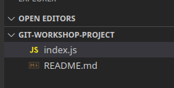
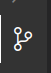

This post is based on the workshop that we held on the 22nd of March in-person, it covers everything we covered in the workshop.

This workshop uses the VS Code GUI for interacting with Git, so make sure you have it installed before proceeding.

If you have any questions or issues while following along, feel free to ask in our Discord server!

## What is git?

Git is a “version control” software, which keeps track of code changes and allows multiple people to easily work on the same codebase.

Usually there is a “main/master branch”, where team members branch off to do their work, and then merge their work back into the main/master branch.


This lets both:

- Many people working on the same codebase in parallel without conflicting with each other most of the time
- You alone working on multiple features in parallel, while always being able to undo/discard/roll back your changes

This makes git useful for both large teams as well as personal projects, helping you ensure that no work is ever lost and you can easily keep track of both your and other people's changes.

Basically every company uses git to manage their codebase, with very rare exceptions (e.g. Google developed their own one that basically only they use), but when you enter the industry you're guaranteed to use git at some point.

## GitHub

This guide is centered around GitHub, which is the most popular git hosting service. To clarify the difference using an analogy:

- Git is like a video library, where you can locally manage it, but it's hard to share it
- GitHub is like YouTube, where you could host your video library for everyone to easily see (and comment on), however, YouTube isn't the only place where you can host a video library, with many alternatives like Vimeo and DailyMotion and so on.

Some popular alternatives to GitHub include things like GitLab, BitBucket (Atlassian), Azure Repos (Microsoft), and so on. The companies you join may choose to use another provider instead of GitHub, and you'll have to authenticate with them separately (likely with SSH keys).

Anyway, to follow this guide, make sure you have a GitHub account.

## Installation

Installing and authenticating git is one of the harder parts of getting to know git, and more than half of our workshop time became dedicated to making sure everyone's on the same page with installation.

### Windows

Go to [https://git-scm.com/downloads](https://git-scm.com/downloads) and follow the installation instructions. Make sure you download the "setup" instead of "portable".

When going through the installer, change the following options to make life easier:


Most editors in windows these days are happy with Unix-style endings (which are superior anyway), and it's standard to use Unix-style in git. Preventing git from automatically changing endings for you will save you headaches later.


Git sometimes opens an external editor to help resolve some issues, it is very rare but you may as well get it to open VS Code rather than vim.

### MacOS & Linux

Follow the instructions on [https://git-scm.com/downloads](https://git-scm.com/downloads), you may have to install Brew first if you're on Mac.

## Authentication

Authenticating git can be very fiddly. If you're familiar with SSH and SSH keys, here's the official guide to setting it up with GitHub: [https://docs.github.com/en/authentication/connecting-to-github-with-ssh](https://docs.github.com/en/authentication/connecting-to-github-with-ssh)

If you're not, then the easiest way is probably using the GitHub CLI.

Install the CLI via: [https://cli.github.com/manual/installation](https://cli.github.com/manual/installation)

If you're on windows, scroll down to "Signed MSI" and go to the releases page, and download `gh_2.25.1_windows_amd64.msi`

### Using GH CLI

After everything's installed, you should be able to open command prompt (cmd.exe) and you'll be able to run both `gh` and `git` without errors.

To authenticate using the gh cli, run: `gh auth login`, then follow the instructions to authenticate:

- **Account:** Github.com
- **Preferred protocol:** HTTPS (Windows), SSH (Mac, Linux)
- **Generate a new key pair (for SSH):** Yes
- **Passphrase (for SSH):** leave it blank and press enter
- **Title (for SSH):** leave it blank and press enter
- **Authenticate:** Log in with browser

Then follow the browser login steps.

After that, you should be logged in.

## Git first-time setup

In order to tell git who you are (for local development), git requires you to run the following commands:

```shell
git config --global user.name "John Doe"
git config --global user.email johndoe@example.com
```

Replace the name and email with your name (or username) and your GitHub email accordingly.

This is a legacy part of Git, however it won't let you make commits until you do it.

## VS Code

Just a reminder that everything below will require VS Code to follow along, so make sure you have it installed from here:

[https://code.visualstudio.com/download](https://code.visualstudio.com/download)

## Beginning a repository

From here, in the workshop, we asked people to form groups of 2+ people and pick a group leader to be the repository owner. If you're alone, it's ok to follow along still, but asking a friend who's learning git alongside you to help would also be fine.

Below are instructions for the group leader to follow:

### Creating the repository

We start by making a new folder for your project and opening that folder in VS Code. Make sure you open the folder in VS Code, rather than just individual files. When you open the terminal (Ctrl+Shift+`) it should show that you're in the correct folder. 

Next, you should copy the files from here:

https://github.com/ProgSoc/git-workshop-project

When clicking a file in GitHub, make sure you click the "Raw" view to see raw content (for the .md file).


In the end, you should have something like this:



### Initializing git

Run `git init` in the terminal to initialize the repository, or click "Initialize Repository" in the git tab in VS Code



The git tab
### Committing the initial files

We will explain what a commit is better further below, but to commit everything, go to the git tab and type in a commit message (probably just "initial commit") and press commit.

### Publish the repository

Press the publish button in the git tab (or type Ctrl+Shift+P and search "publish repository"), then make sure the repository is public (which makes some permission management easier), and follow the prompts if it asks you to log in.

### View your repository

In the bottom right corner, a notification with a button should appear to open the repository, or you can just go to your GitHub account and see it.

### Sharing the repository with other people

If you're working with other people, share the repository with others in the Collaborators tab:


They should receive an email invitation which, when clicked, would add them to the repository.

### Cloning the repository

`git clone [url]` is a Git command line utility which is used to target an existing repository and create a clone, or copy of the target repository in a local folder.

If you're in a team, other team members you added need to clone it. If you're following along alone, you could clone the repository again in another folder or just ignore this step.

To clone your repository:

1. Open up the terminal
2. Navigate to the folder where you want to store your repository
3. Clone the repository using the either the **HTTPS **or **SSH **URL based on how you authenticated earlier.


## Working with your repository

We now have a working repository! Now, we can start making changes to it, just like you would when you're in a real project.

We start by making new branches. In git, branches are a way to maintain a set of changes which are separate from the main codebase. You can make your own branch, make a couple of commits to it, then merge it back into the main codebase (the "master" or the "main" branch).

You and your teammate could have entirely separate branches with different changes, and then you can both merge them into the master branch separately as long as they don't change the same lines (in which case you may get merge conflicts, which we will talk about later).

Multiple people can even merge changes into the same file (again, as long as the exact same lines aren't changed).  

### Creating a new branch

To make a new branch, click the branch button in the bottom left:


Then create a new branch:


You should then see that you're on the new branch:


### Making changes to your repository

Now that you have a local copy of your repository, you can start making changes. 

Go ahead and make changes to the README.md or index.js file, and make sure to hit save.

An example "diff", aka a visualisation of the changes I made.
You should see the changes reflected in the git tab of VS Code.

To add your new changes to git staging, add individual files or all changes, by hovering over the changed file and clicking the + icon:


To commit your changes to the git tree, add a commit comment and click commit:


### Pushing your changes

When you’ve made a commit, you need to push it to GitHub. If this is a new branch, you need to “Publish” the branch. You can do it by clicking this button:


After you publish your branch, it should be visible in the list of branches:


### Making more commits

We’ve showed you how to publish branches, but you can always make as many commits as you want per branch.

Technically multiple people can commit to the same branch, but it’s not ideal and often leads to merge conflicts.

### Making a pull request

When you are ready to merge your changes into the **master **branch of your repository, you must create a new pull request.

A pull request allows other members of your team to analyse and review the changes you are making to the code, being able to add comments and provide potential improvements.

It is best practice to have your pull request approved by at least one team member before merging the code back into master to mitigate any issues with the code or incorrect changes in functionality.

To create a pull request, you can click this button in GitHub:


Or click select the branch, then click this:

Or go to the general branches tab and press "Open pull request" next to the branch.

Next, you can add the pull request information:


And then click create!

### Merging a pull request

To merge the changes, press “Merge pull request” and then confirm the merge.

There are multiple types of merges, being merging, squashing, and rebasing.


The 3 methods of merging are:

- Creating a merge commit: It copies across all of the commits in the branch into the master branch, and then tops it off with a merge commit. This means that each commit you made will be in the master branch's git history.
- Squash and merge: Join all of the commits into 1 big commit, then merge that. This will hide all of the branch's commits, but it looks a bit cleaner in the master branch's git history.
- Rebase and merge: This one is advanced, but basically it replays all commits on top. Explaining this is out of the scope of this post.

### View your changes in the master branch!

Go to the master branch’s commits, and observe that the changes are all now in the master branch.


As you can see, the PR that was merged leave their commits in the master branch and in the git tree it shows the line connecting back, however squash & merged PR is its own commit and it's disconnected from the branch it belongs to.

Squashing vs just merging is up to personal preference. The workplaces where I've worked prefer squashing, but I know people who prefer merging instead, just make sure your team agrees on one and consistently chooses it.

## Merge conflicts

What happens if multiple people make a change to the same line?

You get a merge conflict!

Merge conflicts show what’s your current change, what’s the incoming change (what you’re trying to merge in), and you have to resolve them.


### Inducing a merge conflict

To learn how to deal with merge conflicts, you can force a merge conflict manually for the sake of learning them.

In order to create a merge conflict, do the following:

- From master, 2 people should each create a new branch.
- Both people should make a commit, changing the same line in different ways
- Both people open a pull request
- Merge one of the pull requests
- Observe that now you can’t merge the other pull request
- The other person needs to run `git pull origin master` to update their branch, this shows the merge conflict
- Once it’s resolved, you can push again and the second PR can be merged

If you're doing this alone, you can manually make the 2 different branches and the 2 different pull requests. Just make sure that when you're creating a new branch, you're starting from the master branch.

### Resolving a merge conflict

When you run `git pull origin master` and get a merge conflict, in the git tab of VS Code you'll see the conflicting files. When you click a file, you'll see an interface something like this:


"Current" is the branch you're currently on, and "Incoming" is the changes you're merging in, for example, with `git pull origin master`, the "Incoming" changes would be the master branch.

Click the appropriate buttons at the top, and clean up the code, and then you can press the + button next to the file in the git tab, and then you can commit the merge.

After that, you can push again and things should be resolved.

## Gitignore

Creating a .gitignore file in your repository will let you ignore files that you don't want git to track. You can read more about gitignore here:

[Atlassian Gitignore](https://www.atlassian.com/git/tutorials/saving-changes/gitignore)

## Thank you for reading!

This should be the very basics of git, based on the workshop content. If you have any questions, make sure to ask on our Discord server!
