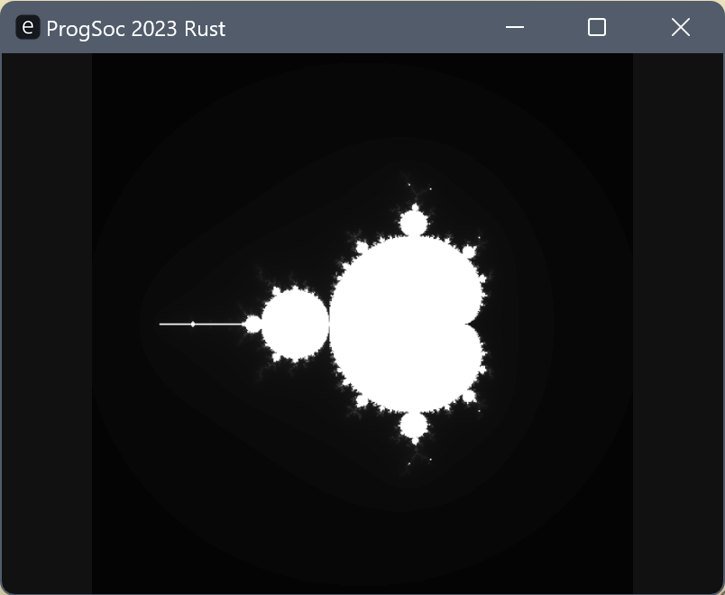

# Rust Workshop 2023

> This Workshop was originally presented as the "Introduction to Rust" Workshop on 8th September 2023, by Oliver and Jacob with demonstrations by Leo and other members of the Programmers' Society.

## Setup notes

To follow along with the desktop project at the end of the workshop, you'll need to install the components below:

1. Install Compiler & Linker Tooling
    * Windows: <https://visualstudio.microsoft.com/visual-cpp-build-tools>
    * Linux (Debian Flavour): `apt install build-essential`
    * Linux (Arch Flavour): `pacman -S base-devel`
    * MacOS: `xcode-select --install`
2. Rust Compiler
    * <https://rust-lang.org/tools/install>
    * If you already have Rust, update it with `rustup update`
3. Workshop Repository
    * Via web ("Code > Download ZIP") or `git clone` <https://github.com/ProgSoc/RustWorkshop2023>
4. (Optional) You can also install VSCode (or use another LSP editor if you know what that means), and use the `rust-analyzer` extension for extra real-time error help along the way.

## A History

2006 - Graydon Hoare, a researcher at Mozilla (the makers of Firefox) comes home to his apartment to find the lift broken, again. It is not the first time this has happened, and each time it has been because the software running the lift crashed and needed to be reset. Frustrated, Graydon sets out to make a programming language that can't crash; and so, he writes the first version of the Rust compiler in OCaml, a language born out of the functional programming and theorem proving worlds.

2009 - Mozilla are looking to improve Firefox, a historically good-enough browser but always with some problems, in the face of strong competition from Google's Chrome. They see promise in Graydon's experimental memory-safe systems programming language to eliminate a large number of bugs in firefox, and sponsor him and other researchers at Mozilla to develop it further as open-source.

2010 - Rust gets its [first Git commit](https://github.com/rust-lang/rust/tree/d6b7c96c3eb29b9244ece0c046d3f372ff432d04), and the team begins work on making the compiler [self-hosting](https://en.wikipedia.org/wiki/Self-hosting_(compilers)) utilising LLVM.

2012 - Mozilla starts the [Servo experimental browser project](https://servo.org) to begin replacing parts of Firefox with Rust.

2015 - Rust goes 1.0, with the theme of "Stability Without Stagnation". Since then, every six weeks there has been a new Rust release.

2016 - Rust is voted the most loved language in the [StackOverflow Developer Survey](https://survey.stackoverflow.co/2016).

2018 - Rust releases a [new edition](https://blog.rust-lang.org/2018/12/06/Rust-1.31-and-rust-2018.html), with a focus on productivity and to allow extra features separately that would otherwise break old code.

2020 - Perhaps the closest Rust came to not surviving, Mozilla laid off over 1000 employees during the Covid-19 pandemic. This included the Servo team who were disbanded, but the Rust project was able to be formed into the Rust Foundation and survive. The Servo project was transferred to the Linux Foundation, but development effectively stalled. In 2023, the Spanish open-source software cooperative [Igalia](https://www.igalia.com/) started up active development with a team of four.

2021 - Rust releases the 2021 edition focusing on quality-of-life improvements, and infrastructure changes to allow future syntax.

2022 - Rust is voted the most loved language for the seventh year running in the [StackOverflow Developer Survey](https://survey.stackoverflow.co/2023/). ProgSoc also delivers its first Introduction to Rust workshop.

2023 - ProgSoc runs the Rust workshop for a second year, you get to follow along right here!

If you want to learn some more of the history of Rust, have a read of [this MIT Technology Review article](https://www.technologyreview.com/2023/02/14/1067869/rust-worlds-fastest-growing-programming-language).

Something different about Rust compared to  other similar open-source projects like Python, Blender, Linux or OpenBSD is [the lack of](https://graydon2.dreamwidth.org/307291.html) [a BDFL](https://en.wikipedia.org/wiki/Benevolent_dictator_for_life).

## Why Rust?

### Memory Safety

### Zero-Cost Abstractions

### Helpful Compiler Errors

### Community

### Industry

## Hello, World!

We're now going to write our first Rust program! Head on over to the [Rust Playground](https://play.rust-lang.org) to follow along for this section. If you're feeling brave enough, you can also create a simple project locally and run the code from there (but we'll get to that later in the workshop).

First up, let's get the classic "Hello, World" going.

## The Rust Community, and Resources

As we mentioned earlier, Rust's community is one of its biggest assets. There is a [user forum](https://users.rust-lang.org/) and [community-run Discord server](https://discord.com/invite/rust-lang-community). There are also [Christmas Island crab-migration-loads](https://prod.static9.net.au/fs/bc95a081-1a1b-483e-aef1-9f0261f06aff) ([and here too](https://www.theguardian.com/australia-news/gallery/2022/jan/29/australian-crawl-christmas-islands-baby-red-crab-migration-in-pictures)) of learning resources available for everyone. We've provided a small selection of some of the best here:

* [The Rust Book](https://doc.rust-lang.org/book) - Reference manual for the language.
* [Rust Cheatsheet](https://cheats.rs) - Easily searchable list of every feature in Rust.
* [Rust-by-Example](https://doc.rust-lang.org/rust-by-example) - Learn Rust by following along examples across the various aspects of Rust.
* [Rustlings Exercises](https://rustlings.cool) - Small exercises that get you to fill in the blanks to get gradually more comfortable writing Rust.
* [Rust Cookbook](https://rust-lang-nursery.github.io/rust-cookbook) - Common data structures and algorithms in Rust
* [A half-hour to learn Rust by FasterThanLime](https://fasterthanli.me/articles/a-half-hour-to-learn-rust) - A rapid fire article to learn Rust
* [No Boilerplate Talks](https://youtube.com/@NoBoilerplate) - Quick (~10min) and motivating Rust talks to get you excited about its potential

We recommend you watch the 10 minute "Rust Makes you Feel like a Genius" lightning talk by Tris of No Boilerplate (click below):

## Hello, Desktop!

## Takeaway
