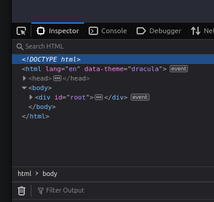

# 2024 React Workshop

Welcome to the ProgSoc's 7th workshop this year!

# Resources

## Google Slides

Throughout this workshop, I'll be referring to these slides:

[https://docs.google.com/presentation/d/1B1zWH5AppuNZbFjtvcHZqcI9V3kCOTU2reHPcpLHs-A/edit?usp=sharing](https://docs.google.com/presentation/d/1B1zWH5AppuNZbFjtvcHZqcI9V3kCOTU2reHPcpLHs-A/edit?usp=sharing)

## Online Development Environment

Using this online development environment means you don't need to set up any software on your computer besides the browser you already have!

https://stackblitz.com/github/ProgSoc/2024ReactWorkshop

## Discord

For this workshop there's a discord channel where you can ask any questions.

https://discord.com/channels/504971400394702858/1298453195374460928

## React Docs

https://react.dev/

# What is React, and why is it important?

React is a UI Library for the Web and Native Applications.

In this workshop, we'll mostly be talking about the web version.

React makes it easier to manage the flow of data across your application and ensures that the entire page doesn't need to be reloaded when that data changes. While we can accomplish the same thing without using the React library, it simplifies the data management process in large applications by an order of magnitude.

To demonstrate the difference between how you would update data with and without React, below are some code examples that show how you would implement the same logic with and without React.

## Without React

```javascript
// Create initial data
let data = ["Apple", "Banana", "Cherry"];

// Function to render data in the DOM
function render() {
  let container = document.getElementById("container");
  container.innerHTML = "";

  for (let i = 0; i < data.length; i++) {
    let div = document.createElement("div");
    div.textContent = data[i];
    container.appendChild(div);
  }
}

// Initial render
render();

// Update the data and re-render
data.push("Date");
render();
```

## With React

```jsx
import React, { useState } from "react";

function FruitList() {
  const [fruits, setFruits] = useState(["Apple", "Banana", "Cherry"]);

  return (
    <div>
      {fruits.map((fruit, index) => (
        <div key={index}>{fruit}</div>
      ))}
      <button onClick={() => setFruits((prev) => [...prev, "Date"])}>
        Add Date
      </button>
    </div>
  );
}
```

## What's the difference?

1. **Manual Updates**: In vanilla JavaScript, you must manually update each UI element when the state changes. This can be time-consuming and error-prone for large applications.
2. **Efficiency**: React uses a virtual DOM to calculate minimal updates needed when state changes, which makes it more efficient than manually updating elements.
3. **Reusability**: React breaks down an interface into reusable components that can be easily managed and updated, making your code easier to maintain and develop.
4. **Declarative Syntax**: React uses declarative syntax for rendering components, which means you describe what should be rendered on the screen rather than how to achieve it. This makes your code more understandable and reduces the chances of errors.

# React Components

Components are the building blocks of React; they encapsulate HTML elements, styling and logic into modular pieces that can be re-used across the application. The simplest example of a Component is probably something like this:

```jsx
import React from "react";

function Greeting(props) {
  return <h1>Hello, {props.name}</h1>;
}
```

As you can see from this example, a React Component is a function that returns something that looks like HTML, the difference being that it contains our data in curly brackets.

To show how this can be useful, here's an example of how those components work in practice:

```jsx
import React from "react";
import Greeting from "./Greeting"; // Import the Greeting component

function App() {
  return (
    <div>
      <Greeting name="Alice" /> {/* Use the Greeting component */}
      <Greeting name="Bob" />
    </div>
  );
}
```

Here, you can see that we're referencing the `Greeting` component we created earlier inside, which looks like an HTML tag but is the function we defined.

This mix of React components and HTML markup is called `JSX` or JavaScript React, (its own mini-language). Using this syntax, we can pass variables when we use our component. In this example, the `name` variable.

Another notable factor in this example is how to reuse a component. Despite this example referencing `Greeting` twice, they will render differently and have different values.


**All components must be uppercase.**

## Styling

There's an almost endless variety of different ways to style a React Component, depending on the tools that your project is using. In this case, we'll cover two of the major ways:

### Using CSS Modules

```css
/* Greeting.module.css */
.greeting {
  color: red;
}
```

```jsx
import React from "react";
import styles from "./Greeting.module.css"; // Import the CSS module

function Greeting(props) {
  return <h1 className={styles.greeting}>Hello, {props.name}</h1>; // Apply the CSS class to the element
}
```

We can define our classes in a separate file and import them into our file using CSS modules. This allows us to reference the class names directly.


**In JavaScript `class` is reserved so all `JSX` elements use `className` instead**

### Using Tailwind CSS (Utility Classes)

```jsx
import React from "react";

function Greeting(props) {
  return (
    <h1 className="text-red-500 font-bold text-3xl">Hello, {props.name}</h1>
  ); // Apply Tailwind utility classes to the element
}
```

Using a tool like [TailwindCSS](https://tailwindcss.com/), we can do the same thing without creating a separate file.

# React Hooks

To identify which functions will interact with the UI and cause updates, React uses "hooks". These functions normally start with `use` .

Some examples of hooks include:

- `useState()`
- `useEffect()`
- `useContext()`

Hooks are used to _hook_ into the state of the UI.

We'll discuss the state in the next part and why it's important for a reactive application.

Each of these hooks has a different purpose and affects your React application's UI and logic differently. The documentation hooks and nearly every other React feature are extremely well documented on their website (linked above).

# What is State?

State is an object or a series of variables that store data about the "state" of your application, e.g. whether certain parts are hidden or shown, what text is displayed to the user or what errors are currently displayed on the page.

The entire reason that React exists is to manage "state". Similar to how data is contained within an instance of a class in Java.

```java
public class Counter {
    private int count;

    public Counter() {
        this.count = 0;
    }

    // Getter for the current count
    public int getCount() {
        return this.count;
    }

    // Method called when the increment button is clicked
    public void incrementCount() {
        this.count++;
    }
}
```

We implemented a similar data structure inside a React Component in the example demonstration code.

## Global vs Local State

Managing local vs global state is one of the most difficult parts of state management.

In local state, variables and the UI they affect are contained within a certain scope, in React's case, a component and, in Java's terms, a class.

In global state, the same data needs to be able to be changed and updated across the application. Using vanilla or plain JavaScript without React would be a little difficult to implement. However, using React's built-in state-management tools makes it easier to scope your data, so the UI only updates when needed.

### Local State Example

```jsx
import React, { useState } from "react";

function Counter() {
  const [count, setCount] = useState(0); // Local state variable for the count

  return (
    <div>
      <p>You clicked {count} times</p>
      <button onClick={() => setCount(count + 1)}>Click me</button>
    </div>
  );
}
```

In this example, the state is stored and referenced using a React `useState` function whose value, when updated, will update the rendering of only the `Counter` component that it's used in.

If there were more `Counter` components across the application, but they wouldn't update when you clicked the button on one of them.

### Global State Example

```jsx
import React, { useContext, useState } from "react";

const CountContext = React.createContext(); // Create a context for sharing state between components

function Counter() {
  const count = useContext(CountContext); // Access the count from the context

  return <p>You clicked {count} times</p>;
}

function App() {
  const [count, setCount] = useState(0); // Global state variable for the count

  return (
    <CountContext.Provider value={count}>
      {" "}
      {/* Provide the count to child components via context */}
      <div>
        <Counter />
        <button onClick={() => setCount(count + 1)}>Click me</button>
      </div>
    </CountContext.Provider>
  );
}
```

However, in this example, we have what React calls `Context` which we can create with the `React.createContext()` function and reference using the `useContext()` function.

Because all of our counter components are referencing the same `CountContext` , when the button is clicked, every instance of our counter component across the application will re-render and update immediately.

# Frameworks & Rendering

If you've ever browsed the listings for developers, you might've noticed different flavours of the React framework. These are libraries that make use of React and make it more opinionated, as well as adding extra features.

## Rendering

Regarding web applications, there are various ways that data can be fetched and displayed to the user.

### CSR (Client Side Rendering)

Client-side rendering is the default for React as it doesn't require a backend server and just outputs a bunch of static files. One notable aspect is that the very first request you'll get when accessing a CSR React App is that all that's there is a very bare-bones `index.html` file with a `div` an element like this:



In CSR, you specify the `id` of the root element. Then, using JavaScript, React will build the entire application inside that `div` element.

The disadvantage of this is that the device has to do a lot of work building your application on the fly. This sometimes means that web crawlers won't see your application's content and just that empty `div`.

### SSR (Server Side Rendering)

As you might be able to gather, SSR works a bit differently. In an SSR environment, nearly no JavaScript is shipped to the client during the first request, meaning that the user can see the entire page without waiting for the JavaScript to load and process.

This means the web crawlers' snapshot of your application will have all your content, paragraphs, text, and structure.

It also speeds up the user experience, reducing load times (depending on how the backend is cached).

### Hydration

When it comes to a React application, the best option is normally to combine these two approaches, have that first render available to the user quickly, and then load in all the elements that make the website interactive, like JavaScript.

In this scenario, the server will render the page _before_ sending it to the client, and then afterwards, once all the JavaScript has loaded in "hydrate" the static HTML sent in the first request.

## Frameworks

Some of the most popular frameworks are [NextJS](https://nextjs.org/) and [RemixJS](https://remix.run/).

Both of these Frameworks use React's powerful state management to create reactive websites with cool features and good SEO (basically able to be crawled by Google). They add extra features to React like Server Side Rendering, Image Optimisation and Metadata Management.

NextJS also integrates closely with the parent company's cloud ecosystem, Vercel Cloud. This gives them more advanced features like server-side rendering and dedicated CI/CD for NextJS applications.

On the other hand, Remix has adapters for other cloud providers like Cloudflare, Netlify, and Vercel.

# Workshop Feedback

[https://docs.google.com/forms/d/e/1FAIpQLSc8J78z32cjD%5F%5Ff7zJn4sT6cBs9QMyZ6qdtNub%5FhyEG6KrcQw/viewform?usp=sf%5Flink](https://docs.google.com/forms/d/e/1FAIpQLSc8J78z32cjD%5F%5Ff7zJn4sT6cBs9QMyZ6qdtNub%5FhyEG6KrcQw/viewform?usp=sf%5Flink)


