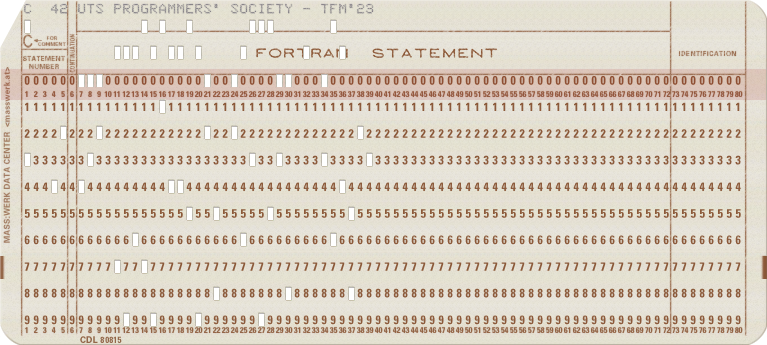

A ProgSoc Compendium.

---

> [***RTFM***: /R-T-F-M/ \[UNIX\], impolite.](http://www.catb.org/jargon/html/R/RTFM.html)
>
> Abbreviation for 'Read The F\*\*\*ing Manual'.
>
> 1. Used by [gurus](http://www.catb.org/jargon/html/G/guru.html) to brush off questions they consider trivial or annoying. Compare [Don't do that then!](http://www.catb.org/jargon/html/D/Don-t-do-that-then-.html).
> 2. Used when reporting a problem to indicate that you aren't just asking out of [randomness](http://www.catb.org/jargon/html/R/randomness.html). "No, I can't figure out how to interface Unix to my toaster, and yes, I have RTFM." Unlike sense 1, this use is considered polite. See also [FM](http://www.catb.org/jargon/html/F/FM.html), [RTFAQ](http://www.catb.org/jargon/html/R/RTFAQ.html), [RTFB](http://www.catb.org/jargon/html/R/RTFB.html), [RTFS](http://www.catb.org/jargon/html/R/RTFS.html), [STFW](http://www.catb.org/jargon/html/S/STFW.html), [RTM](http://www.catb.org/jargon/html/R/RTM.html), all of which mutated from RTFM, and compare [UTSL](http://www.catb.org/jargon/html/U/UTSL.html).
>
> \- [The Jargon File](https://www.catb.org/jargon/). Eric S. Raymond.

## Welcome

### Foreword

After <del>nine</del> ten years <del>in development</del> of suspense, TFM has `return`ed (the stack trace must be huge!).

### TFM Mini-FAQ

#### What is it?

#### How can I get a copy?

### Copy Rights

To be written.

#### Past Publications

## Apropos ProgSoc

### What We Do

### Execs

### Constitution

### Eras

#### Founders

#### Golden Years

#### Society 2.0

#### Today

## Surviving at UTS

### The First Semester

### Continuing

#### Canvas

#### EdStem

#### My Student Admin

#### eRequests

#### Timetable Planner

### Studying

#### UTS Library

#### FEIT Learning Precinct (FLP)

### Eating

#### UTS Food Court

#### Spice Alley

### Tourism

#### Building 1

#### Building 2

#### Building 7

#### Building 10

#### Building 11

#### The Goods Line

#### The ProgSoc Brick

### Transport

#### Train

#### Bus

#### Tram

#### Bike

## Wiki

### Tools and Applications

### Programming

### Guides

## Projects

## Events

## Lore

## Contributing
